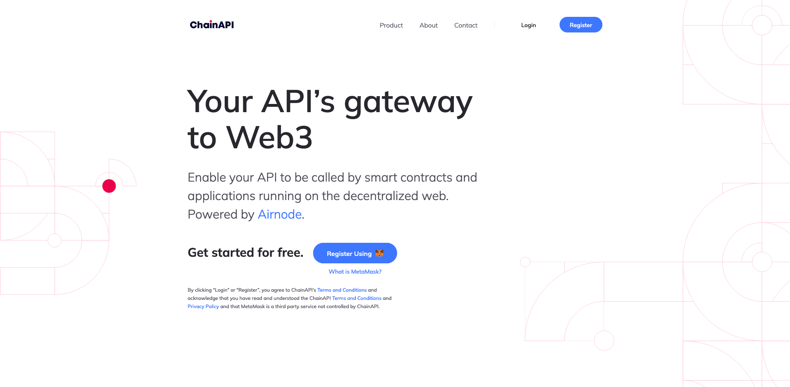
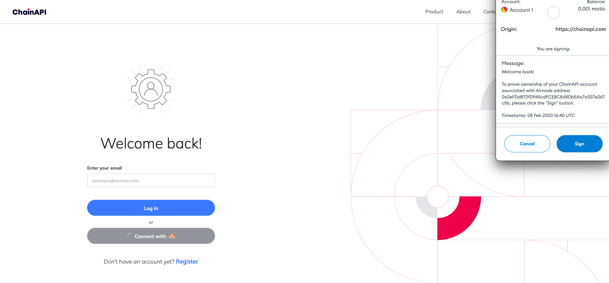
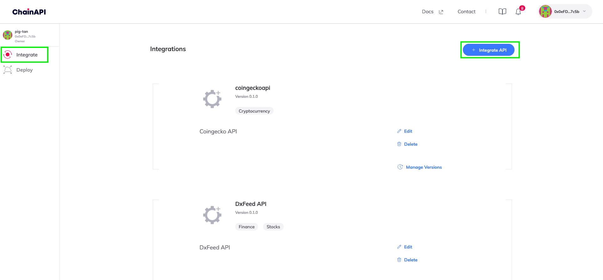
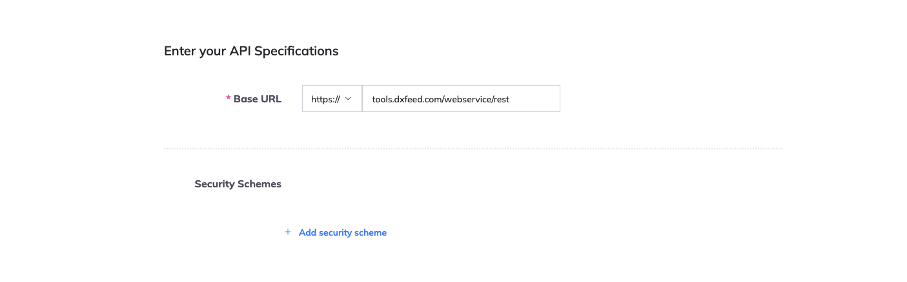
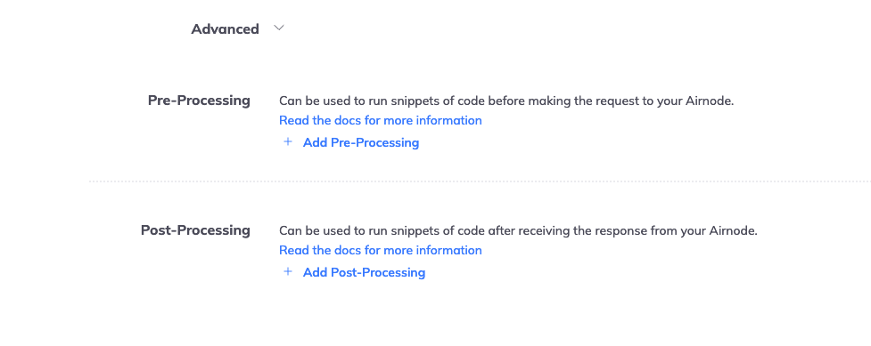

<PageHeader/>

# {{$frontmatter.title}}

[ChainAPI](https://chainapi.com/) is a platform that enables you to integrate
and deploy the open-source
[Airnode](../../../reference/airnode/latest/understand/) with its step-by-step
integration and deployment tools. It helps streamline the Airnode integration
process for API providers.

Using ChainAPI, API providers can configure and deploy an Airnode which links
their API data to several blockchains.

ChainAPI can connect almost any API, whether open or authenticated, to Airnode.
Airnode then queries your API operations to be consumed by EVM on-chain dAPPs,
by using the request/response protocol.

## 1. Getting Started

To get started, go to [ChainAPI](https://chainapi.com/) and log in by connecting
your [MetaMask](https://metamask.io/).

> 

You will be prompted to confirm and sign the transaction through your MetaMask
extension.

Make sure you’re using a new MetaMask Wallet with a fresh mnemonic. Your
mnemonic will later be used to deploy the Airnode. You need to keep it extremely
safe as this will serve as the “private key” of your deployed Airnode.

_Each time you return to ChainAPI you will connect again, using MetaMask, to
identify yourself by signing a message for the same account._

> 

Complete the signup process and name your workspace.

Workspaces provide you with a way to invite other users to help or collaborate
with integrations and deployments. This makes it easy to manage your Airnodes as
a team or to outsource the process while still maintaining control over your
integrations and deployments.

>  _To change the name of your workspace in the
> future, click on **Name** on the top-left of the dashboard_

Within ChainAPI you will be able to create and manage your integrations or
Airnode deployments by navigating to the **Integrations** or **Deploy**
dashboards on the left hand navigation panel.

## 2. Integrating your Airnode

To integrate your Airnode, select the **Integrate API** option in the top right
hand of the dashboard.

For this guide, we will be using the
[dxFeed's Public REST API](https://tools.dxfeed.com/webservice/rest-demo.jsp) as
an example. You can use any REST API you want.

> 

Enter the details about the API you want to Integrate.

> 

You need to enter the base URL of your API along with all the endpoints that you
want to integrate. If your API requires any security scheme (API Key, Basic HTTP
Auth) you have the option to add that too.

As it’s a public API, it doesn’t have any security schemes.

> 

You can now start adding all your endpoints. Start by adding the endpoint name,
its path, the parameters and then the method to call it. You can add as many
endpoints as you want. To add another endpoint, click on the **Add another
Endpoint** button.

> 

Now you need to add all the parameters and define where they go
(query/header/path/cookie). You can also decide if you want their values fixed
or not.

Here, the dxFeed REST API has one GET endpoint `/events.json` with some query
parameters. You can add all the parameters that your API requires.

[Reserved parameters](../../../reference/ois/latest/reserved-parameters.md)
define what part of the response is to be picked and encoded before fulfillment.
It can be defined by the requester but we can also hardcode it in the Airnode
configuration.

> 

You can also add
[pre and post-processing snippets](../../../reference/ois/latest/processing.md)
for your Airnode.

- [Pre-processing](/reference/ois/latest/specification.html#_5-9-preprocessingspecifications)
  snippets are executed before making the request to the Airnode.
- [Post-processing](/reference/ois/latest/specification.html#_5-10-postprocessingspecifications)
  snippets are executed after receiving the response from the Airnode.

> 

After adding all the required endpoints, you can now press finish and get ready
to deploy your Airnode.
