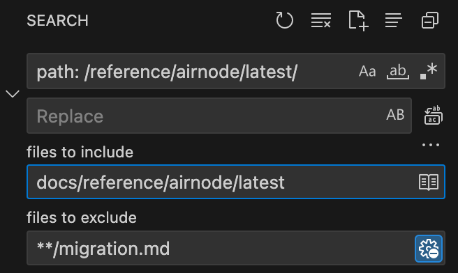

<PageHeader/>

# {{$frontmatter.title}}

Versioning of a a [docset](/dev/docsets.md) only applies to Airnode and OIS.
There is the concept of `/latest` and `/next`. Consider the chart below which
represents Airnode:

| File path and URI         | Version |
| ------------------------- | ------- |
| /reference/airnode/next   | v0.15   |
| /reference/airnode/latest | v0.14   |
| /reference/airnode/v0.13  | v0.13   |

Also consider the directory structure of the project:

```sh
reference
├── airnode
    └── latest       ← v0.14
        ├── assets
        ├── concepts
        ├── ...
    └── next         ← v0.15
        ├── assets
        ├── concepts
        ├── ...
├── ...
```

## Putting `/next` into production

In order to advance the versioning the following actions occur:

1. Rename (`git mv`) the `/latest` folder to the version that is being
   superseded vX.YZ.
2. Make a copy of `/next` as `/latest`.

Update links and other version specific content. For `vx.xx`, `/latest`, and
`/next` review the following and make the following changes where needed.

> Be careful with Airnode `migration.md` pages. Older version are mentioned as
> needed within.

In the number steps below consider some of the search criteria listed below.
Narrow the search include/exclude pattern. `migration.md` should be updated
manually for each Airnode version. Make sure the version, latest, or next
attribute is correct for each version of Airnode or OIS.



- path: /reference/airnode/latest/
- path: /reference/ois/latest/
- version: v0.14
- /blob/v0.14/
- /tree/v0.14/
- pageHeader: Reference → Airnode → v0.14 →
- pageHeader: Reference → OIS → v2.3
- /reference/airnode/latest/
- /reference/airnode/next/
- /reference/airnode/v0.13/
- /reference/ois/latest/
- /reference/ois/next/
- /reference/ois/v0.13/
- "nodeVersion": "0.13.0"
- api3/airnode-deployer:0.13.0 deploy
- 0.13.0
- /ois/latest
- /ois/next
- /ois/tree/
- /ois/blob/

### Check the following

1. Update `themeConfig.sidebar` in `/.vitepress/config.js`
2. Update `/.vitepress/versions.json` to reflect the latest and next versions.
3. Update internal hyperlinks in the content. In latest use `/latest`, next use
   `/next`. For folders of a specific version use the correct version number.
4. Be sure the above step also changed the `path` in frontmatter.
5. Change frontmatter `version:` to the proper version.
6. For `/latest` look for and change external links to API3 repos that may use
   older repo tags, `/master`, or `/main`. Some repos may not use tags and
   `/main` must be used, some may have tags unrelated to Airnode. Evaluate each
   link for changes as needed.
7. Look for links with versions that use x.x.x (i.e. Admin cli, 0.12.0)
8. Look for links to api3 repos that use older version such as Airnode `v0.11`
   or OIS `v2.0`. These need to use the proper versions.
9. Verify links in Airnode releases reference the proper OIS release and
   vice-versa. See the OIS [versions](/reference/ois/latest/versions.md) table.
10. For `/next` change frontmatter `pageHeader: Reference → Airnode → vx.x` to
    the proper version.
11. `/next` will not have a repo tag created until its version is release. Use
    the version of `/latest` in the mean time.
12. Update the [Versions](/reference/ois/latest/versions.md) page in OIS which
    maps OIS versions to Airnode versions.
13. Update the [Versions](/reference/airnode/latest/versions.md) page in
    Airnode.
14. Change OIS and Airnode versions in he quick start guides.
