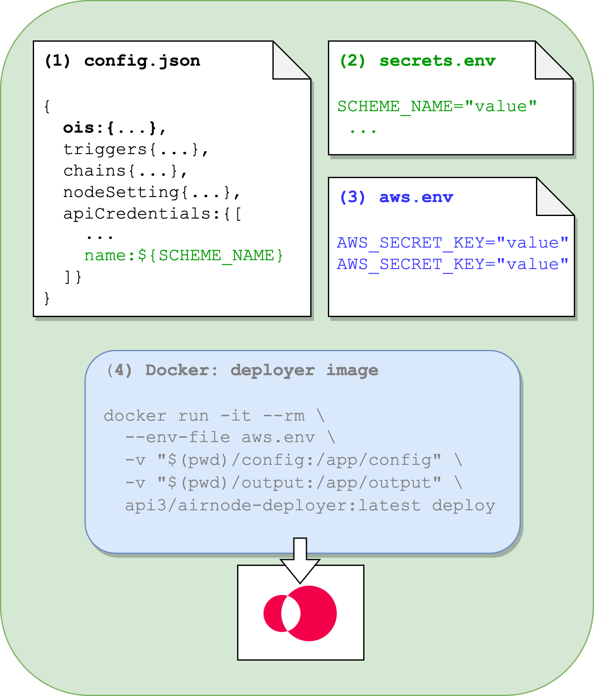

<PageHeader/>

# {{$frontmatter.title}}

An Airnode is a first-party oracle that will push off-chain API data to any
on-chain requester. The Airnode is defined by a file named
[config.json](/reference/airnode/latest/deployment-files/config-json.md).

Airnode is also the backbone that feeds data to beacons. Beacons are the behind
the scene components that supply on-chain dAPIs with data.

The diagrams below illustrate the required configuration files to successfully
deploy an Airnode to AWS, GCP, or a Docker Container.

<Tabs>

@tab:AWS

1. **config.json**: Contains the Airnode's configuration. The OIS object is
   important as it maps an API to Airnode endpoints.
2. **secrets.env**: Values that should not be exposed in config.json.
3. **aws.env**: AWS credentials required by the Docker deployer image.
4. **deployer image**: Deploys Airnode using its deploy command.

@tab:GCP

1. **config.json**: Contains the Airnode's configuration. The OIS object is
   important as it maps an API to Airnode endpoints.
2. **secrets.env**: Values that should not be exposed in config.json.
3. **deployer image**: Deploys Airnode using its deploy command.

@tab:Container

1. **config.json**: Contains the Airnode's configuration. The OIS object is
   important as it maps an API to Airnode endpoints.
2. **secrets.env**: Values that should not be exposed in config.json.
3. **client image**: Deploys Airnode using its deploy command.

</Tabs>

## More...

- See [Understanding Airnode](/reference/airnode/latest/understand/) to learn
  how Airnode is defined by `config.json`.
- See
  [Deployment Files](/reference/airnode/latest/deployment-files/config-json.md)
  to view the available configurations fields for `config.json`.
- See
  [config.json](/reference/airnode/latest/deployment-files/examples/config-json.md)
  to view an example file.
