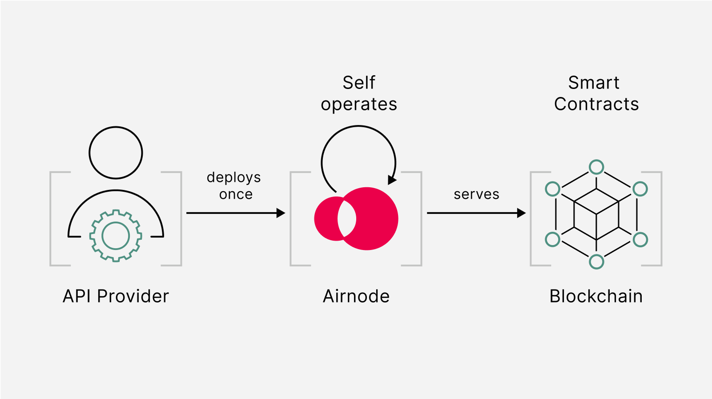

<PageHeader/>

<SearchHighlight/>

<FlexStartTag/>

# {{$frontmatter.title}}

Airnode is a serverless oracle node implemented with a
[set and forget](/explore/airnode/what-is-airnode.md#_1-set-and-forget)
philosophy that brings off-chain data from APIs to on-chain smart contracts.

It consists of two parts:

1. The off-chain **Airnode** (“the node”) that is self-hosted or deployed as
   cloud provider functions (AWS or GCP).
2. The on-chain **protocol contract** AirnodeRrpV0.sol. This is often referred
   to as the oracle smart contracts.

  

Airnode is designed with mechanisms that eliminate both on-chain and off-chain
concerns of API providers. The set-and-forget framework of Airnode is all about
its ease of implementation.

For smart contract developers Airnode is a tool to utilize data from Web2 APIs
within smart contract functions. The ease and flexibility of deployment means it
can be utilized within the product development cycle as data requirements arise.

<!---::: info Read more

For a technical overview of Airnode see
[getting to know Airnode](https://medium.com/api3/getting-to-know-airnode-162e50ea243e)<ExternalLinkImage/>.
:::
-->

## Technical Characterists of Airnode

### Statelessness

Third-party oracle nodes typically track blockchain and request state, either
from the chains memory or database. This approach has disadvantages:

1. The database becomes a single point of failure with costly redundancy
   mechanisms
2. In the instance of on-chain anomalies there is difficulty keeping chain and
   node synchronized
3. Potential debilitating bugs from highly stateful applications

Due to this traditional third-party oracle nodes demand professional node
operators who need to be available around the clock in case anything goes wrong.
This is simply not realistic for oracles if they are to scale to tens or
hundreds or thousands of API Providers.

However, there is an alternate. As the blockchain used by the oracle node
already keeps the state on its behalf, there is no need for the oracle node
itself to keep its state. Duplicating the state also creates twice as many
points of failure.

Therefore, the oracle node should depend on the blockchain node to keep its
state. Thus, Airnode is designed to be stateless.

### Fully-serverless stack

Although serverless functions are better known for scaling automatically even
with extreme concurrent usage, Airnode uses it for different reasons:

1. Serverless functions have the benefit of being stateless: This means any
   problems encountered during Airnode invocation will not persist in the next.
   Being able to quickly reset provides greater robustness against bugs from
   Airnode, APIs or Ethereum nodes.

2. Serverless functions are fully managed: They provide the closest possible
   experience to the _set-and-forget_ philosophy.

3. Serverless functions are priced on-demand: Airnode does not require major
   concurrent usage, resulting in cost-efficiency and even let the user stay
   within free tier [AWS<ExternalLinkImage/>](https://aws.amazon.com/free),
   [GCP<ExternalLinkImage/>](https://cloud.google.com/free) limits.

Additionally, bare serverless functions are easy to port across cloud providers
(e.g., using
[Terraform Framework<ExternalLinkImage/>](https://www.terraform.io/)),
especially when their cloud provider-specific dependencies are limited.

::: info Note

Due to being stateless Airnode is able to reset itself quickly and easily,
providing a solution for most potential issues.

:::

### Approach to security

For an optimal, hands-off user experience, Airnode should utilize fully managed
services whenever possible. To allow this to be done securely, the node is
designed defensively.

There are two external parties that Airnode interacts with:

1. **APIs:** Although Airnode is designed for first-party oracles, it considers
   serving data from third-party APIs as a valid usage scenario. In this case,
   calls made to all APIs are contained in separate serverless function
   invocations so that they cannot induce node-level failure.
2. **Blockchain nodes:** Similarly, using blockchain nodes that are run by
   third-party service providers is considered as a valid usage scenario. To
   ensure maximum availability, Airnode uses all providers simultaneously (and
   not through a Quorum-based consensus or behind a load balancer), which is
   possible thanks to its unique stateless design. The interactions with each
   provider are contained in a separate serverless function invocation so that a
   malicious provider cannot induce node-level failure.

For Airnode cloud hosting is recommended over hosting on-premises. This is due
to the superior availability of serverless functions, and also for their
set-and-forget qualities. As a precaution, redundancy on multiple cloud
providers can be provisioned easily and virtually at no cost thanks to the
fully-serverless design of Airnode.

In addition, the protocol is implemented in a way that a blockchain service
provider cannot tamper with the parameters of a request, but only deny service.
Note this is not the case with alternative solutions, as they treat the
blockchain service provider as a trusted party.

::: info Learn more

Read more about how Airnode works in the
[Airnode reference section](/reference/airnode/latest/understand/).

:::

<!--## Statelessness

Typically, oracle nodes persistently track the blockchain and the state of the
requests they receive (i.e. the present stage of their fulfillment), either in
memory or in a database. In terms of systems, they are not memoryless. However,
such approach comes with many disadvantages:

1. The database becomes a single point of failure, and redundancy is costly and
   complicated to orchestrate.
2. Any on-chain anomalies (block reorganization, ommer blocks etc.) result in
   the chain's and node's states losing synchronization, which is difficult to
   fix.
3. Highly stateful applications have many edge cases that are difficult to
   completely cover by tests. Therefore, debilitating bugs are bound to slip
   through.

These disadvantages result in an unstable oracle node, which is the essential
reason why traditional oracle nodes require _professional node operators_ that
need to be on call 24/7 in case of incidents. Since this is not a realistic
requirement for first-party oracles, an oracle node designed for these oracles
has to be stateless.

However, there's another way to approach state keeping for oracle nodes: since
the node on a given blockchain (such as Ethereum) used by the oracle node
already keeps the state on its behalf, there is no need for the node itself to
keep its state. Duplicating the state would create twice as many points of
failure (and it would be enough for one of them to fail to cause total failure).
Therefore, the oracle node should depend on the blockchain node to keep its
state, which should be reflected in the way in which the oracle node's protocol
is designed-->

<!--### Non-idempotent operations

An API operation is idempotent if calling it multiple times has the same effect
as calling it once. For example, using a GET operation of an exchange's API to
get the exchange rate between ETH and USD is typically an idempotent operation.
It will not make any difference at the API server-side if we call it once or
several times.

In contrast, using a POST operation of a remittance service provider API to send
$100 to another party would be a non-idempotent operation. Each call would send
an additional $100, which means that using the operation multiple times would
have a different effect than using it once.

Stateless oracle nodes cannot "remember" if they already made an API call
associated with a given request, and, under certain conditions, they may repeat
it. At present, this is not an issue since oracles are only used for performing
idempotent operations. In the future, however, Airnode intends to support
non-idempotent operations as well. We are currently researching alternative
methods of achieving this while protecting the resiliency provided by
statelessness.-->

<!--Third-party oracle nodes typically track blockchain and request state, either
from the chains memory or database. This approach has disadvantages:

1. The database becomes a single point of failure with costly redundancy
   mechanisms
2. In the instance of on-chain anomalies there is difficulty keeping chain and
   node synchronized
3. Potential debilitating bugs from highly stateful applications

Due to this traditional third-party oracle nodes demand professional node
operators who need to be available around the clock in case anything goes wrong.
This is simply not realistic for oracles if they are to scale to tens or
hundreds or thousands of API Providers.

However, there is an alternate. As the blockchain used by the oracle node
already keeps the state on its behalf, there is no need for the oracle node
itself to keep its state. Duplicating the state also creates twice as many
points of failure.

Therefore, the oracle node should depend on the blockchain node to keep its
state. Thus, Airnode is designed to be stateless.-->

## Blockchain (RPC) Providers

Airnode requires access to a blockchain RPC node to:

1. Listen for request events from the blockchain to the oracle
2. Trigger transactions to fulfill requests from an API Provider to the smart
   contract

To avoid distruption to oracle operation Airnode has been designed to allow the
useage of multiple RPC providers simulaneously. Each RPC provider is treated as
individual, meaning all providers must be malicious for Airnode operations to be
disrupted reliably. Additionally, using multiple Ethereum providers helps
achieve the highest possible availability.

::: info Airnode operates on free RPC tiers

An Airnode that receives no requests consumes fewer than 3,000 calls per day
which is included within the free plans of RPC providers such as
[Alchemy<ExternalLinkImage/>](https://www.alchemy.com/overviews/rpc-node),
[Infura<ExternalLinkImage/>](https://docs.infura.io/infura/networks/ethereum/json-rpc-methods),
or
[Pokt<ExternalLinkImage/>](https://docs.pokt.network/use/public-rpc/).

:::

<!---
Although the expectation is that the user will be using a public RPC, nothing
prevents API providers from using a private RPC node. Furthermore, Airnode is
designed to allow the usage of multiple RPC providers simultaneously.

This is achieved by treating all of the integrated providers individually. The
operations of an Airnode thus cannot be disrupted reliably unless all of its
providers are malicious. Therefore, using multiple Ethereum providers is a
better strategy to achieve the highest possible availability than using a
private Ethereum node.-->

## Airnode Configuration Files

The Airnode is defined by a file name
[config.json](/reference/airnode/latest/deployment-files/config-json.md). It is
the central element feeding data to beacons, the components that supply on-chain
dAPIs with data behind the scenes.

- See [Understanding Airnode](/reference/airnode/latest/understand/) to learn
  how Airnode is defined by `config.json`.
- See
  [Deployment Files](/reference/airnode/latest/deployment-files/config-json.md)
  to view the available configurations fields for `config.json`.
- See
  [config.json](/reference/airnode/latest/deployment-files/examples/config-json.md)
  to view an example file.

<FlexEndTag/>
