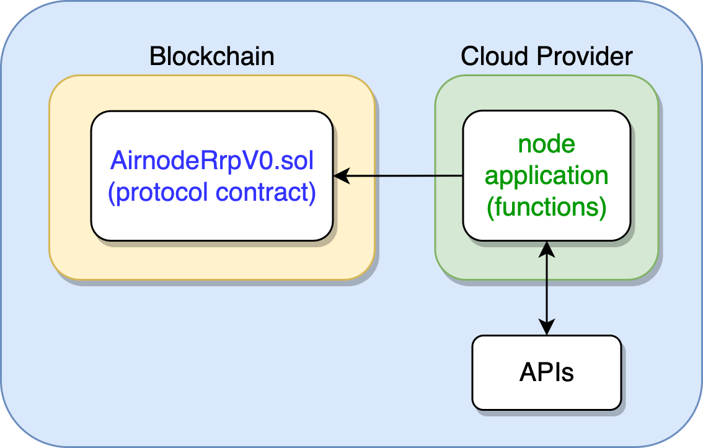

<PageHeader/>

<SearchHighlight/>

# {{$frontmatter.title}}

Airnode is a serverless oracle node implemented with a “set and forget”
philosophy. It consists of two parts: the off-chain **Airnode** (“the node”)
that is self-hosted or deployed as cloud provider functions (AWS or GCP) and the
on-chain **protocol contract** AirnodeRrpV0.sol.

> 
>
> Airnode consists of two parts: the off-chain Airnode (“the node”), usually
> deployed as a set of cloud provider functions (AWS or GCP), and the on-chain
> protocol contract AirnodeRrpV0.sol.

At its core, **Airnode** lets API providers easily run their own _oracle nodes_.
That way, they can provide data to any on-chain _decentralized app_ \(dApp\)
that's interested in their services, all without an intermediary.

At the heart of this mechanism sits **Airnode**, an open-source oracle node.
It's designed to be easily deployed by any API provider with almost no
maintenance. Airnode lets dApp developers write _smart contracts_ that interact
with the on-chain data of API providers.

Airnode is designed with mechanisms that eliminate both on-chain and off-chain
concerns of API providers. The set-and-forget framework of Airnode is all about
its ease of implementation.

::: tip

Learn more about the Airnode experience in Section 4 of the
<a href="/api3-whitepaper-v1.0.3.pdf#page=14" target="_blank">API3
Whitepaper</a><ExternalLinkImage/>, _Airnode: A Node Designed for First-Party
Oracles_.

:::

## Designed for first-party oracles

First-party oracles are integral to the API3 solution: each API is served by an
oracle that is operated by the owner of an API, and not by a third party.

This document discusses the benefits of using first-party oracles, the reasons
why it is not feasible for API providers to operate their own oracles with
currently available solutions, and the solution to this problem posed by
Airnode.

## Off-Chain Data Signing

There is a hybrid solution that still depends on third-party oracles, yet does
not let them tamper with the data. Here, the API providers sign their data with
their private key off-chain and serve it over a regular API endpoint.
Third-party oracles call this endpoint to get the signed data and post it to the
chain. The authenticity of the data — i.e. no tampering by third-party oracles —
can then be verified on-chain using the public key of the API provider.

Although this eliminates the risk of data tampering at the oracle level, this
solution is essentially a half-measure. By depending on third-party oracles, it
continues suffering from the ecosystem issues caused by this and, additionally,
it requires API modifications to implement off-chain signing. This results in a
severely limited API selection even compared to the regular third-party
oracle-based solutions, and restricts the growth potential of the solution's
ecosystem to the application-scale.

## Airnode Features

Airnode is a fully-serverless oracle node that is designed specifically for API
providers to operate their own oracles. It addresses many of the issues API
providers face in relation to oracle nodes:

1. It does not require any specific know-how to operate. In fact, it is
   difficult to even speak of any operation as Airnode is designed around the
   "set and forget" principle.

2. It does not require any day-to-day maintenance such as updating the operating
   system or monitoring the node for uptime thanks to existing fully managed
   serverless technology. It is designed to be stateless, which makes it
   extremely resilient against any problems that can cause permanent downtime
   and require an operator intervention.

3. It is built on services priced on-demand, meaning that the node operators are
   charged only by the usage of their node. This allows API providers to run an
   oracle for free and start paying only after they start generating revenue.

4. It does not require the node operators to handle cryptocurrency at all. Its
   protocol is designed in a way that the requester covers all gas costs.

One way to see Airnode is as a lightweight wrapper around a Web API that allows
it to communicate with smart contract platforms with no overhead or payment
token friction. In terms of the involvement required from an API provider, using
Airnode can be likened to using an API gateway that makes an API accessible over
the Web, rather than operating a blockchain node as a side-business. The intent
is for Airnode to become as ubiquitous and mundane for APIs as using an API
gateway, which will make a vast variety of first-party oracles available to
API3.

API providers invest significant resources to build infrastructure that has high
availability rates. It is important for the oracle node implementation not to
contain individual points of failure that might cause downtime. Existing
solutions using third-party oracles depend on over-redundancy at the oracle
level to cover for this, which results in excessive costs. API3 envisions each
API to only be served by its first-party oracle, which means the redundancy has
to be implemented at the level of the individual Airnode. The fact that the node
is fully serverless facilitates this across different availability zones of a
single cloud provider, or even across multiple cloud providers. Apart from that,
it will be possible to containerize Airnode and operate it on-premises. However,
using the serverless version will be recommended for almost all use cases.

Airnode is developed by the founding members of API3 and is now open-sourced.
The software is feature-complete for current protocols, and further development
will be funded by API3 in the form of grants.

## API Integrations

When it comes to integrating APIs to oracles, we face a chicken-and-egg problem.
If there is no existing demand for an API in an oracle ecosystem, nobody has the
incentive to integrate it. If the API is not available because it's missing an
integration, nobody is going to develop applications that could create the
demand.

To reach its full potential, API3 will need hundreds, if not thousands, of first
party oracles, so that it can easily set up new dAPIs or recompose existing
ones. This can only be achieved if APIs can be integrated to Airnode in an even
more scalable way. To this end, an improved version of the proprietary
integration tools will be open sourced for Airnode. Borrowing from the
[OpenAPI Specification format](https://github.com/OAI/OpenAPI-Specification/blob/master/versions/3.0.3.md)<ExternalLinkImage/>,
Oracle Integration Specifications (OIS) define the operations of an API, the
endpoints of an oracle, and a way of mapping them to each other. Airnode users
will be able to serve an API over their oracle simply by providing its OIS to
their node. Integrations made in this standardized format will be very easy to
collect, version and distribute.

OIS is a JSON file, primarily designed to describe the integration
specifications for Airnode to use. This means that it does not aim to be
human-readable first and creating it manually to specify an integration would be
difficult. This problem will be solved by ChainAPI (a product from API3
currently in development), an integration platform that will allow users to
generate OIS for their APIs through an easy-to-use graphical interface. This
will be accompanied by other quality-of-life improvements for Airnode users,
including a node dashboard and a marketplace to list their endpoints. As a
result, API3 will have a wide selection of first-party oracles to compose dAPIs
from and ecosystem growth will no longer be bottlenecked by integration
capacity.
