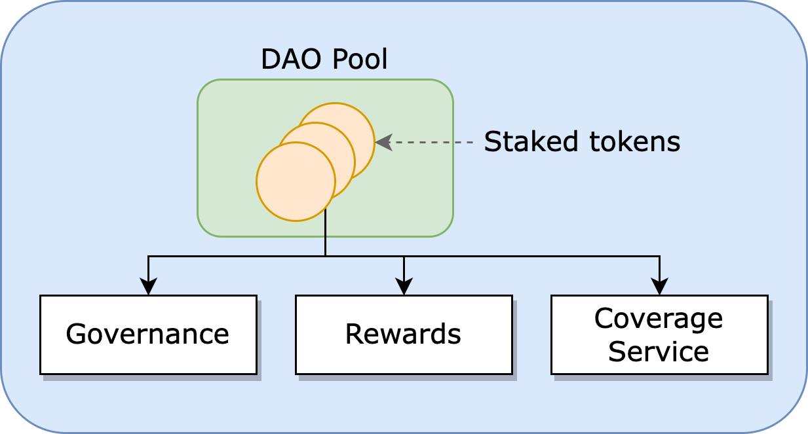

<PageHeader/>

<SearchHighlight/>

# {{$frontmatter.title}}

The API3 DAO has a single staking pool called the **DAO pool**. Staking API3
tokens in the pool will grant representation and
[inflationary rewards](/explore/dao-members/rewards.md). Staked tokens will be
used as collateral to pay out service coverage claims as needed. To do this, the
pool focuses on three token utilities and implements
[service coverage](/explore/dapis/service-coverage.md) which, by design,
balances rewards and risks through responsible governance.

## Tokens

API3 is the native token of the API3 project. The API3 ecosystem is a single
token environment. Check out the Medium post
[API3 Tokenomics Update](https://medium.com/api3/api3-tokenomics-update-f032d6e49b30)<ExternalLinkImage/>
for an in-depth overview on API3 tokenomics.

### Unstaked Tokens

Unstaked tokens are simply owned by an entity and do not generate revenue or
have voting rights. They are subject to market value and inflation.

### Staked Tokens

Staked API3 tokens are used as collateral for the on-chain service coverage that
will provide quantifiable and trustless security guarantees to dAPI users. These
mechanics will remove the need for a central authority at the ecosystem level.

Staking simply means you are placing API3 tokens into the DAO pool. When staking
tokens to the DAO pool you gain access to weekly inflationary
[rewards](/explore/dao-members/rewards.md) but also share in the risk of service
coverage. You are also granted voting rights on active DAO proposals and
inflationary rewards.

To stake your tokens see the [Staking Tokens](/guides/dao-members/staking.md)
guide. You can stake as many times as you’d like. Your percentage of all the
tokens in the DAO pool are directly related to your percentage of the rewards
and the risks. If you stake 10% of the pool you earn 10% of rewards and will pay
10% of service coverage claims.

## Token Utilities

Decentralized governance requires well-balanced incentive mechanisms that
accurately model both positive and negative outcomes. In other words, the
governing entities should be rewarded for good results and penalized for bad
ones. The API3 token is designed to facilitate this through three main
utilities:

_Main utilities of the API3 token._

> 
>
> 1. [Staking](/explore/dao-members/dao-pool.md#staking): Grants membership in
>    the API3 DAO and rights to inflationary
>    [rewards](/explore/dao-members/rewards.md).
> 1. [Collateral](/explore/dao-members/dao-pool.md#collateral): Backs service
>    coverage that protect users from damages caused by dAPI malfunctions.
> 1. [Governance](/explore/dao-members/dao-pool.md#governance): Grants direct
>    representation in the API3 DAO.

Note that it is critical for these three utilities to coincide. All governing
entities must receive staking rewards for them to govern in a way that maximizes
revenue. All governing entities must have their funds used as collateral for
them to govern in a way that minimizes **_security_** risks. "_Security_" refers
to a "guarantee or reliability of dAPI service"

Reference <a href="/api3-whitepaper-v1.0.3.pdf#page=25" target="_blank">section
5.4 _"API3 Tokenomics"_</a><ExternalLinkImage/> of the API3 whitepaper.

### Staking

The staking utility incentivizes participation in the DAO and alignment of
incentives. By staking your API3 tokens into the DAO pool, you receive
governance voting rights and take part in providing API3 users with quantifiable
_security_ in the form of service coverage. The DAO pool also grants you
inflationary rewards and exposes you to the risk of service coverage claims.

> 
>
> 
Staked tokens in the DAO pool grant 
> governance voting rights, inflationary rewards and are used to fund the coverage 
> service which exposes staked tokens to the risks of service coverage claims.

**Benefits:**

- Generates inflationary [rewards](/explore/dao-members/rewards.md) by
  decreasing the circulating supply of API3 tokens through revenue burn from
  service coverage fees.
- Improved token inflation protection compared to unstaked tokens.
- Voting privileges on DAO proposals.

**Risks:**

- Staked tokens in the DAO pool are used to cover potential financial losses
  from dAPI malfunctions that the dAPI consumer might incur.

To stake your tokens, see the guide
[Staking Tokens](/guides/dao-members/staking.md). You can stake as many times as
you’d like. Your percentage of all the tokens in the DAO pool are directly
related to your percentage of the rewards and the risks. If you stake 10% of the
pool you earn 10% of rewards and will pay 10% of service coverage claims.

### Collateral

The collateral utility has the participants share the DAO's operational risk and
incentivizes them to minimize it.

If staking tokens only yielded inflationary
[rewards](/explore/dao-members/rewards.md), the sole governance incentive would
be to maximize the revenue. This would be done by increasing the number of dAPI
users aggressively, and the amount that is secured by the dAPIs with it. Doing
so puts excessive pressure on a dAPI which is more likely to malfunction due to
an attack. Therefore, this is not a sustainable governance strategy for
decentralized data feeds.

Exposing the governing parties to the risk would align their incentives with
that of the DAO. The governing parties need to be penalized when a dAPI
malfunction occurs using an onchain service coverage that provides dAPI users
with quantifiable and trustless security guarantees. The
[Service Coverage](/explore/dapis/service-coverage.md) uses staked tokens of the
DAO pool as collateral, which means that when a dAPI malfunction is confirmed
through the dispute resolution protocol, user damages will be covered from the
pool's staked tokens.

See <a href="/api3-whitepaper-v1.0.3.pdf#page=27" target="_blank">Section 5.4.2,
_"Collateral"_</a><ExternalLinkImage/>, of the API3 whitepaper.

### Governance

The governance utility gives the participants the ability to enact and manage
staking and collateral.

The only way to gain representation in the DAO is to stake API3 tokens in the
pool. Staked tokens give their holders the right to take part in the governance
of the API3 ecosystem through the DAO. To vote token holders must stake their
API3 tokens in the pool, which also gives them access to weekly inflationary
[rewards](/explore/dao-members/rewards.md) but also share in the risk of service
coverage.

All governing parties will be exposed to all risks and rewards of API3, and will
govern to optimize them. Inflationary rewards and the staked tokens being used
as collateral will create a positive feedback loop in terms of governance
quality. Initial token holders will have to stake and expose themselves to risk
if they do not want to lose value to inflation. If they misgovern and lose
collateral through service coverage claims, these tokens will get returned to
the open market, from where they will be acquired by new governing parties. In
contrast, if initial token holders govern well and cause token scarcity in the
market, the representation distribution will be protected. In other words,
governance tokens being used as collateral results in a robust Darwinian
structure that improves itself and is able to recover from failures.

## Monetization

In general the industry standard for API provider subscription fees are commonly
paid monthly or annually, as this scheme suits both API providers and their
clients. API3 follows the same scheme for dAPIs.

### dAPI monetization

To gain access to a dAPI, a dApp will pay a recurring subscription fee, which
may be fixed or customized for the dApp based on a specific use case. These
prices will be determined by the respective team, and will include a premium if
the dApp wants to receive [Service Coverage](/explore/dapis/service-coverage).
The payment can be made in any cryptocurrency, which will be received by the DAO
in API3 tokens through a liquidity pool-based decentralized exchange.

### API provider compensation

API providers will be compensated periodically at fixed rates, which will fit
their existing pricing models. This will be done using stable coins wherever
possible, some API providers categorically reject handling cryptocurrency as
payment. In such cases, the DAO will provide a grant that will be paid out in
return of the proof that the API provider is compensated in fiat by the grantee.
