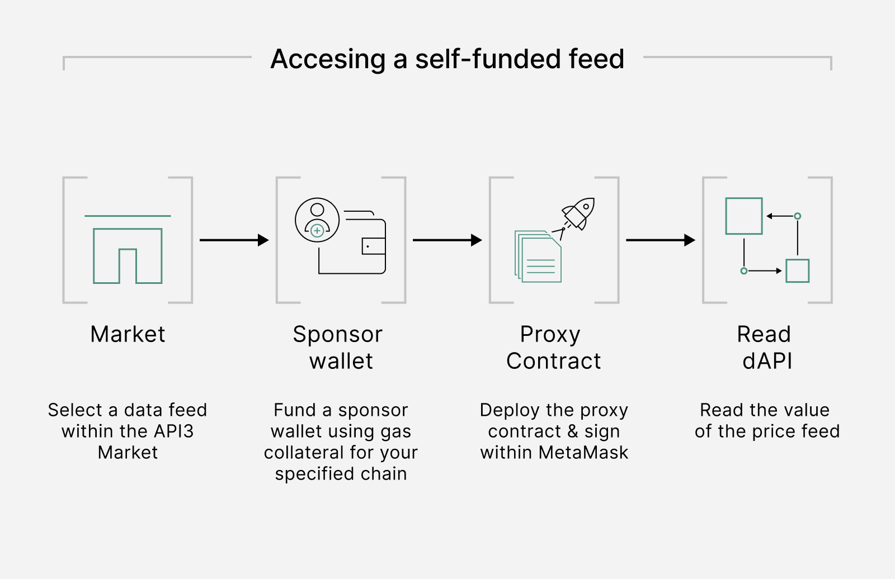

<PageHeader/>

<SearchHighlight/>

# {{$frontmatter.title}} # Using dAPIs

A dAPI has been designed to be the user interface that enables builders to
easilly access & manage to a variety of data feed services. Through the API3
Market a variety of data feed services can be accessed:

1- Self-funded dAPIs

2- Managed dAPIs

# Self-Funded dAPIs

Self-funded dAPIs provide developers with the tools to try out data feed
services with minimal associated costs and no upfront commitment before
committing to managed dAPIs.

Self-funded dAPIs are sourced from a single first-party oracle where the oracle
transactions fees are paid from a respective sponsor wallet. Once funds are
available in this wallet, oracle updates on the associated dAPI will begin
automatically (given the Airnode invocation restrictions).

In the same way, the dAPI will stop being updated if the required funds for
updates are not sufficiently available anymore.

::: warning Please note

API3 does not recommend using self-funded dAPIs in a production environment.
Read more in our
[security considerations](/explore/dapis/security-considerations.md).

:::

### Advantages of self-funded dAPIs

Introducing a sponsor wallet mechanism for self-funded dAPIs provides serveral
advantages for builders:

- Developers can utilize dAPIs in a permissionless fashion using the self-serve
  tooling within the [API3 Market](https://market.api3.org/dapis)
- Developers have the ability to use an oracle within early stages of the
  development life cycle without an ongoing commitment
- dApps that may only require data feeds for a short period of time can activate
  a self-funded dAPI as needed
- Whilst a self-funded dAPI provides access to a single API Provider, the feed
  does provide access to a median price from the agreegation of multiple data
  sources

Additionally, the API3 Market provides an intuitive interface to check the
status of respective self-funded dAPIs and fund them accordingly.

## Accessing a self-funded feed

You can access a self-funded dAPI now through the
[API3 Market](https://market.api3.org) in a permissionless and simple process.

::: tip

Follow a guide on
[how to use the API3 Market](/guides/dapis/call-dapi-dapiserver/index) to access
a self-funded dAPI to get started in under 30mins.

:::

# Managed dAPIs

Managed dAPIs are sourced from multiple first-party oracles and aggregated using
a median function. Compared to self-funded dAPIs, managed dAPIs are monetized,
as API3 requires payment in USDC on Ethereum Mainnet to operate them.

To access a managed dAPI users need to authorize access through the API3 Market.
Self-funded dAPIs can be upgraded by paying for a managed version and selecting
a desired amount of first-party oracles that should be included in the
aggregation. API3 will create the respective Beacon Set from the best available
first-party providers for the requested data set and point the dAPI towards this
creation.

In addition, API3 takes over the gas management overhead associated with
operating the respective dAPI. API3 recommends the usage of managed dAPIs in
production environments. Please read more about the
[security consideration](/explore/dapis/security-considerations.md) of managed
dAPIs.

::: info Read more

Learn more about dAPI managed services through reading our
[monetizing data feeds](https://medium.com/@ugurmersin/monetizing-data-feeds-951cd5c912bd)
overview.

:::

# API3 Market

The API3 Market lists all available dAPIs, self-funded and managed alike. It
represents a hub that allows developers to:

- Browse through a catalogue of potential data feeds to integrate
- Fund their operation in the case of self-funded dAPIs
- Authorize for the upgrade to a managed version
- Request new data types

