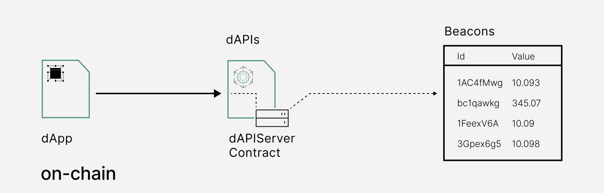

<PageHeader/>

<SearchHighlight/>

# {{$frontmatter.title}}

dAPIs are continuously updated streams of off-chain data, such as the latest
cryptocurrency, stock and commodity prices. They can power various decentralized
applications such as DeFi lending, synthetic assets, stable coins, derivatives,
NFTs and more.

dAPIs are composed of Beacons, which are first-party data feeds. A Beacon is
directly powered by the owner of the data, the API provider. Compared to
third-party oracle solutions, which involve middlemen node operators, this
approach is secure, transparent, cost-efficient and scalable. API3 composes
dAPIs out of Beacons, and provides them as turn-key data feed solutions on many
chains.

# Introducing dAPIs

A dAPI is the interface that smart contracts connect to access data feed
services through.

Through the use of the function `setDapiName` API3 can associate the ID of a
Beacon or Beacon Set with a human-readable name like AVAX/USD. The benefit of
this approach is that the dApps continue reading the same dAPI name through
`readDataFeedWithDapiName` without being required to make any changes to their
oracle specifications, effectively turning dAPIs into a turn-key data feed
solution for smart contract engineers.

At the core, a **dAPI** is a mapping that points towards a **Beacon** or a
**Beacon Set**, similarly to how an ENS name is mapped to a wallet address. As
such a dAPI is the interface to securely connect to a variety of oracle services
such as price reference feeds or other data feeds used within DeFi.

This makes it possible for the API3 DAO to take over the management overhead
that is associated with oracle infrastructure by e.g. creating a new Beacon Set
if one first-party oracle becomes unavailable and pointing the name "AVAX/USD"
towards the newly created ID.

::: info Read more

Learn more about dAPIs by reading
[dAPIs: APIs for dApps](https://medium.com/api3/dapis-apis-for-dapps-53b83f8d2493).

## What is a Beacon or a Beacon Set?

A Beacon is a point of data that is kept alive on-chain by a respective
first-party oracle. It corresponds to an ID which is derived from the hash of
the Airnode address that is deployed by an API Provider, in combination with the
request parameters. This resulting ID will always represent a specific provider
with specific request parameters and cannot be changed.

Following the same principle, a Beacon Set is addressed by an ID, which is
derived from the hash of multiple Beacons. This allows for the creation of
aggregations between multiple Beacons. The resulting ID of a Beacon Set always
represents the specific Beacons that make it up and cannot be changed.

Values for Beacons or Beacon Sets are kept up to date on-chain on
[DapiServer.sol](https://github.com/api3dao/airnode-protocol-v1/blob/main/contracts/dapis/DapiServer.sol)<externalLinkImage/>,
where they can be read directly through `readDataFeedValueWithId`.

::: info Read more

Learn how Beacons are the building blocks for
[Web3 data connectivity](https://medium.com/api3/beacons-building-blocks-for-web3-data-connectivity-df6ad3eb5763).

:::

## Understanding the dAPI Interface

dAPIs possess a range of distinct attributes:

- dAPIs have a standardized, user-friendly interface that intends to abstract
  away the technical implementation.
- A dApp uses the dAPI interface to access data feed services. These services
  exist in a fully permissionless or authorized format.
- dAPIs exist entirely on-chain as smart contracts and use first-party oracles
  served in a variety of data feed services such as self-funded or managed dAPIs
  (more on this later).
- Through a dAPI smart contract, developers can access additional services such
  as Service Coverage or Oracle Extractable Value.

<!--## Why use dAPIs?

Due to being composed out of first-party data feeds, dAPIs offer security,
transparency, cost-efficiency and scalability in a turn-key package.

_Security_

Data used to update a first-party data feed is cryptographically signed by the
owner of the data. This means that the data that will update a feed cannot be
tampered with once it leaves the source. Furthermore, the API providers host a
first-party oracle node, Airnode, to push the data to the chain themselves. This
renders denial of service attacks by third parties ineffective.

_Transparency_

The cryptographic signatures prove that the data that updates a feed comes
directly from a specific API provider. Furthermore, Beacons that underpin dAPIs
allow the user to inspect what exact API endpoints are being called, and with
which parameters. This provides complete transparency to the dApp developer,
which is a big step from depending on a pseudonymous selection of third parties
that intentionally obscure their data sources.

_Cost-efficiency_

dAPIs are cost efficient compared to third-party data feeds, as the user does
not need to pay middlemen node operators for their services. Furthermore,
first-party data feeds do not require redundancy against middlemen layer
attacks. This makes single-Beacon dAPIs feasible, and allows API3 to provide a
wide variety of data feeds in a cost-efficient way.

_Scalability_

An inherently secure and cost-efficient data feed design allows API3 to build a
large number of dAPIs on many chains. This is supplemented by purpose-designed
Airnode protocols and relayer schemes to improve efficiency while not degrading
the security guarantees of a first-party data feed. The improved scalability of
dAPIs also factors into building aggregated data feeds. Since first-party data
feeds do not require redundancy at the middlemen layer, the aggregation costs
less gas and source-level decentralization becomes more affordable.-->

## Accessing a dAPI: DapiServer.sol

Developers use the
[DapiServer.sol](https://github.com/api3dao/airnode-protocol-v1/blob/main/contracts/dapis/DapiServer.sol)<externalLinkImage/>
contract to access dAPIs. `DapiServer.sol` reads directly from its data store of
Beacons, which are powered by API provider-owned and operated
[Airnodes](/reference/airnode/latest/). A developer will deploy a proxy contract
to access the dAPI. Now a developer can easily set the proxy contract address in
his contract and start reading from the dAPIs.

dAPI proxies allow dAPIs to be used like libraries. The smart contract just
needs to import the interface for calling the proxy contract. To read a
different dAPI, the contract does not need to change the code itself, rather it
only needs to use a different proxy address when calling the read() function on
the proxy contract.

## Understanding the `DapiServer.sol`

> 

A dAPI can be pointed towards an individual Beacon or an aggregation of multiple
Beacons (Beacon Set).

> 

Each dAPI has a human-readable name (e.g., `AVAX/USD`) that makes them easily
accessible using `DapiServer.sol` by simply passing the encoded bytes32 value of
the `dapiName` to a reader function.

```solidity
// Reading the AVAX/USD dAPI using the DapiServer contract
(value, timestamp) =
  IDapiServer(_dapiServerContractAddress).readDataFeedWithDapiName("0x415...0000");
```

See
["Using an API3 Market proxy contract and Remix"](/guides/dapis/call-dapi-proxy/)
and
["Using the DapiServer contract and Remix"](/guides/dapis/call-dapi-dapiserver/)
for a step-by-step guides on how to call a dAPI. Also visit the
[reference section for dAPIs](/reference/dapis/).

## More related material

<div class="api3-css-nav-box-flex-row">
  <NavBox type='GUIDE' id="_dapi-just-the-code"/>
  <NavBox type='GUIDE' id="_call-dapi-proxy"/>
  <NavBox type='GUIDE' id="_call-dapi-server"/>
</div>

<!--Additionally it is going to play a cruical role in setting up required
contracts for OEV (LINK) and Service Coverage (LINK). // add this when OEV & Service Coverage pages are added-->

<!--## dAPI Maintenance

The exact process that is being followed currently and what is envisioned for
the future can be found in
[how are dAPIs maintained](/explore/dapis/how-are-dapis-maintained.md).-->

<!--## Medium Articles

For more information, please refer to
[dAPIs: APIs for dApps](https://medium.com/api3/dapis-apis-for-dapps-53b83f8d2493)<externalLinkImage/>,
[Beacons](https://medium.com/api3/beacons-building-blocks-for-web3-data-connectivity-df6ad3eb5763)<externalLinkImage/>
and
[Monetizing Data Feeds](https://medium.com/@ugurmersin/monetizing-data-feeds-951cd5c912bd)<externalLinkImage/>.-->
