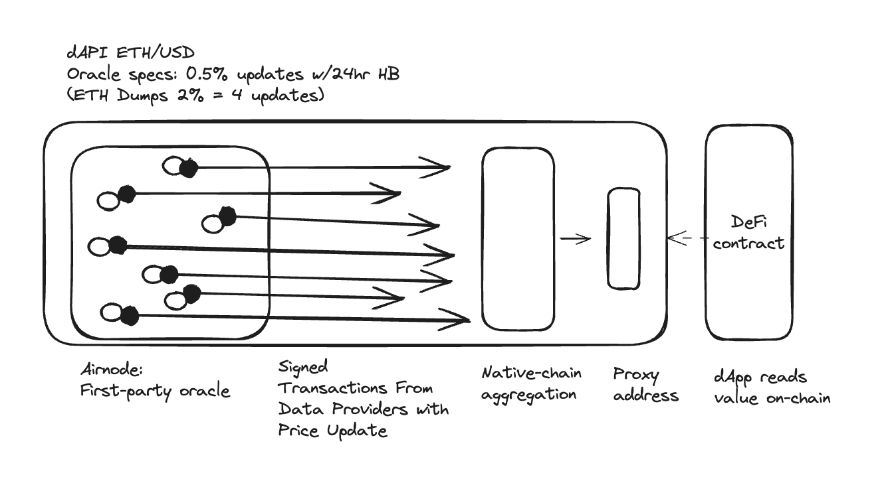

<PageHeader/>

<SearchHighlight/>

<FlexStartTag/>

# {{$frontmatter.title}}

> <Video src="https://www.youtube.com/embed/wLZ4pyqAFuE"/>

<!--A dAPI is a standardized interface that smart contracts can use to access data
feed services, that are continuously updated. These can range from the latest
cryptocurrency, forex, stock or commodity prices.-->

dAPIs are on-chain data feeds sourced from off-chain first-party oracles owned
and operated by API providers themselves. Data feeds are continuously updated by
first-party oracles using signed data. dApp owners can read the on-chain value
of any dAPI in realtime.

<!--They can power various decentralized applications such as DeFi
lending, synthetic assets, stable coins, derivatives, NFTs and more.-->

Thanks to first-party oracles source transparency is realized, enabling the
independent verification of whether an oracle is decentralized. By removing the
third-party node layer that other oracle solutions rely on, dAPIs provide a
solution with improved security, cost-efficiency, and scalability.

## dAPI composition

At the core, a **dAPI** is a mapping that points towards a **beacon** or a
**beacon set**, similarly to how an ENS name is mapped to a wallet address.

dAPIs are directly powered and maintained on-chain by multiple off-chain oracle
nodes operated by the owner of data (API Provider) served directly to a network.
API3 refers to these as a beacon. Each of these off-chain sources serve
cryptographically signed data by a data provider before being aggregated
on-chain, something API3 refers to as a beacon set.

The natively aggregated value is read through a proxy address as part of the
dAPI requester. It is simple for developers to integrate into their contracts
and once imported a dAPI can be re-directed to read any price feed without any
further technical implementation. For a further technical understanding of dAPIs
head to the [developer reference section.](/docs/reference/dapis/).

::: info Read more

Dive into the design decisions about dAPIs by reading
[dAPIs: APIs for dApps](https://medium.com/api3/dapis-apis-for-dapps-53b83f8d2493).

:::

<!--### What is a Beacon or a Beacon Set?

A beacon is a point of data that is kept alive on-chain by a respective
first-party oracle. It corresponds to an ID which is derived from the hash of
the Airnode address that is deployed by an API Provider, in combination with the
request parameters. This resulting ID will always represent a specific provider
with specific request parameters and cannot be changed.

Following the same principle, a beacon set is addressed by an ID, which is
derived from the hash of multiple beacons. This allows for the creation of
aggregations between multiple beacons. The resulting ID of a beacon set always
represents the specific beacons that make it up and cannot be changed.

Values for beacons or beacon sets are kept up to date on-chain by many Airnodes
which are owned by API providers, where they can be read using an API3 Market
[proxy contract](/reference/dapis/understand/proxy-contracts.md).-->

### A simple way to access next-generation push oracles

dAPIs operate in a familiar push-model, meaning price is updated on-chain
according to pre-determined oracle specifications. These are 0.25%, 0.5% and 1%
update thresholds that can be selected through the
[API3 Market](https://market.api3.org/dapis). All oracles have a 24hr heartbeat.

dAPIs are simple and permissionless to access. Through the use of the proxy
contract function `read()` you can do this in minutes with little changes to the
code.

<!--

### Activate and Manage dAPIs

The API3 Market provides tooling for dApp owners to access decentralized price
feeds, known as dAPIs. Use the [API3 Market](https://market.api3.org) to search
for dAPIs, activate feeds, obtain dAPI proxy contract addresses, and monitor
dAPIs.

From the API3 Market developers will manage all data feed subscriptions. Once
the dAPI interface has been imported to a dApps contract, upgrading a data feed
happens through the API3 Market.

### Get started

Refer to these guides and learn how to activate and read the dAPI using a proxy
contract:

- [Subscribing to Self-Funded dAPIs](/guides/dapis/subscribing-self-funded-dapis/index.md)
- [Reading a Self-Funded dAPI Proxy](/guides/dapis/read-a-dapi/)

<!--## dAPI: A standardized interface

dAPIs possess a range of distinct attributes:

- dAPIs have a standardized, user-friendly interface that intends to abstract
  away the technical implementation.
- A dApp uses the dAPI interface to access data feed services. These services
  exist in a fully permissionless or authorized format.
- dAPIs exist entirely on-chain managed by a central contract that manages a
  beacon store that is in turn updated by Airnodes.
- Through a dAPI smart contract, developers can access additional services such
  as Service Coverage or Oracle Extractable Value. -->

<!--## Why use dAPIs?

Due to being composed out of first-party data feeds, dAPIs offer security,
transparency, cost-efficiency and scalability in a turn-key package.

_Security_

Data used to update a first-party data feed is cryptographically signed by the
owner of the data. This means that the data that will update a feed cannot be
tampered with once it leaves the source. Furthermore, the API providers host a
first-party oracle node, Airnode, to push the data to the chain themselves. This
renders denial of service attacks by third parties ineffective.

_Transparency_

The cryptographic signatures prove that the data that updates a feed comes
directly from a specific API provider. Furthermore, Beacons that underpin dAPIs
allow the user to inspect what exact API endpoints are being called, and with
which parameters. This provides complete transparency to the dApp developer,
which is a big step from depending on a pseudonymous selection of third parties
that intentionally obscure their data sources.

_Cost-efficiency_

dAPIs are cost efficient compared to third-party data feeds, as the user does
not need to pay middlemen node operators for their services. Furthermore,
first-party data feeds do not require redundancy against middlemen layer
attacks. This makes single-Beacon dAPIs feasible, and allows API3 to provide a
wide variety of data feeds in a cost-efficient way.

_Scalability_

An inherently secure and cost-efficient data feed design allows API3 to build a
large number of dAPIs on many chains. This is supplemented by purpose-designed
Airnode protocols and relayer schemes to improve efficiency while not degrading
the security guarantees of a first-party data feed. The improved scalability of
dAPIs also factors into building aggregated data feeds. Since first-party data
feeds do not require redundancy at the middlemen layer, the aggregation costs
less gas and source-level decentralization becomes more affordable.-->

<!--Additionally it is going to play a crucial role in setting up required
contracts for OEV (LINK) and Service Coverage (LINK). // add this when OEV & Service Coverage pages are added-->

<!--## dAPI Maintenance

The exact process that is being followed currently and what is envisioned for
the future can be found in
[how are dAPIs maintained](/explore/dapis/how-are-dapis-maintained.md).-->

<!--## Medium Articles

For more information, please refer to
[dAPIs: APIs for dApps](https://medium.com/api3/dapis-apis-for-dapps-53b83f8d2493),
[Beacons](https://medium.com/api3/beacons-building-blocks-for-web3-data-connectivity-df6ad3eb5763)
and
[Monetizing Data Feeds](https://medium.com/@ugurmersin/monetizing-data-feeds-951cd5c912bd).-->

<FlexEndTag/>
