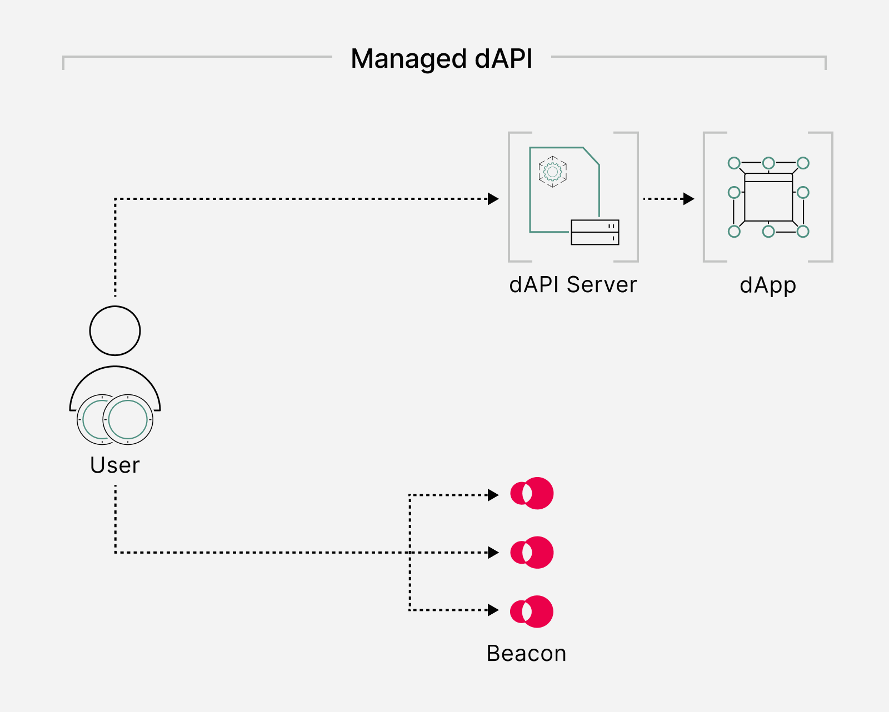

<PageHeader/>

<SearchHighlight/>

# {{$frontmatter.title}}

A dApp is an application that is implemented as a smart contract that runs on a
decentralized blockchain. By the same token, a dAPI is an API-like service that
is delivered to smart contracts. Just as applications use APIs, dApps will use
dAPIs.

## Overview

dAPIs deliver quantifiably secure data feeds from curated sources to smart
contracts. Through a dAPI DeFi lenders, synthetic assets, algorithmic
stablecoins or derivatives (to name a few) can securely access continuously
updated streams of off-chain price reference data.

dAPIs are managed API services designed to resemble Web APIs for Web2 apps, but
from the perspective of a dApp. They have a standardized, user-friendly
interface that <!--intends to--> abstracts away the technical implementation and
can be composed of a variety of Airnode protocols. <!-- is this correct?-->

::: info Learn more

Read more about the [oracle protocols](/explore/dapis/what-are-dapis.md) dAPIs
utilize.

:::

<!--These typically encompass Request-response Protocol (RRP), Publish-subscribe Protocol (PSP),
relayed RRP, relayed PSP and API-signed data.-->

<!-- Can we turn this paragraph into an asset

dAPIs are then delivered to builders from a variety of oracle services price
reference data for the latest cryptocurrency, stock and commodity prices.-->

### Understanding the dAPI Interface

dAPIs is an interface to connect to data feeds. They have been specifically
engineered for smart contracts to mimic traditional Web APIs. dAPIs possess a
range of distinct attributes:

- dAPIs have a standardized, user-friendly interface that intends to abstract
  away the technical implementation.
- A dApp uses the dAPI interface to access data feed services. These services
  exist in a fully permissionless or authorized format.
- dAPIs exist entirely on-chain as smart contracts and use first-party oracles
  served in a variety of data feed services such as self-funded or managed dAPIs
  (more on this later).
- Through a dAPI smart contract, developers can access additional services such
  as Service Coverage or Oracle Extractable Value.

## dAPI Services

dAPIs have been designed to serve builders with data feeds that are appropiate
across the full application development cycle. As such, dAPIs are accessed in a
range of oracle services depending on product stage and use case. These consist
of:

1. Self-funded data feeds (single-source)
2. Managed data feeds (multi-source)

### 1. Self-funded data feeds

Self-funded dAPIs provide developers with the tools to use single-source data
feed services with no upfront commitment. They are served in a fully
permissionless fashion through the API3 Market. Once gas funds have been
provided in the oracle sponsor wallet a dAPI will begin automatically post data
on-chain when price deviation thresholds are met.

To activate an oracle feed, users must deposit chain-native collateral to a
designated dAPI sponsor wallet. This collateral will cover the costs of gas for
oracle transactions.

<!--Self-funded data feeds are permissionless price reference dAPIs where collateral for an oracle update transaction is provided by the user. Self-funded dAPIs are activated by funding a gas wallet using the API3 Market.-->

Self-funded data feeds are provided as an output of a single first-party oracle
that triggers price updates on-chain to a 1% deviation threshold. As such these
dAPIs are appropiate for early-stage of dApp development.

<!--In cases where a single source is deemed insufficient or the overhead of keeping a wallet topped up for oracle services is undesirable, API3 recommends to utilize an ageeegated data feed.-->

API3 suggests using an aggregated data feed when a single source does not
provide enough reliability, or the costs associated with topping up your wallet
for oracle services are too prohibitive.

    <NavBox type='EXPLORE' id="_access-a-self-funded-data-feed"/>

### 2. Managed data feeds (multi-source)

Managed dAPIs provide aggregated high-quality price reference data served
on-chain by first-party oracles. dAPIs provide DeFi with a secure and
transparent oracle solution that can be decentralized according to user
requirements.

Compared to self-funded dAPIs, managed dAPIs require user authorization through
the API3 Market. As such reading an agreegated data feed is permissioned,
meaning users need to register access to the dAPI. API3 will absorb gas fees and
maintain dAPIs as part of the managed service.

<!--higher-level? or user friendly?-->

<!--Compared to single sourced (byog) dAPIs, API3 and the underlying API providers will also take over the gas management overhead from this point onward until the
time that the service expires.-->

<!--design illustration-->

### Service coverage

API3 provides dAPI users with a quantifiable level of security as on-chain
service coverage. Staked tokens in the DAO pool are used to cover potential
financial losses from dAPI malfunctions that the dAPI consumer might incur.

::: info Please note

Service coverage is not a live service and will be accessible in the future.

:::

### Accessing dAPIs

<!--You access a dAPI through the API3 Market. This is a simple process by following the tools within API3 Market.-->

Accessing a dAPI via the [API3 Market](https://market.api3.org/dapis) is an
uncomplicated process requiring only a few simple steps. Utilizing the tools
available within the API3 Market, users can swiftly gain access to a dAPI with
minimal effort.

::: info Get started

Follow the this quick guide to get started with self-funded dAPIs.

:::
