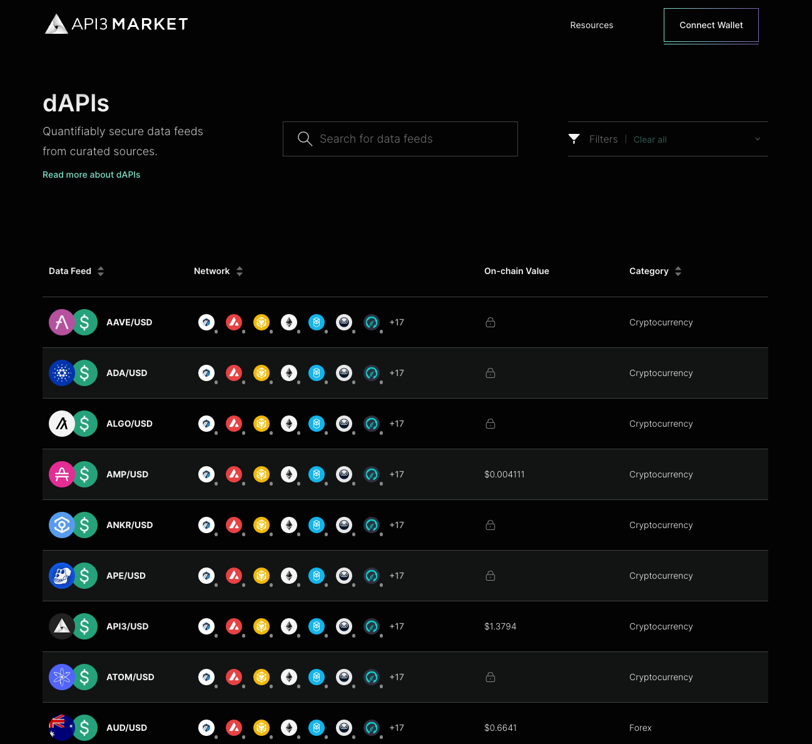

<PageHeader/>

<SearchHighlight/>
<!-- section to review upon staged beta of market -->
# API3 Market

API3 has developed an oracle solution that enables smart contracts to access and
utilize valuable real-world data with ease. As such it is essential to make sure
the process of accessing this data is as user-friendly and efficient as
possible.

### What is the API3 Market?

The API3 Market provides tooling for dApp owners to access dAPIs. Use the
[API3 Market<ExternalLinkImage/>](https://market.api3.org) to search for dAPIs,
obtain dAPI proxy contract addresses, and monitor dAPIs..

From the API3 Market developers will manage all data feed subscriptions. Once
the dAPI interface has been imported to a dApps contract, upgrading a data feed
happens through the API3 Market.

### Get started with self-funded dAPIs

Currently, self-funded dAPIs can be accessed through a quick and simple process:

1. Explore and select your data feed
2. Fund a sponsor wallet
3. Access data feed through a proxy

Self-funded data feeds are currently accessible at the
[API3 Market<ExternalLinkImage/>](https://market.api3.org), with managed data
feeds launching in the coming months.

While the API3 Market UI is intuitive, follow this
[simple guide](/guides/dapis/subscribing-self-funded-dapis/) to sponsor,
activate and read a self-funded dAPI.
