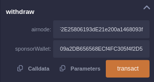
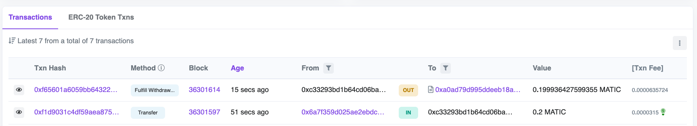

<PageHeader/>

<SearchHighlight/>

<FlexStartTag/>

# {{$frontmatter.title}}

> <Video src="https://www.youtube.com/embed/Hss-8Tzg7TI"/>

## Introduction

[Airnodes](/reference/airnode/latest/concepts/airnode.md) are first-party
oracles that are directly operated by the API Providers that provide data to any
on-chain dApp. The Smart Contracts can request data from the Airnodes without
going through any intermediary.

This guide shows you how to code, deploy, and run a simple smart contract that
requests data from an Airnode, via the
[Request Response Protocol](/reference/airnode/latest/concepts/).

## 1. Coding the Requester Contract

::: warning Check your Network!

Make sure you're on a Testnet before trying to deploy the contracts on-chain!

:::

Given below is an example of a basic
[Requester Contract](/reference/airnode/latest/concepts/requester.md) to request
data from any Airnode. To follow along, you can open the following contract in
Remix and try deploying your own Requester Contract.

[Open in Remix<ExternalLinkImage/>](https://remix.ethereum.org/#url=https://github.com/vanshwassan/RemixContracts/blob/master/contracts/RequesterWithWithdrawal.sol&optimize=false&runs=200&evmVersion=null&version=soljson-v0.8.9+commit.e5eed63a.js&lang=en)

```solidity
// SPDX-License-Identifier: MIT
pragma solidity 0.8.9;

import "@api3/airnode-protocol/contracts/rrp/requesters/RrpRequesterV0.sol";
import "@openzeppelin/contracts/access/Ownable.sol";

// A Requester that will return the requested data by calling the specified Airnode.
contract Requester is RrpRequesterV0, Ownable {
    mapping(bytes32 => bool) public incomingFulfillments;
    mapping(bytes32 => int256) public fulfilledData;

    // Make sure you specify the right _rrpAddress for your chain while deploying the contract.
    constructor(address _rrpAddress) RrpRequesterV0(_rrpAddress) {}

    // To receive funds from the sponsor wallet and send them to the owner.
    receive() external payable {
        payable(owner()).transfer(address(this).balance);
    }

    // The main makeRequest function that will trigger the Airnode request.
    function makeRequest(
        address airnode,
        bytes32 endpointId,
        address sponsor,
        address sponsorWallet,
        bytes calldata parameters

    ) external {
        bytes32 requestId = airnodeRrp.makeFullRequest(
            airnode,                        // airnode address
            endpointId,                     // endpointId
            sponsor,                        // sponsor's address
            sponsorWallet,                  // sponsorWallet
            address(this),                  // fulfillAddress
            this.fulfill.selector,          // fulfillFunctionId
            parameters                      // encoded API parameters
        );
        incomingFulfillments[requestId] = true;
    }

    function fulfill(bytes32 requestId, bytes calldata data)
        external
        onlyAirnodeRrp
    {
        require(incomingFulfillments[requestId], "No such request made");
        delete incomingFulfillments[requestId];
        int256 decodedData = abi.decode(data, (int256));
        fulfilledData[requestId] = decodedData;
    }

    // To withdraw funds from the sponsor wallet to the contract.
    function withdraw(address airnode, address sponsorWallet) external onlyOwner {
        airnodeRrp.requestWithdrawal(airnode, sponsorWallet);
    }
}
```

### Request Parameters

A full request using the `AirnodeRrpV0.sol` contract's `makeFullRequest`
function requires all parameters needed by the Airnode application to be passed
at runtime.

```solidity
    function makeRequest(
        address airnode,
        bytes32 endpointId,
        address sponsor,
        address sponsorWallet,
        bytes calldata parameters

    ) external {
        bytes32 requestId = airnodeRrp.makeFullRequest(
            airnode,                        // airnode
            endpointId,                     // endpointId
            sponsor,                        // sponsor's address
            sponsorWallet,                  // sponsorWallet
            address(this),                  // fulfillAddress
            this.fulfill.selector,          // fulfillFunctionId
            parameters                      // encoded API parameters
        );
        incomingFulfillments[requestId] = true;
    }
```

Since the `makeRequest` function makes a
[full request](/reference/airnode/latest/concepts/request.md#full-request), it
needs the following parameters to pass on to `airnodeRrp.makeFullRequest`.

- `airnode` and `endpointId`: As a pair, these uniquely identify the endpoint
  desired at a particular Airnode.

- `sponsor`: The [sponsor](/reference/airnode/latest/concepts/sponsor.md)
  address.

- `sponsorWallet`: The
  [sponsor wallet](/reference/airnode/latest/concepts/sponsor.md#sponsorwallet)
  address that the sponsor derived using the Airnode's address and extended
  public key.

- `fulfillAddress` and `fulfillFunctionId`: The public address of your requester
  contract and its function that is called upon the return of the request.

- `parameters`: Specify the API parameters and any
  [reserved parameters](/reference/ois/latest/reserved-parameters.md), these
  must be encoded. See
  [Airnode ABI specifications](/reference/airnode/latest/specifications/airnode-abi.md)
  for how these are encoded. In most, cases the `parameters` are encoded
  off-chain and passed to the requester which only forwards them. You can use
  the `@api3/airnode-abi` package to perform the encoding and decoding.

### Response Parameters

The callback to a requester contains two parameters, as shown in the `fulfill`
function in the code sample below.

```solidity
    function fulfill(bytes32 requestId, bytes calldata data)
        external
        onlyAirnodeRrp
    {
        require(incomingFulfillments[requestId], "No such request made");
        delete incomingFulfillments[requestId];
        int256 decodedData = abi.decode(data, (int256));

        fulfilledData[requestId] = decodedData;
    }
```

- `requestId`: First acquired when making the request and passed here as a
  reference to identify the request for which the response is intended.
- `data`: In case of a successful response, this is the requested data which has
  been encoded and contains a timestamp in addition to other response data.
  Decode it using the function decode() from the abi object.

### Withdrawal

The `withdraw()` function is used to withdraw funds from the designated sponsor
wallet to the sponsor. In this case, we're using the `RrpRequesterV0` for which
the sponsor is the Requester contract itself.

It calls the `requestWithdrawal` function of the `airnodeRrp` contract.

- `airnode`: The address of the Airnode.

- `sponsorWallet`: The address of the sponsor wallet.

## 2. Deploying and Sponsoring the Requester

:::warning Set up your Testnet Metamask Account!

Make sure you've already configured your Metamask wallet and funded it with some
testnet ETH before moving forward. You can request some from
[here](https://faucet.paradigm.xyz/)

:::

You now need to deploy the Requester Contract and call it through Remix. It will
be calling the Coingecko Airnode to request the latest price of Ethereum.

### Compile and Deploy the Requester Contract on Goerli Testnet

- [Click here](https://remix.ethereum.org/#url=https://github.com/vanshwassan/RemixContracts/blob/master/contracts/Requester.sol&optimize=false&runs=200&evmVersion=null&version=soljson-v0.8.9+commit.e5eed63a.js)
  to open the Requester Contract in Remix.

> 

- Click on the **COMPILE** tab on the left side of the dashboard and click on
  **Compile Requester.sol**

> 

- Head to Deploy and run Transactions and select Injected Provider — MetaMask
  option under Environment. Connect your MetaMask. Make sure you’re on the
  Goerli Testnet.

- The `_rrpAddress` is the main `airnodeRrpAddress`. The RRP Contracts have
  already been deployed on-chain. You can check for your specific chain
  [here](/reference/airnode/latest/). Fill it in and Deploy the Contract.

> 

### Sponsor the Requester

The
[Sponsor Wallet](/reference/airnode/latest/concepts/sponsor.md#sponsorwallet)
needs to be derived from the requester's contract address, the Airnode address,
and the Airnode xpub. The wallet is used to pay gas costs of the transactions.
The sponsor wallet must be derived using the command
[derive-sponsor-wallet-address](/reference/airnode/latest/developers/requesters-sponsors.md#how-to-derive-a-sponsor-wallet)
from the Admin CLI. Use the value of the sponsor wallet address that the command
outputs while making the request. **This wallet needs to be funded.**

::: details Coingecko's Airnode Details

```
Coingecko's Airnode Address = 0x478f9e54E5B2ee1D0A05cae1FaA3591CAA1b7091
Coingecko's Airnode XPUB = xpub6CnJr6BxgEpTBs9Aso71S5EkcRsR4MHzzKGTRA8aoyYhyvqgcacZFnx6a6quX47Vo97oACohk2isNAz68jnmDqrxQ9C1dKWMZtDN6tyVHaG
Coingecko's Endpoint ID (`/simple/price`) = 0xfb87102cdabadf905321521ba0b3cbf74ad09c5d400ac2eccdbef8d6143e78c4
```

:::

```sh
npx @api3/airnode-admin derive-sponsor-wallet-address \
  --airnode-xpub xpub6CeoWe3yV6yiewhdpfXDcj4JURNar7yuD95AtS6eba18z6aZaXzKKrVH9bNb8nMDptUA4vcAEr6HoYEMCpNwsGCeVqQhvXsHLJheVF8K6VM \
  --airnode-address 0x09c623940ad5729A36d6982E9F8e132214FEaA3d \
  --sponsor-address <Use the address of your Deployed Requester>

  Sponsor wallet address: 0x6394...5906757
  # Use the above address from your command execution as the value for sponsorWallet.
```

::: warning Designated Sponsor Wallets

Sponsors should not fund a `sponsorWallet` with more then they can trust the
Airnode with, as the Airnode controls the private key to the `sponsorWallet`.
The deployer of such Airnode undertakes no custody obligations, and the risk of
loss or misuse of any excess funds sent to the `sponsorWallet` remains with the
sponsor.

:::

### Encoding parameters

`parameters` specify the API and Reserved Parameters (see
[Airnode ABI specifications](/reference/airnode/latest/specifications/airnode-abi.md)
for how these are encoded). The parameters are required to be encoded in bytes32
before you send it. Use the `@api3/airnode-abi` library to encode the parameters
off-chain and then send it to the Requester.

You can encode your API Parameters off-chain using the following code snippet.

```js
const { encode } = require('@api3/airnode-abi');
const { decode } = require('@api3/airnode-abi');

// Add your parameters here, then copy the encoded data to be used as parameters in the makeRequest function.
const params = [
  { type: 'string', name: 'vs_currencies', value: 'usd' },
  { type: 'string', name: 'ids', value: 'bitcoin' },
  { type: 'string', name: '_path', value: 'bitcoin.usd' },
  { type: 'string', name: '_type', value: 'int256' },
];

const encodedData = encode(params);
const decodedData = decode(encodedData);

console.log(encodedData);
console.log(decodedData);
```

It should output the encoded parameters. If you want, you can copy the encoded
parameters directly from here:

```
0x315353535300000000000000000000000000000000000000000000000000000076735f63757272656e63696573000000000000000000000000000000000000000000000000000000000000000000000000000000000000000000000000000120696473000000000000000000000000000000000000000000000000000000000000000000000000000000000000000000000000000000000000000000000001605f7061746800000000000000000000000000000000000000000000000000000000000000000000000000000000000000000000000000000000000000000001a05f7479706500000000000000000000000000000000000000000000000000000000000000000000000000000000000000000000000000000000000000000001e0000000000000000000000000000000000000000000000000000000000000000375736400000000000000000000000000000000000000000000000000000000000000000000000000000000000000000000000000000000000000000000000007626974636f696e00000000000000000000000000000000000000000000000000000000000000000000000000000000000000000000000000000000000000000b626974636f696e2e7573640000000000000000000000000000000000000000000000000000000000000000000000000000000000000000000000000000000006696e743235360000000000000000000000000000000000000000000000000000
```

## 3. Making the Request

Head over to the **Deploy & run transactions** tab, click on the `contract`
dropdown and select `Requester.sol`

Now select the `makeRequest` dropdown to see all the parameters you need to pass
in order to make a full request to the Airnode. Populate all the fields and
click on Transact.

> 

Head over to
[Goerli Testnet Explorer<ExternalLinkImage/>](https://goerli.etherscan.io/) and
check your `sponsorWallet` for any new transactions.

> 

Here, you can see the latest `Fulfill` transaction.

::: info You might need to wait for a minute or two

The Airnode calls the fulfill() function in `AirnodeRrpV0.sol` that will in turn
call back the requester contract at `fulfillAddress` using function
`fulfillFunctionId` to deliver data.

:::

Now go back on Remix and check for `requestId` under logs for the latest
transaction.

Copy your `requestId` and paste it under the `fulfilledData` method to decode
the response. Click on call and you will see the API response. Here, you can see
your requested data decoded in `int256`

> 

## 4. Withdrawing Funds from the `sponsorWallet` (optional)

You can withdraw funds from the sponsor wallet to address of the owner by
calling the `withdraw()` function.

The Airnode listens for withdrawal requests and fulfills them automatically.
Therefore, the Requester contract makes a request for withdrawal to the Airnode.
The Airnode then fulfills the request, calls the `recieve()` function in the
Requester contract, that sends the funds back to the owner.

```solidity
    receive() external payable {
        payable(owner()).transfer(address(this).balance);
    }
```

The `sponsorWallet` does not get deleted, and can be used in the future simply
by funding it again.

Simply pass in the `airnode` and the `sponsorWallet` address and click
**transact**. Confirm the transaction on Metamask.

> 

_[Click here to read more about how sponsors, requesters and withdrawals work](//reference/airnode/latest/concepts/sponsor.html)_

Now wait for the Airnode to fulfill the withdrawal request. You can check the
sponsor wallet for any new transactions.

> 

The funds from the `sponsorWallet` have been transferred to the owner.

<FlexEndTag/>
