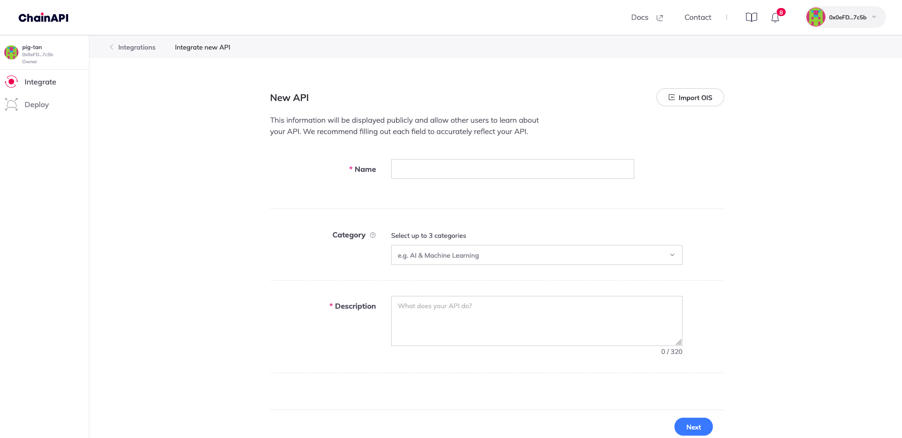
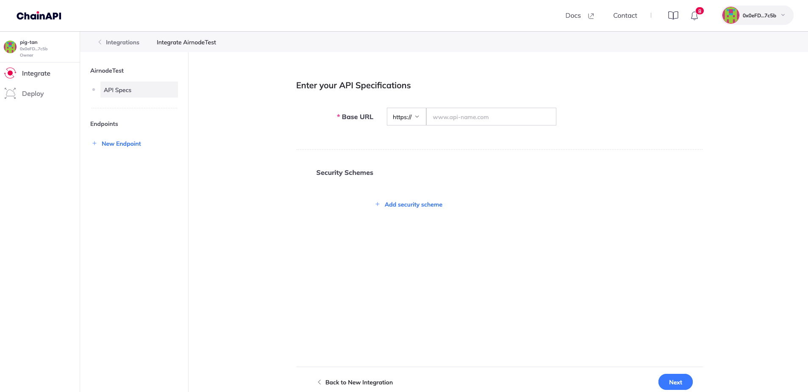
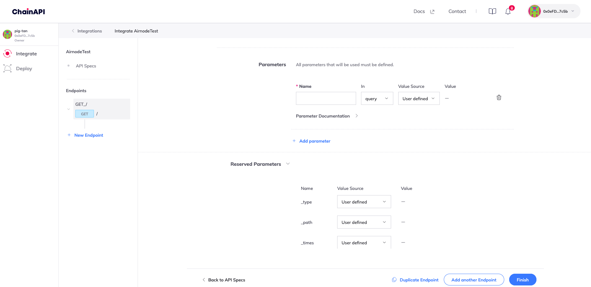

<PageHeader/>

# {{$frontmatter.title}}

[ChainAPI](https://chainapi.com/) is a platform that enables you to integrate
and deploy the open-source
[Airnode](../../../reference/airnode/latest/understand/) with its step-by-step
integration and deployment tools. It helps streamline the Airnode integration
process for API providers.

Using ChainAPI, API providers can configure and deploy an Airnode which links
their API data to several blockchains

ChainAPI can connect almost any API, whether open or authenticated, to Airnode.
Airnode then queries your API operations to be consumed by EVM on-chain dAPPs,
by using the request/response protocol.

## Getting Started

To get started, go to [ChainAPI](https://chainapi.com/) and log in by connecting
your [MetaMask](https://metamask.io/).

> 

You will be prompted to confirm and sign the transaction through your MetaMask
extension.

Make sure you’re using a new MetaMask Wallet with a fresh mnemonic. Your
mnemonic will later be used to deploy the Airnode. You need to keep it extremely
safe as this will serve as the “private key” of your deployed Airnode.

_Each time you return to ChainAPI you will connect again, using MetaMask, to
identify yourself by signing a message for the same account._

> 

Complete the signup process and name your workspace.

Workspaces provides you with a way to invite other users to help or collaborate
with integrations and deployments. This makes it easy to manage your Airnodes as
a team or to outsource the process while still maintaining control over your
integrations and deployments.

>  _To change the name of your workspace in the
> future, click on name on the top-left of the dashboard_

Within ChainAPI you will be able to create and manage your integrations or
Airnode deployments by navigating to the **Integrations** or **Deploy**
dashboards on the left hand navigation panel.

## Integrating your Airnode

To integrate your Airnode, select the **Integrate API** option in the top right
hand of the dashboard.

> 

Enter the details about the API you want to Integrate.

> 

You need to enter the base URL of your API along with all the endpoints that you
want to integrate. If your API requires any security scheme (API Key, Basic HTTP
Auth) you have the option to add that too.

> 

You can now start adding all your endpoints. Start by adding the endpoint name,
its path, the parameters and then the method to call it. You can add as many
endpoints as you want. To add another endpoint, click on the **+ Add another
Endpoint** button.

> 

Now you need to add all the parameters and define where they go
(query/header/path/cookie). You can also decide if you want their values fixed
or not.

[Reserved parameters](../../../reference/ois/latest/reserved-parameters.md)
define what part of the response is to be picked and encoded before fulfillment.
It can be defined by the requester but we can also hardcode it in the Airnode
configuration.

> 

You can also add
[pre and post-processing snippets](../../../reference/ois/latest/processing.md)
for your Airnode.

- [Pre-processing](/reference/ois/latest/specification.html#_5-9-preprocessingspecifications)
  snippets are executed before making the request to the Airnode.
- [Post-processing](/reference/ois/latest/specification.html#_5-10-postprocessingspecifications)
  snippets are executed after receiving the response from the Airnode.

> 

After adding all the required endpoints, you can now press finish and get ready
to deploy your Airnode.

## Deploying your Airnode

To deploy the Airnode, go to the **Deploy** section on the menu. Click on **New
Deployment** to create a deployment.

Name your deployment and select which integration you want to use.

> 

Select your Cloud Provider where you want your Airnode to be deployed.

::: warning

You won’t be able to change these settings again after saving your deployment.
Be advised that the use of this service requires the user to engage third-party
cloud service providers. ChainAPI is not responsible for any charges to the user
by such third-parties

:::

> 

Now select the Chains for your deployment. You can also select multiple networks
and providers if you want it on multiple chains.

You can either use public providers but it is recommended to use multiple
providers. This will ensure that your Airnode is always available and will not
be affected by any downtime of a single provider.

> 

[Authorizer](/reference/airnode/latest/concepts/authorizers.html) contracts
allow you to specify which smart contracts can make requests to your Airnode’s
endpoints.

::: tip Authorizers

When an Airnode receives a request, it can use on-chain authorizer contracts to
verify if a response is warranted. This allows the Airnode to implement a wide
variety of policies and to authorize requester contract access to its underlying
API.

:::

- Public Authorizers will allow any smart contract to make requests to your
  Airnode.
- Restricted Authorizers will only allow smart contract addresses that have been
  granted access to make requests to your Airnode.

[Click here to learn more about Authorizations.](/reference/airnode/latest/concepts/authorizations.html)

> 

Review your configuration for one final time. If everything seems correct, click
on **Next**.

> 

Download all the Airnode configuration files and extract them.

> 

This is what your Airnode configuration files will look like:

> 

**config** contains
[`config.json`](/reference/airnode/latest/deployment-files/config-json.html) and
[`secrets.env`](/reference/airnode/latest/deployment-files/secrets-env.html).

- The `config.json` file is used during the deployment/redeployment of an
  Airnode to configure its behavior and to provide mappings of API operations.

- The `secrets.env` file holds values for `config.json` that must be kept
  secret.

The output directory will have the `receipt.json` that will be generated after
you successfully deploy the Airnode.

The `aws.env`/`gcp.json` files holds your cloud provider credentials for
deployments.

The README.md contains all the steps to deploy the airnode provided in a
markdown format.

Add your Cloud Provider credentials to the `aws.env`/`gcp.json` file.

You need to add your mnemonic to the `secrets.env` file. Make sure you **keep it
extremely safe** as this will serve as the “private key” of your deployed
Airnode. From the mnemonic phrase, Airnode is able to assign wallet addresses to
both the Airnode instance and its users.

You also need to add your Blockchain Provider URL for each network you want to
deploy your Airnode on.

You can also set-up your
[HttpGateway](/reference/airnode/latest/understand/http-gateways.html)
credentials. It’s an optional service that allows authenticated users to make
HTTP requests to your deployed Airnode instance for testing. ChainAPI has
already generated these keys for you but you can change them if you want.

Now you’re ready to deploy your Airnode. Make sure you have
[Docker](https://www.docker.com/) installed on your system.

Copy and paste the commands below to your terminal at the root directory of your
deployment package to deploy your Airnode.

::: code-group

```sh [Windows]
docker run -it --rm ^
      --env-file aws.env ^
      -v "%cd%/config:/app/config" ^
      -v "%cd%/output:/app/output" ^
      api3/airnode-deployer:0.7.3 deploy
```

```sh [OSX]
docker run -it --rm \
      --env-file aws.env \
      -e USER_ID=$(id -u) -e GROUP_ID=$(id -g) \
      -v "$(pwd)/config:/app/config" \
      -v "$(pwd)/output:/app/output" \
      api3/airnode-deployer:0.7.3 deploy
```

```sh [Linux]
docker run -it --rm \
      --env-file aws.env \
      -e USER_ID=$(id -u) -e GROUP_ID=$(id -g) \
      -v "$(pwd)/config:/app/config" \
      -v "$(pwd)/output:/app/output" \
      api3/airnode-deployer:0.7.3 deploy
```

:::

Your Airnode should now be deployed. You can check its status in the deployment
section on ChainAPI.

> 

You are now ready to make requests to your Airnode.
