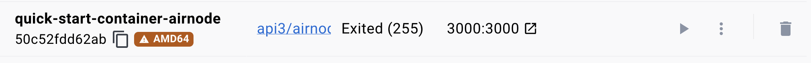
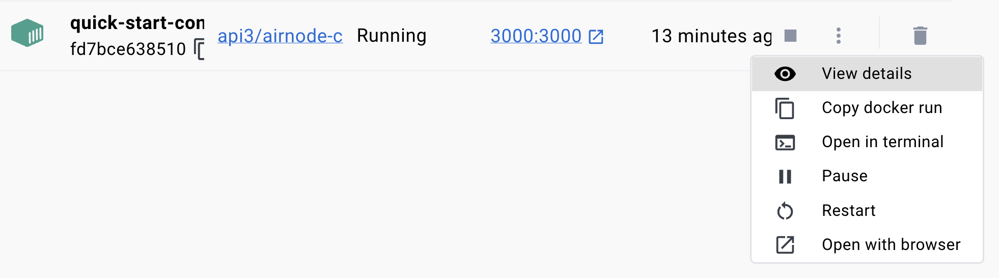

<PageHeader />

<SearchHighlight />

<FlexStartTag />

# {{$frontmatter.title}}

This guide demonstrates Airnode's ability to execute its
[`postProcessingSpecifications`](/reference/ois/latest/processing.md) capability
which runs user defined code during its run cycle. The following describes the
work flow Airnode uses:

1. Run `preProcessingSpecifications`
2. Airnode calls requested OIS endpoint
3. Run `postProcessingSpecifications`
4. Airnode encodes the response values defined by reservedParameters

In this guide you will use `postProcessingSpecifications` to get the average
price of the API3 token and its average market cap for the last seven days. This
will be calculated after calling the CoinGecko operation
`/coins/{coin}/market_chart`.

## 1. Setup a Docker container to run Airnode

A local Docker container running Airnode is needed. Go to the guide
[Deploying Airnode locally using Docker](/guides/airnode/deploy-airnode/deploy-container/index.md)
to set one up. Once the container is running, return to step #2 below.

## 2. Update the `config.json` file

The project that was used for the Airnode deployed in step #1 above contains a
`config.json` file. Rename it to something like `config-org.json` and create a
new blank file named `config.json` in the same project folder. Then copy and
paste the contents of the `config.json` file show below into your newly created
file.

::: details Copy/paste config.json

```json
<!--@include: ./src/config.json-->
```

:::

The newer `config.json` file points to a different API provider operation
(`/coins/{coin}/market_chart`).

```js
"paths": {
  "/coins/{coin}/market_chart": {
    "get": {
      "parameters": [
        ...
      ]
    }
  }
},
```

## 3. Review the `postProcessingSpecifications`

After calling the API provider's operation but before encoding the resulting
values for on-chain use, Airnode will run the post processing code defined in
`postProcessingSpecifications`. During execution of this code, the data from the
API provider operation can be summarized into the values needed.

```js
"preProcessingSpecifications": [],
"postProcessingSpecifications": [
  {
    "environment": "Node",
    "timeoutMs": 5000,
    "value": "   let avg_price = 0;   let avg_market_cap = 0;   input.prices.forEach(el => { avg_price = avg_price + el[1]; });   input.avg_price = (avg_price / 7).toString();   input.market_caps.forEach(el => { avg_market_cap = avg_market_cap + el[1]; });   input.avg_market_cap = (avg_market_cap / 7).toString();   output = input;   "
  }
]
```

Below is a more human readable rendering of the post processing code. The
`input` variable contains the response from the API provider's operation. The
`output` variable must be set before the code exists as Airnode uses it to
encode any values for use on-chain. See more about
[Input and Output](/reference/ois/latest/processing.md#input-and-output) in the
OIS reference.

```js
let avg_price = 0;
let avg_market_cap = 0;
input.prices.forEach((el) => {
  avg_price = avg_price + el[1];
});
input.avg_price = (avg_price / 7).toString();
input.market_caps.forEach((el) => {
  avg_market_cap = avg_market_cap + el[1];
});
input.avg_market_cap = (avg_market_cap / 7).toString();
output = input;
```

## 4. Remove the existing Docker container

The Docker container you created in step #1 must be deleted and a new one
created which uses the newer `config.jon` file. From within the Docker desktop
app find the docker container named **quick-start-container-airnode** and delete
it.



## 5. Redeploy the Docker container

From your project root run the Docker container deploy command. It will use the
newer `config.json` file you have created.

::: code-group

```sh [Mac/WSL2/PowerShell]
docker run \
  --volume "$(pwd):/app/config" \
  --name quick-start-container-airnode \
  --publish 3000:3000 \
  api3/airnode-client:latest
```

```batch [Windows CMD]
docker run ^
  --volume "%cd%:/app/config" ^
  --name quick-start-container-airnode ^
  --publish 3000:3000 ^
  api3/airnode-client:latest
```

```sh [Linux (host networking)]
docker run \
  --volume "$(pwd):/app/config" \
  --name quick-start-container-airnode \
  --network host \
  api3/airnode-client:latest
```

:::

Leave the command active in the terminal window. It will display the log items
from the container. If you wish to close it then use the log monitor from within
the Docker desktop app by selecting **View details** from the container's
**Action** menu.



```sh
% docker run \
  --volume "$(pwd):/app/config" \
  --name quick-start-container-airnode \
  --publish 3000:3000 \
  api3/airnode-client:latest
WARNING: The requested image's platform (linux/amd64) does not match the detected host platform (linux/arm64/v8) and no specific platform was requested
[2023-06-06 21:49:44.565] INFO Gateway "httpSignedDataGateway" not enabled.
[2023-06-06 21:49:44.586] INFO Gateway "oevGateway" not enabled.
[2023-06-06 21:49:44.596] INFO HTTP (testing) gateway listening for request on "http://localhost:3000/http-data/01234567-abcd-abcd-abcd-012345678abc/:endpointId"
[2023-06-06 21:49:44.607] INFO API gateway server running on "http://localhost:3000"

```

## 6. Call the Airnode endpoint

Use CURL and call the Airnode endpoint that gets the market data from the
CoinGecko operation `/coins/{coin}/market_chart`. The CURL command will call the
httpGateway exposed by the Airnode. This avoids the need to use a smart contract
to get the response. The
[httpGateway](/reference/airnode/latest/understand/http-gateways.md) is a
testing tool not normally enabled on production systems.

```sh
# For Windows CMD replace line termination marker \ with ^
curl -X POST \
  -d '{"parameters":{"air_coin":"api3","air_vs_currency":"usd"}}' \
  -H 'Content-Type: application/json' \
  'http://localhost:3000/http-data/01234567-abcd-abcd-abcd-012345678abc/0x2de6e288ed16965b68a62d4b2a747b094b3c857941285e625bed3a7be31445e4' | json_pp

# response
{
   "encodedValue" : "0x00000000000000000000000000000000000000000000000000000000001309ed00000000000000000000000000000000000000000000000000000000065b158a",
   "rawValue" : {
      "avg_market_cap" : "106632586.97711395",
      "avg_price" : "1.2477250309068642",
      "market_caps" : [
         [
            1685577600000,
            105212548.064737
         ],
         ...
      ],
      "prices" : [
         [
            1685577600000,
            1.23324995186942
         ],
         ...
      ],
      "total_volumes" : [
         [
            1685577600000,
            3074677.52645394
         ],
         ...
         ]
      ]
   },
   "values" : [
      "1247725",
      "106632586"
   ]
}
```

The data retrieved from the API provider CoinGecko (`market_caps`, `prices`, and
`total_volumes` ) was added to the `rawValue` field. Then the `rawValue` (as the
`input` variable) was "piped" through the `postProcessingSpecifications` user
defined code which in turn calculated the price and market cap averages which
were added back into `rawValue` via the `output` variable.

- `"avg_price" : "1.2477250309068642"`
- `"avg_market_cap" : "106632586.97711395"`

After the `postProcessingSpecifications` user defined code exited Airnode used
the mappings of the `reservedParameters` field in the `config.json` file to
determine what data should go into the `values` field. Airnode then encoded the
values into the `encodedValue` field suitable for use on-chain.

## 7. Verify `encodedValue`

Verify that `encodedValue` actually contains the two numbers in the `values`
field. Copy and paste the `encodedValue` string you received after executing the
Airnode endpoint into the form below and select the **Decode** button.

<EthersAbiCoder types="int256,int256"/>

<FlexEndTag />
