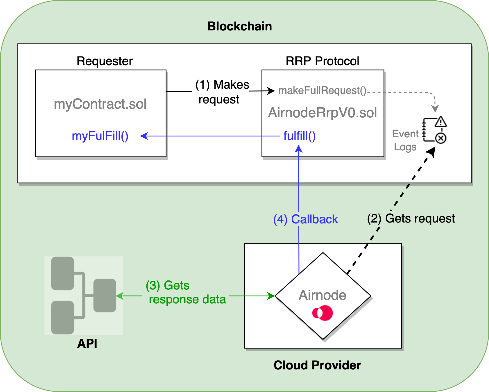

<PageHeader/>

<SearchHighlight/>

<FlexStartTag/>

# {{$frontmatter.title}}

This guide steps through the process of making a direct request of an Airnode
using RRP (request-response protocol) to get data from an API provider. Another
example of a guide that explains how to use the RRP is the
[QRNG > Remix Example](/guides/qrng/remix-example/index.md).

::: warning Consider dAPIs

While using the Airnode's RRP protocol to acquire API provider data is usable it
is not as efficient or as straight forward as using a dAPI. Therefore, best
practices usually entail using a [dAPI](/explore/dapis/what-are-dapis.md) to
acquire API provider data.

:::

## How the RRP protocol works

An Airnode is a first-party oracle that can push off-chain API data to on-chain
smart contracts, known as a requester, using RRP. A requester is a contract that
can trigger an Airnode request. To do so, the requester needs to be sponsored
and make the request using a matching sponsor wallet. See
[Requesters and Sponsors](/reference/airnode/latest/concepts/requesters-sponsors.md)
on how to sponsor a requester and derive the sponsor wallet.

In the diagram below a requester makes a request to the on-chain RRP protocol
contract (AirnodeRrpV0.sol) that adds the request to its event logs. During its
run cycle the off-chain Airnode accesses the event logs, gets the requested data
from the the API provider, then performs a callback to the requester.

In summary, you only need to do two things.

- Call `makeFullRequest()` or `makeTemplateRequest()` on the AirnodeRrpV0.sol
  contract, which returns a
  [requestId](/reference/airnode/latest/concepts/request.md#requestid).
- Add a `myFulfill()` function (call it what you like) to your requester (your
  smart contract) where the off-chain Airnode can send the requested data when
  ready. The data includes the same `requestId` as the one returned at the time
  of making the request.

> 
>
> 1.  <p>The requester (myContract.sol) makes a request to the RRP protocol contract (AirnodeRrpV0.sol) by calling <code>makeFullRequest()</code> which adds the request to the event logs and returns a <code>requestId</code> to the requester.</p>
> 2.  <p>Airnode retrieves the on-chain request from the event logs during its run cycle.</p>
> 3.  <p>Airnode gathers response data from the API specified in the request.</p>
> 4.  <p>Airnode performs a callback to a named function <code>myFulfill()</code> in myContract.sol via the AirnodeRrpV0.sol function <code>fulfill()</code> with the requested data and the <code>requestId</code>.</p>

For a more detailed diagram see the first image in the
[Airnode: concepts and definitions](/reference/airnode/latest/concepts/airnode.md#airnode-processes-rrp-requests)
doc.

The following section of this document discusses the requester implementation,
its deployment and sponsoring.

## 1. Inherit RrpRequesterV0.sol

A requester inherits from the
[RrpRequesterV0.sol<ExternalLinkImage/>](https://github.com/api3dao/airnode/blob/v0.9/packages/airnode-protocol/contracts/rrp/requesters/RrpRequesterV0.sol)
contract. This will expose the AirnodeRrpV0.sol protocol contract to the
requester allowing it to make Airnode requests.

```solidity
import "@api3/airnode-protocol/contracts/rrp/requesters/RrpRequesterV0.sol";

contract MyRequester is V0 {
  ...
  constructor (address airnodeRrpAddress)
      public
      RrpRequesterV0(airnodeRrpAddress)
  {}
  ...
}
```

Note the constructor parameter `airnodeRrpAddress`, which is the public address
of the AirnodeRrpV0.sol protocol contract on the blockchain you wish to use. It
is used by RrpRequesterV0.sol to point itself to AirnodeRrpV0.sol. See the list
of all [Airnode contract addresses](/reference/airnode/latest/) in the reference
section.

## 2. Implement the request logic

There are two types of requests provided by the AirnodeRrpV0.sol contract. See
the concepts and definitions
[Request](/reference/airnode/latest/concepts/request.md) page for information
related to each request type.

This example uses a
[full request](/reference/airnode/latest/concepts/request.md#full-request) type
(note the `airnodeRrp.makeFullRequest()` function call in the code below) which
is called from the requester's own function `callTheAirnode()`. The function
`makeFullRequest()` requires that the requester pass all parameters needed by
Airnode to call its underlying API.

Once the request has been made to `airnodeRrp.makeFullRequest()`, the
AirnodeRrpV0.sol contract returns a `requestId` confirming the request has been
accepted and is in process of being executed. Your requester would most likely
wish to track all `requestId`s. Note the line
`incomingFulfillments[requestId] = true;` in the code below that stores the
`requestId`s in a mapping. This is useful when the Airnode responds to the
requester later at the function (`airnodeCallback()`) with the `requestId` and
the `data` requested.

```solidity
import "@api3/airnode-protocol/contracts/rrp/requesters/RrpRequesterV0.sol";

contract MyRequester is RrpRequesterV0 {
  mapping(bytes32 => bool) public incomingFulfillments;
  mapping(bytes32 => int256) public fulfilledData;

  constructor (address airnodeRrpAddress)
      public
      RrpRequesterV0(airnodeRrpAddress)
  {}

  function callTheAirnode(
      address airnode,
      bytes32 endpointId,
      address sponsor,
      address sponsorWallet,
      bytes calldata parameters // Inbound API parameters which may already be ABI encoded
      )
      external
  {
      /// Make the Airnode request
      bytes32 requestId = airnodeRrp.makeFullRequest(
          airnode,                        // airnode
          endpointId,                     // endpointId
          sponsor,                        // sponsor's address
          sponsorWallet,                  // sponsorWallet
          address(this),                  // fulfillAddress
          this.airnodeCallback.selector,  // fulfillFunctionId
          parameters                      // API parameters
          );
      incomingFulfillments[requestId] = true;
  }

  /// The AirnodeRrpV0.sol protocol contract will callback here.
  function airnodeCallback(
      bytes32 requestId,
      bytes calldata data
  {
      ...
  }
}
```

### Request Parameters

A full request using the AirnodeRrpV0.sol contract `makeFullRequest()` function
requires all parameters needed by the Airnode application to be passed at
runtime. This is in contrast to a template request that would use a template for
some or all of the required parameters. Learn more about using templates in the
[Using RRP Templates](/guides/airnode/using-rrp-templates.md) guide.

Since the requester's `callTheAirnode()` function makes a
[full request](/reference/airnode/latest/concepts/request.md#full-request), it
must gather the following parameters to pass on to
`airnodeRrp.makeFullRequest()`.

- **airnode** and **endpointId**: As a pair, these uniquely identify the
  endpoint desired at a particular Airnode.

- **sponsor**: The
  [sponsor](/reference/airnode/latest/concepts/requesters-sponsors.md#what-is-a-sponsor)
  address.

- **sponsorWallet**: The
  [sponsor wallet](/reference/airnode/latest/concepts/requesters-sponsors.md#how-to-derive-a-sponsor-wallet)
  address that the sponsor received when deriving the wallet for the Airnode
  being called.

- **fulfillAddress** and **fulfillFunctionId**: The public address of your
  requester contract and its function that is called upon the return of the
  request.

- **parameters**: Specify the API parameters and any
  [reserved parameters](/reference/airnode/latest/specifications/reserved-parameters.md)
  which must be encoded. See
  [Airnode ABI specifications](/reference/airnode/latest/specifications/airnode-abi.md)
  for how these are encoded.

  In most, cases the parameters are encoded off-chain and passed to the
  requester which only forwards them. You can use the
  [@api3/airnode-abi](/reference/airnode/latest/packages/airnode-abi.md) package
  to perform the encoding and decoding. Take a look at the JavaScript snippet
  below.

  ```javascript
  // JavaScript snippet

  import { encode } from '@api3/airnode-abi';

  const parameters = [
    { type: 'string32', name: 'coin', value: 'ETH' },
    { type: 'string32', name: 'apiKey', value: 'UHHS7SRGC975E' },
  ];
  const encodedData = encode(parameters);

  console.log(encodedData);
  // '0x...'
  ```

  However, this is not a hard requirement and you can encode the parameters
  on-chain as well. Take a look at the Solidity snippet below.

  ```solidity
  // Solidity snippet

  abi.encode(
    string32("1SS"),
    string32("period"), "30d",
    string32("symbols"), "btc,eth,matic,link,uni,sushi,aave,chz,theta,rsr,grt,enj,ocean,kacy"
  )
  ```

For additional information on request parameters when calling
`airnodeRrp.makeFullRequest()`, see
[Request Parameters](/reference/airnode/latest/concepts/request.md#request-parameters)
in the Reference section.

## 3. Capture the Response

As soon as the Airnode gathers a request, from the event log of the on-chain
contract `AirnodeRrpV0.sol`, it gets the data from the API provider, encodes it,
and starts an on-chain transaction responding to the request. The Airnode calls
the `AirnodeRrpV0.sol` contract function `fulfill()`, which in turn calls the
requester at `airnodeCallback()`. For the purposes of the callback, recall the
request supplied the request contract address and the desired callback function
which the AirnodeRrpV0.sol protocol contract stored with the `requestId`.

```solidity
import "@api3/airnode-protocol/contracts/rrp/requesters/RrpRequesterV0.sol";

contract MyRequester is RrpRequester {
    mapping(bytes32 => bool) public incomingFulfillments;
    mapping(bytes32 => int256) public fulfilledData;

    constructor (address airnodeRrpAddress)
        public
        RrpRequesterV0(airnodeRrpAddress)
    {}

    function callTheAirnode(
        ...
    }

    /// The AirnodeRrpV0.sol protocol contract will callback here.
    function airnodeCallback(
        bytes32 requestId,
        bytes calldata data
        )
        external
        onlyAirnodeRrp
    {
        require(incomingFulfillments[requestId], "No such request made");
        delete incomingFulfillments[requestId];
        int256 decodedData = abi.decode(data, (int256));
        fulfilledData[requestId] = decodedData;
    }
}
```

### Response Parameters

The callback to a requester contains two parameters, as shown in the
`airnodeCallback()` function in the code sample above.

- **requestId**: First acquired when making the request and passed here as a
  reference to identify the request for which the response is intended.
- **data**: In case of a successful response, this is the requested data which
  has been encoded and contains a
  [timestamp](/reference/ois/latest/reserved-parameters.md#timestamp-encoded-to-uint256-on-chain)
  in addition to other response data. Decode it using the function `decode()`
  from the `abi` object.

## 4. Deploy and Sponsor the Requester

Deploy the requester to the desired blockchain and then sponsor the requester.
See
[Requesters and Sponsors](/reference/airnode/latest/concepts/requesters-sponsors.md#how-to-sponsor-a-requester)
to learn more about sponsoring a requester.

<FlexEndTag/>
