<PageHeader/>

<SearchHighlight/>

<FlexStartTag/>

# {{$frontmatter.title}}

## Introduction

[Airnode](/reference/airnode/latest/concepts/airnode.md) is a first-party oracle
node deployed and operated by the API provider to provide any data from their
REST API on-chain. It is a lightweight, serverless, and cost-efficient oracle
node that can be deployed in minutes.

This guide will walk you through the steps to set up an Airnode with your own
REST API.

## ChainAPI

[ChainAPI](https://chainapi.com/) is a platform that enables you to integrate
and deploy the open-source [Airnode](/reference/airnode/latest/understand/) with
its step-by-step integration and deployment tools. It helps streamline the
Airnode integration process for API providers.

Using ChainAPI, API providers can configure and deploy an Airnode which allows
them to provide their API data to multiple chains.

ChainAPI can connect almost any API, whether open or authenticated, to Airnode.
Airnode then queries your API operations to be consumed by EVM on-chain dApps,
by using the [Request-Response Protocol](/reference/airnode/latest/concepts/).

To get started, go to [ChainAPI](https://chainapi.com/) and login using
[MetaMask](https://metamask.io/).

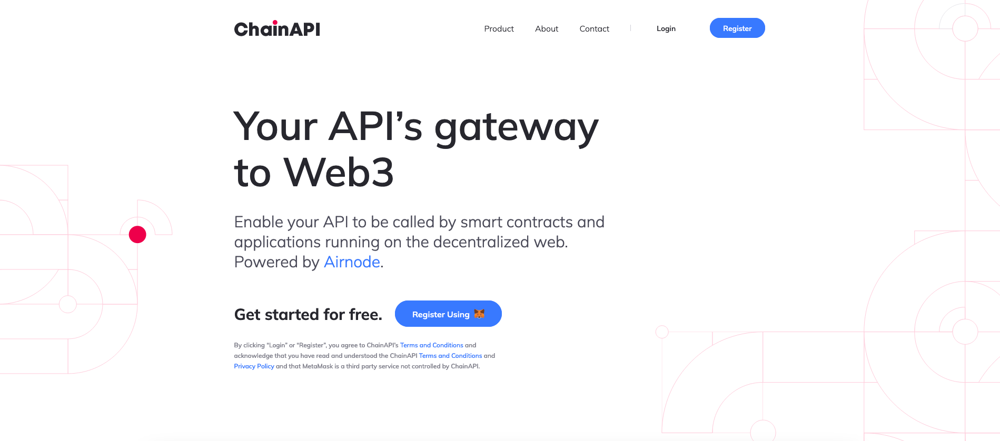

Sign in with your MetaMask account. If you don't have a MetaMask account, you
can create one by following the instructions
[here](https://metamask.io/download/).

After registering, you will be redirected to the ChainAPI dashboard.

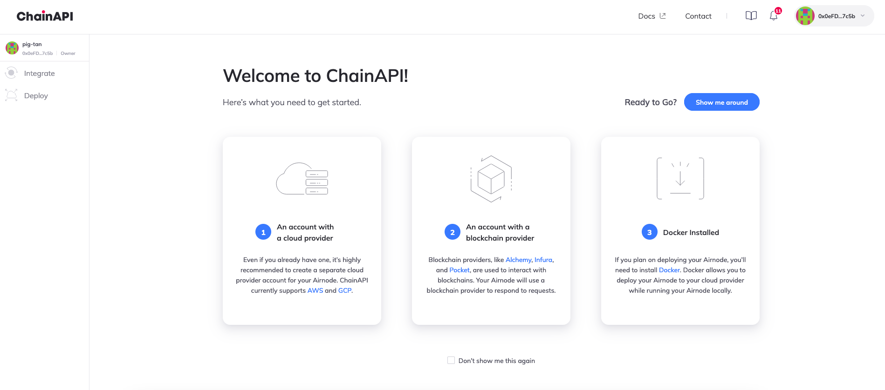

## Creating a New Integration

To create a new integration, click on the **Integrate** button on the top left
corner of the dashboard and select **Integrate API**.

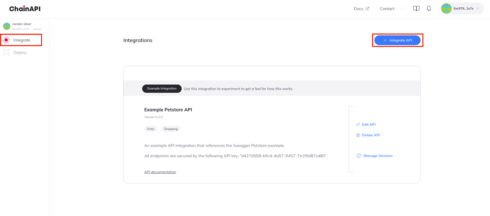

Enter your API name, select the category and description and click on
**Create**.

Enter the base URL for your API and click on **Next**. You can also add in
support for security schemes like API keys or an HTTP bearer token by clicking
on **Add Security Scheme**.

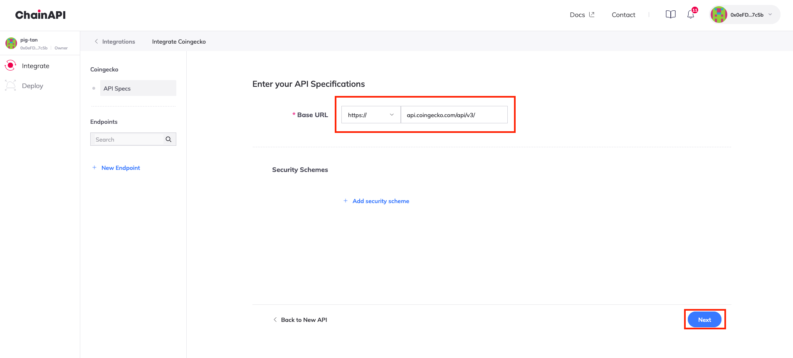

You will now be redirected to the next step where you can add your API
endpoints. For each endpoint you want to add, click on **Add Endpoint** and
enter the endpoint name, path, method, and description.

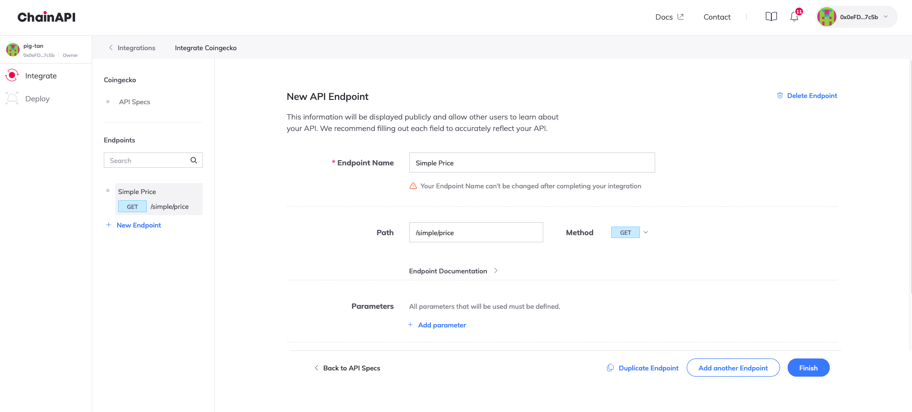

You can now add all the parameters for your endpoint. Click on **Add parameter**
and enter the parameter name and type(query/header/path/cookie). You can also
define the parameter as a user-defined or a fixed value. You can add multiple
parameters for each endpoint by clicking on **Add parameter**.

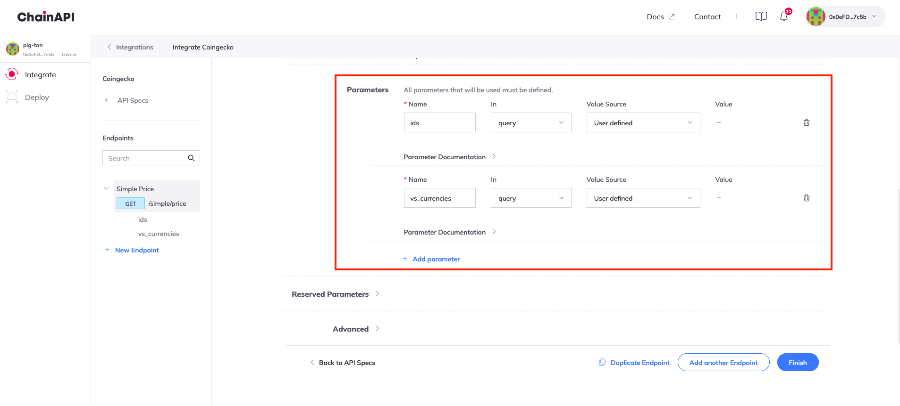

[Reserved parameters](/reference/ois/latest/reserved-parameters) define what
part of the response is to be picked and encoded before fulfillment. It can be
defined by the requester or can also be hardcoded in the Airnode configuration.
To hardcode the reserved parameters, click on **Reserved Parameters** to define
the parameter's `_name`, `_path` and `_times`.

[Pre/Post Processing](/reference/ois/latest/processing) allows you to specify
snippets of Javascript code to be run before or after a request is made to your
Airnode. Click on **Advanced** and select **Add Pre-processing** or **Add
Post-processing** to add your snippets.

- Pre-processing snippets are executed before making the request to the Airnode.
- Post-processing snippets are executed after receiving the response from the
  Airnode.

To read more about pre and post-processing, click
[here](/reference/ois/latest/processing).

After adding all the required endpoints and parameters, click on **Finish**.

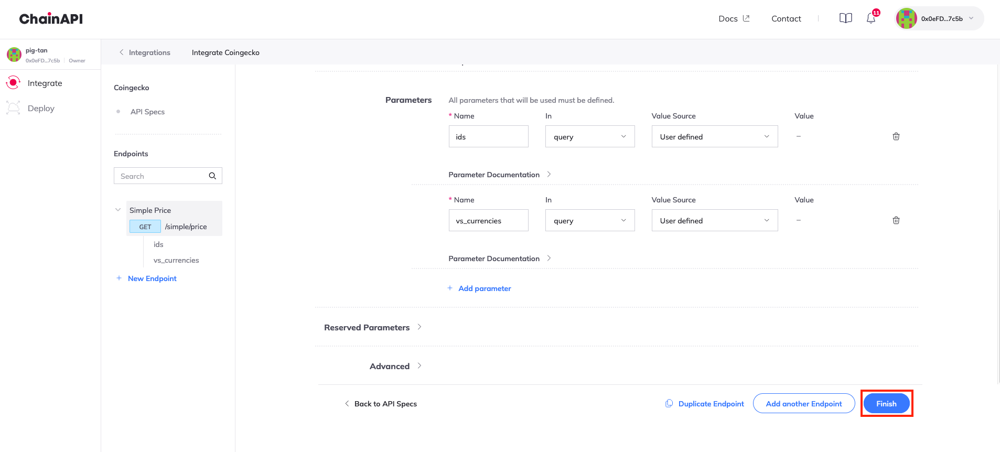

## Setting up a Deployment

To set up a new deployment for your Airnode, click on the **Deploy** button on
the top left corner of the dashboard and select **New Deployment**.

Enter your deployment name and select the integration you would want to use with
the deployment. Click on **Next**.

Select the cloud provider you would want to use for your deployment. You can
choose between AWS or GCP. Choose the region and the Airnode version and click
on **Next**.

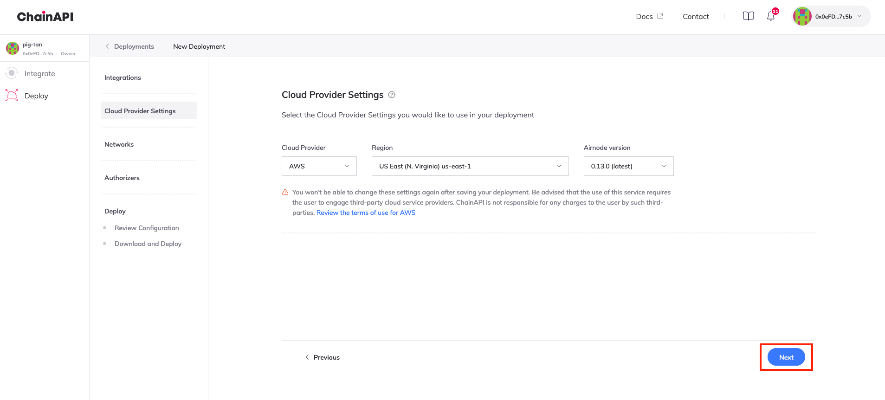

Select the chains you would want to use your Airnode on. You can choose any of
the supported chains (Mainnets/Testnets) with up to 10 custom providers for each
chain. Click on **Next** after selecting the chains and the number of providers.

[Authorizer](/reference/airnode/latest/concepts/authorizers) contracts allow you
to specify which smart contracts can make requests to your Airnode’s endpoints.

When an Airnode receives a request, it can use on-chain authorizer contracts to
verify if a response is warranted. This allows the Airnode to implement a wide
variety of policies and to authorize requester contract access to its underlying
API.

- Public Authorizers will allow any smart contract to make requests to your
  Airnode.
- Restricted Authorizers will only allow smart contract addresses that have been
  granted access to make requests to your Airnode.

To read more about authorizers, click
[here](/reference/airnode/latest/concepts/authorizers).

For basic deployments, you can keep the authorizer as **Public**. Click on
**Next**.

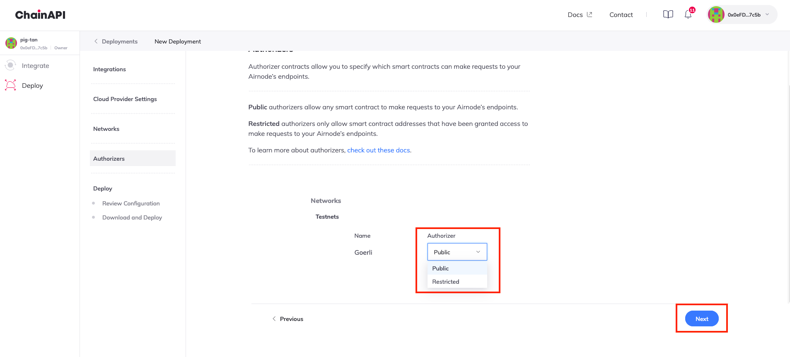

Review your configuration for the final time and click on **Next**.

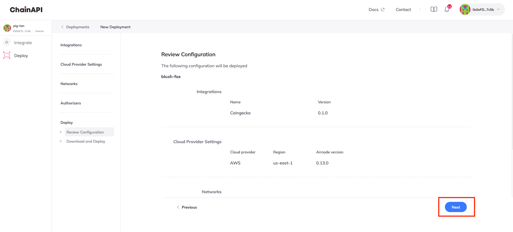

You will now be redirected to download the configuration files for your Airnode.
Click on **Download Files** to download the configuration file.

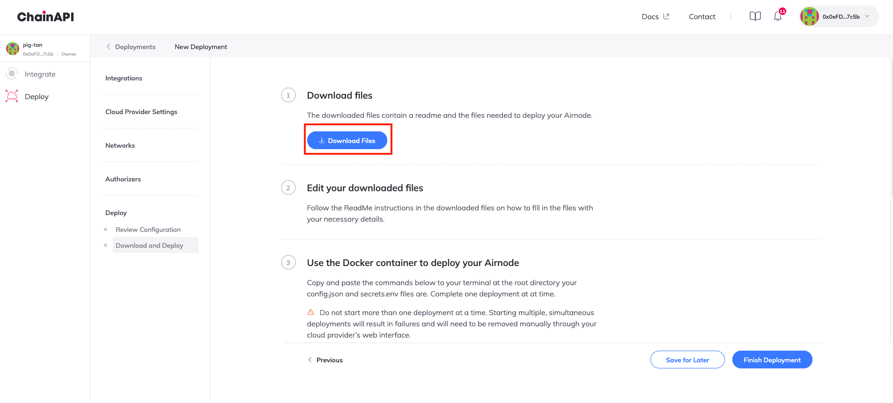

You can now deploy your Airnode using the configuration file. You can either
refer to the steps on-screen or follow the deployment guide
[here](/guides/airnode/deploy-airnode/deploy-aws/).

Once you are done deploying your Airnode, you can click on **Finish Deployment**
to view your deployment status.
