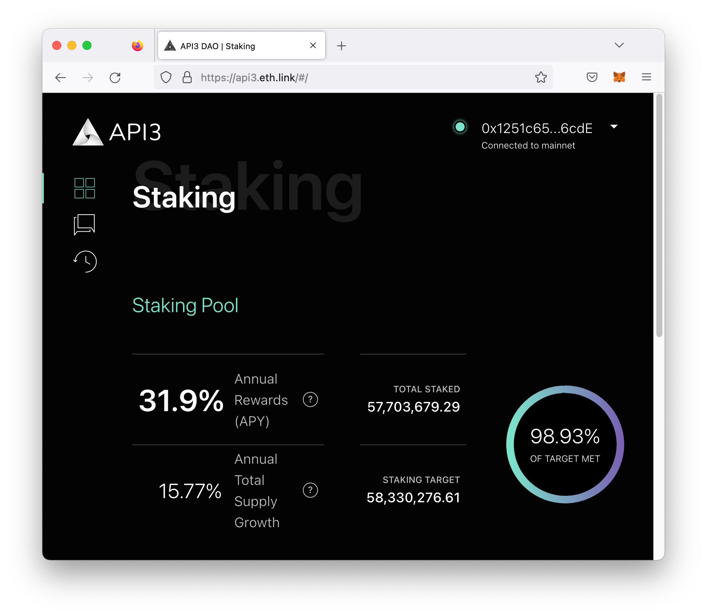

<PageHeader/>

<SearchHighlight/>

<FlexStartTag/>

# {{$frontmatter.title}}

The [DAO Dashboard](https://dao.api3.org) is the portal to participate in the
API3 DAO. It is aimed at API3 members and others that want to understand how to
interact with the DAO or modify/reuse any of its infrastructure.

## Preparing to use the Dashboard

The guides for DAO Members to use the dashboard require a digital wallet such as
[MetaMask](https://metamask.io/download/) to be integrated with your browser.

1. Access the [DAO Dashboard](https://dao.api3.org) on **Mainnet**.

2. Install a digital wallet (such as [MetaMask](https://metamask.io/download/))
   for your preferred browser.

3. Connect your wallet by clicking the **Connect Wallet** button in the upper
   right hand corner. Select your wallet from the popup. Be sure your wallet is
   connected to the mainnet for production use.

Once loaded, the dashboard will default to the staking view. On the left is the
annual percentage yield which is the return on investment after one year. Below
that is annual total supply growth. Rewards are updated weekly based on the
percentage of the staking target met, which is calculated by the staked amount
divided by the staking target.

At the bottom of the page there are two sections, **Balance and Staking**. The
balance section allows you to deposit and withdraw your tokens while the staking
section allows you to stake and unstake your tokens.

## The DAO Dashboard Guides

The DAO dashboard has three views as seen in the navigation menu in the upper
left hand corner ( Staking, Governance, and History). Visit the following guides
and learn more about the dashboard functionality.

- [Staking Tokens](/guides/dao-members/staking.md) - Stake API3 tokens into the
  DAO pool to gain governance rights (proposals and voting) and earn rewards.
- [Working with Proposals](/guides/dao-members/proposals.md) - View and create
  proposals.
- [How to Vote](/guides/dao-members/voting.md) - Vote on proposals directly or
  through delegation.

<FlexEndTag/>
