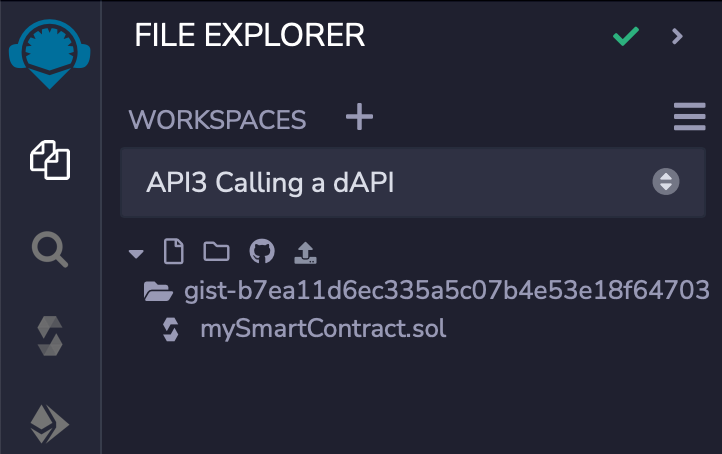
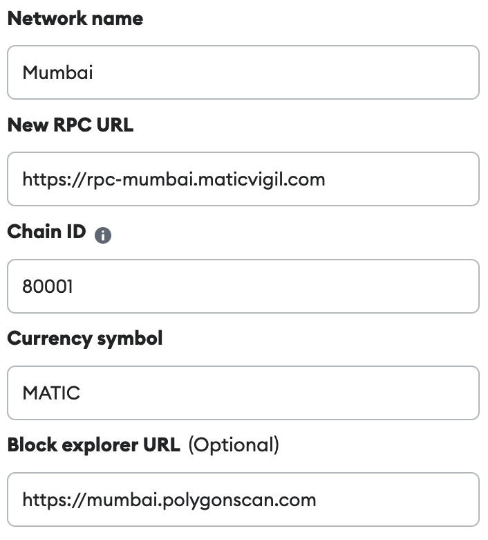
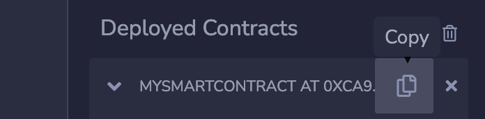
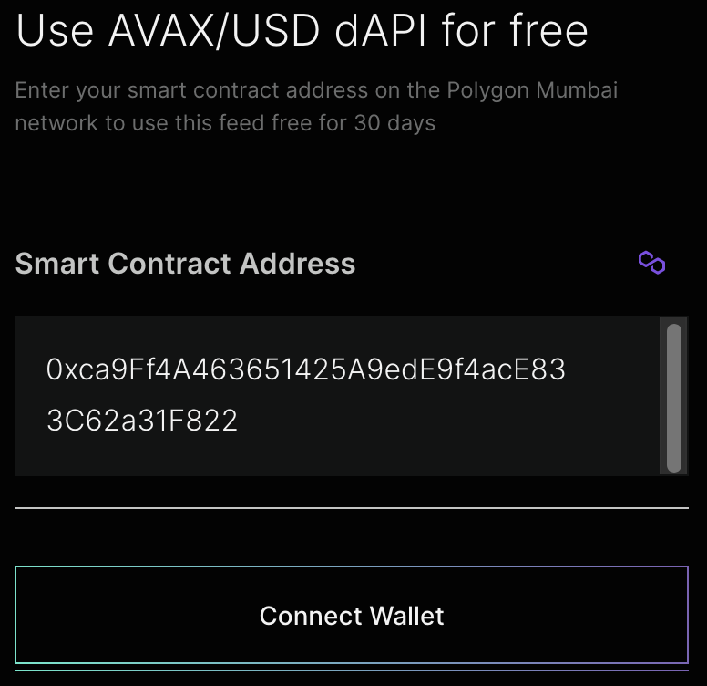
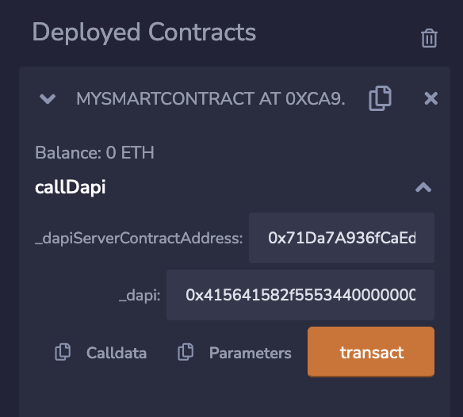
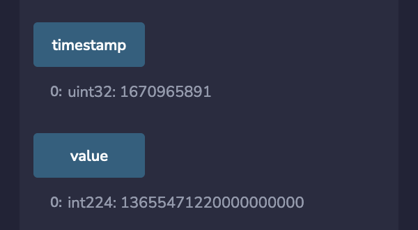

<PageHeader/>

<SearchHighlight/>

# {{$frontmatter.title}}

This guide will create a simple smart contract in the Remix IDE derived from a
[GitHub gist](https://gist.github.com/wkande/b7ea11d6ec335a5c07b4e53e18f64703).
You will deploy this contract onto the Polygon Mumbai testnet.  
The contract will import the `DapServer.sol` contract and use one of its
functions to call a dAPI.

::: tip

The preferred method of calling a dAPI is to use a proxy acquired from the
[API3 Market](https://market.api3.org/dapis). Please take a look at the
[Call dAPI (proxy)](./../call-dapi-proxy/index.md) guide.

:::

## 1. Load the Remix workspace

[Click here](https://remix.ethereum.org/#version=soljson-v0.8.9+commit.e5eed63a.js&optimize=false&runs=200&gist=b7ea11d6ec335a5c07b4e53e18f64703)
to open Remix pre-loaded with a workspace and a single smart contract called
`mySmartContract.sol` pulled from a gist on GitHub.

Optionally consider renaming the Remix workspace (now called gist-sample) to
**Call a dAPI (DapiServer)** using the hamburger menu. This will separate this
guide from other guides provided in these docs.

## 2. Understanding the smart contract

In Remix click on the contract named `mySmartContract.sol` to view its source
code. This smart contract imports `DapiServer.sol` and uses the function
`readDataFeedWithDapiName(_dapi)` which populates the contract variables `value`
and `timestamp`. This function is one of
[four functions](/reference/dapis/functions/read-data-feed-with-dapi-name.html)
available to call a dAPI.

## 3. Compile the contract

Select the **SOLIDITY COMPILER** pane and compile `mySmartContract.sol`. Note
the version of the compiler matches the contract's declaration.

::: tip

If the compile button refuses to show the contract name, switch to another
workspace and back again. Remix sometimes has an issue after renaming a
workspace.

:::

## 4. MetaMask and Mumbai

The dAPI used for this guide is **AVAX/USD** on the Polygon Mumbai testnet. You
will be deploying the smart contract `mySmartContract.sol` onto Mumbai. If you
do not have Mumbai setup in MetaMask use the MetaMask criteria below to add
Mumbai to MetaMask.

::: details Expand to view: MetaMask criteria for Mumbai.

:::

If you need additional help connecting MetaMask to the Mumbai testnet
[check this guide](https://medium.com/stakingbits/how-to-connect-polygon-mumbai-testnet-to-metamask-fc3487a3871f).

Be sure MetaMask is set to an account you wish to use. Use this
[faucet](https://faucet.polygon.technology/) to acquire test MATIC for Mumbai.

## 5. Deploy `mySmartContract.sol`

Select the **DEPLOY & RUN TRANSACTIONS** pane. Set **ENVIRONMENT** to "Injected
Provider - MetaMask" which should show "Custom (80001) network" below if you
have MetaMask set properly. Lastly select the **Deploy** button and follow
through with the MetaMask integration to deploy the smart contract onto Mumbai.

     
Use the Deploy button and deploy the contract onto Polygon Mumbai.
      
      

     
After deployment the contract will appear under      <b>Deployed Contracts</b>.
      
    

::: warning Remix Reload Contract

If you close the Remix IDE or change workspaces, Remix will lose track of any
deployed contracts. The [Remix Reload Contract](./../remix-reload-contract.md)
guide will step you through the process to reload a deployed contract in order
to interact with it again.

:::

## 6. Permissions

Because you are calling a dAPI on a testnet, a subscription for the dAPI
**AVAX/USD** on Mumbai is not needed. However you will need to get permission
for your smart contract to call the dAPI.

Copy the address of the smart contract. Select copy icon to the right of the
contract name, `mySmartContract.sol`.

Go to the API3 Market page for
[AVAX/USD on Mumbai](https://market.api3.org/dapis/polygon-testnet/AVAX-USD).
Enter the contract address into the permissions widget to the right side of the
page.

Select the **Connect Wallet** button to activate MetaMask. Once activated select
the **Get Access** button to interact with MetaMask and facilitate the
transaction. Your contract `mySmartContract.sol` now has permission to call the
AVAX/USD dAPI.

## 7. Call `mySmartContract` function `callDapi()`

Next call the function `callDapi()` on your newly deployed smart contract. It
will require two parameters.

- **\_dapiServerContractAddress:
  `0x71Da7A936fCaEd1Ee364Df106B12deF6D1Bf1f14`**<CopyIcon text="0x71Da7A936fCaEd1Ee364Df106B12deF6D1Bf1f14"/>
   The contract address for the `Dapiserver.sol` contract on Mumbai. It and
  other network addresses for `Dapiserver.sol` can be found on the
  [Chains and Contracts](/reference/dapis/chains.md) page in the reference
  section.
- **\_dapi:
  `0x415641582f555344000000000000000000000000000000000000000000000000`**<CopyIcon text="0x415641582f555344000000000000000000000000000000000000000000000000"/>
   A bytes32 representation of AVAX/USD. Use
  `utils.formatBytes32String("AVAX/USD");` to get this encoded value. Try it in
  the [ethers playground](https://playground.ethers.org/).

Add the two parameters and select the **transact** button to interact with
MetaMask and complete the transaction. Once the transaction is completed the
smart contract's variables `timestamp` and `value` have been populated.

## 8. View `timestamp` and `value`

After the call to `callDapi()` is complete, the `timestamp` and `value` contract
variables hold the results until the function is called again in which case
these variables would be updated.

Select both the **timestamp** and **value** buttons to retrieve their current
state.

  

Compare the `value` with the value displayed on the
[API3 Market for AVAX/USD](https://market.api3.org/dapis/polygon-testnet/AVAX-USD)
on Mumbai.

