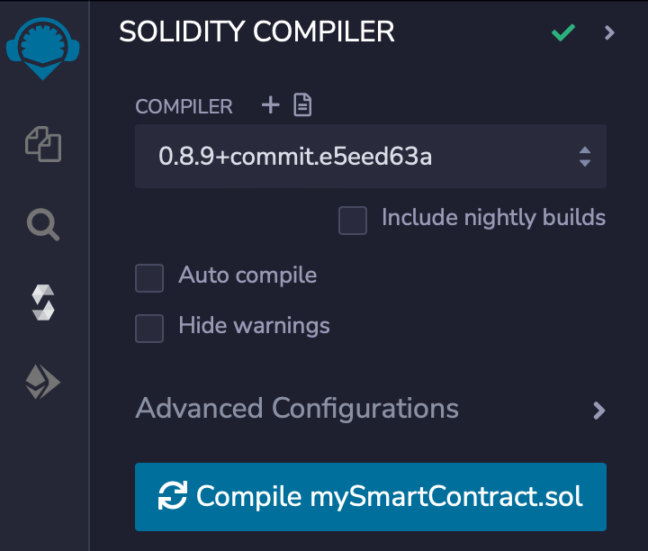
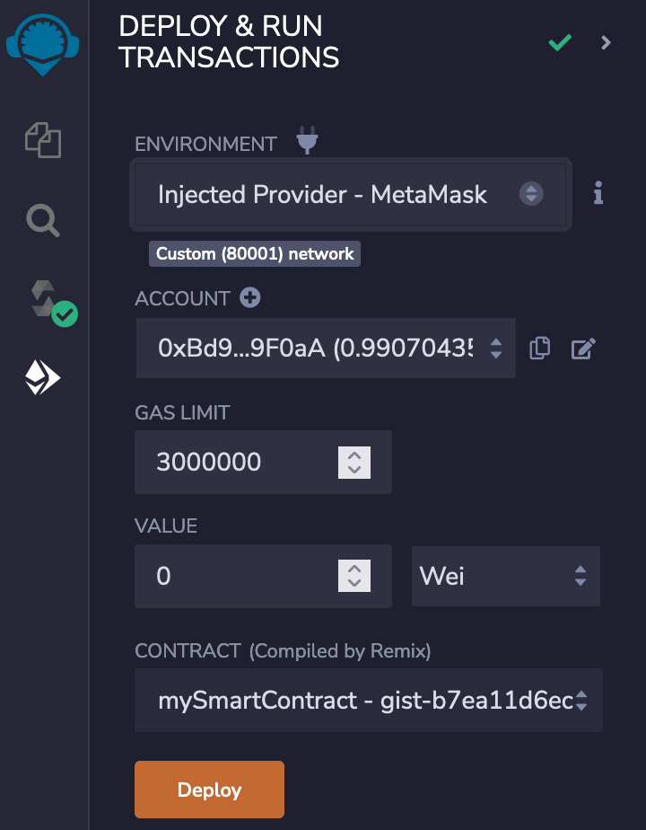
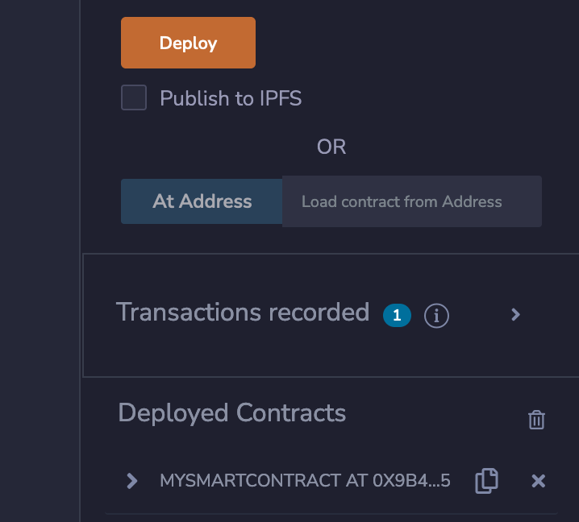

<PageHeader/>

<SearchHighlight/>

# {{$frontmatter.title}}

This guide will use a simple workspace in the Remix IDE created from a GitHub
gist. You will deploy a simple smart contract onto the Goerli network that calls
a dAPI.

## 1. Load the Remix workspace

[Click here](https://remix.ethereum.org/#version=soljson-v0.8.9+commit.e5eed63a.js&optimize=false&runs=200&gist=b7ea11d6ec335a5c07b4e53e18f64703)
to open Remix pre-loaded with a workspace and a single smart contract called
`mySmartContract.sol` pulled from a gist on GitHub.

Optionally consider renaming the Remix workspace (now called "gist-sample") to
"API3 Calling a dAPI" using the hamburger menu. This will separate this guide
from other guides provided in these docs.


## 2. Understanding the smart contract

In Remix click on the contract named `mySmartContract.sol` to view its source
code. This smart contract imports `DapiServer.sol` and uses its function
`readDataFeedWithDapiName(_dapiName)` which returns a value and timestamp. This
function is one of four functions available to call a dAPI. These functions are
[explained](/reference/dapis/functions/read-data-feed-with-dapi-name.html) in
the reference section under dAPIs.

::: details Expand to view: `mySmartContract.sol`

```solidity
// SPDX-License-Identifier: MIT
pragma solidity 0.8.9;

import "@api3/airnode-protocol-v1/contracts/dapis/interfaces/IDapiServer.sol";
contract mySmartContract {

int224 private value;
uint32 private timestamp;

    function callDapi(
        address _dapiServerContractAddress,
        bytes32 _dapiName
    )  external {

        // Call the DapiServer contract for the value and timestamp of AVAX/USD on Polygon Mumbai.
        // _dapiServerContractAddress: DapiServer contract address - 0x71Da7A936fCaEd1Ee364Df106B12deF6D1Bf1f14
        // _dapiName: AVAX/USD - 0x415641582f555344000000000000000000000000000000000000000000000000
        (value, timestamp) =
            IDapiServer(_dapiServerContractAddress).readDataFeedWithDapiName(_dapiName);
    }
}
```

:::

## 3. Compile the contract

Select the **SOLIDITY COMPILER** pane and compile `mySmartContract.sol`. Note
the version of the compiler matches the contract's declaration.



## 4. MetaMask and Mumbai

The dAPI used for this guide is **AVAX/USD** on the Polygon Mumbai testnet. You
will be deploying the smart contract `mySmartContract.sol` onto Mumbai. If you
do not have Mumbai setup in MetaMask use the MetaMask criteria below to add
Mumbai to MetaMask.

::: details Expand to view MetaMask criteria.


:::

If you need additional help connecting MetaMask to the Mumbai network
[check this guide](https://medium.com/stakingbits/how-to-connect-polygon-mumbai-testnet-to-metamask-fc3487a3871f).

::: tip MATIC Faucet

Use this [faucet](https://faucet.polygon.technology/) to acquire test MATIC for
Mumbai.

:::

## 5. Deploy `mySmartContract.sol`

Select the **DEPLOY & RUN TRANSACTIONS** pane. Set **ENVIRONMENT** to "Injected
Provider - MetaMask" which should show "Custom (80001) network" below if you
have MetaMask set properly. Lastly select the **Deploy** button and follow
through with the MetaMask integration to deploy the smart contract onto Polygon
Mumbai.

<div class="api3-outer-flex-box">
     <div class="api3-outer-flex-box-cell">Use the Deploy button and deploy the contract onto Polygon Mumbai.
      
      </div>
     <div class="api3-outer-flex-box-cell">After deployment the contract will appear under      <b>Deployed Contracts</b>.
      
    </div>
</div>

## 4. Permissions

Because you are calling a dAPI on a testnet it is not required to get a
subscription for `mySmartContract.sol`. Learn more about subscriptions **TODO:
finish this**.

## 5. Call `readDataFeedWithDapiName(_dapiName)`

0x1343FFF8a5CadACB32F775737AD00a949E7B5843

<style>
  .api3-outer-flex-box{
    display: flex;
    flex-wrap: wrap;
    justify-content: space-between;
    
  }
  .api3-outer-flex-box-cell{

    width: 290px;
    vertical-align:top;
    font-size:small;

  }


</style>
