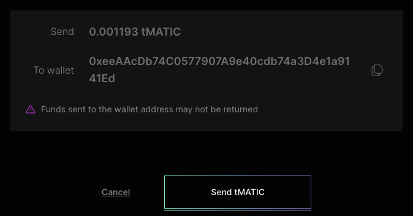
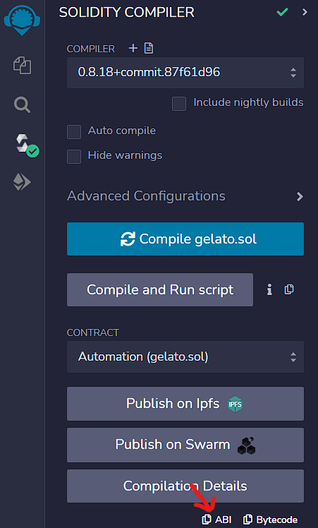
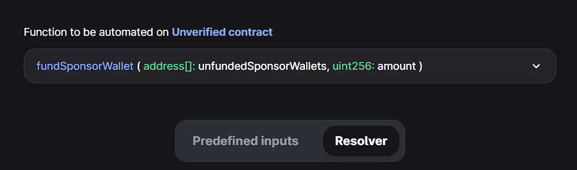

<!-- https://blog.chain.link/smart-contract-call-another-smart-contract/ -->

<!-- https://medium.com/@blockchain101/calling-the-function-of-another-contract-in-solidity-f9edfa921f4c -->

<PageHeader/>

<SearchHighlight/>

# {{$frontmatter.title}}

::: warning Third-party application

Gelato is a third-party application that is not developed by the API3 team. The
API3 team does not provide support for Gelato. If you have any questions or
issues with the gelato platform, please contact the Gelato team directly.

:::

Gelato is a decentralized automation platform that allows you to automate tasks
on multiple blockchain networks. In this guide, we will show you how to use
Gelato to automate the funding of multiple dAPI sponorWallets. This is useful if
you have multiple dAPIs that you want to use in your smart contract. Instead of
manually funding each dAPI at regular intervals, you can use Gelato to automate
the process.

This following contract will be used in this guide. Open it in
[Remix](https://remix.ethereum.org/#url=https://gist.githubusercontent.com/Ashar2shahid/a63d5b04ff9640c2f860f54dffa78995/raw/ce0a9461b817f59774deb1aaaa368438e4e3328b/Automation.sol)

```solidity
// SPDX-License-Identifier: MIT

pragma solidity ^0.8.9;
import "@openzeppelin/contracts/access/Ownable.sol";
import "https://github.com/gelatodigital/automate/blob/master/contracts/integrations/AutomateReady.sol";


// @title Contract to fund sponsor wallets if balance is less than minimum balance
contract Automation is Ownable, AutomateReady {

    address[] public sponsorWallets; // Array of sponsor wallet addresses
    uint256 public minimumBalance; // Minimum balance required in sponsor wallet
    uint256 public fundAmount; // Amount that will be funded to sponsor wallet


     // @notice Constructor
     // @param _automate Address of the Automate contract
     // @param _taskCreator Address of the TaskCreator
     constructor(address _automate, address _taskCreator)
        AutomateReady(_automate, _taskCreator)
    {}

    // @notice Initialize the contract
    // @param _sponsorWallets Array of sponsor wallet addresses
    // @param _minimumBalance Minimum balance required in sponsor wallet
    // @param _fundAmount Amount to be funded to sponsor wallet
    function intializeWallet(address[] calldata _sponsorWallets, uint256 _minimumBalance, uint256 _fundAmount) public onlyOwner {
        sponsorWallets = _sponsorWallets;
        minimumBalance = _minimumBalance;
        fundAmount = _fundAmount;
    }

    // @notice Check if sponsor wallet balance is less than minimum balance
    // @return canExec Boolean value to check if task can be executed
    // @return execPayload Payload to be executed
    function checkSponsorWallet() external view returns(bool canExec,  bytes memory execPayload) {
        uint unfunded = 0;
        canExec = false;
        for(uint i=0;i<sponsorWallets.length;i++){
            if(sponsorWallets[i].balance < minimumBalance) {
                unfunded = unfunded + 1;
            }
        }
        address[] memory unfundedSponsorWallets = new address[](unfunded);
        uint counter = 0;
        for(uint j=0; j<sponsorWallets.length;j++){
            if(sponsorWallets[j].balance < minimumBalance) {
                unfundedSponsorWallets[counter]=sponsorWallets[j];
                counter=counter+1;
            }
        }
        execPayload =  abi.encodeWithSignature("fundSponsorWallet(address[],uint256)",unfundedSponsorWallets,fundAmount);
        if(unfundedSponsorWallets.length > 0){
            canExec = true;
        }
    }

    // @notice Fund sponsor wallet
    // @param unfundedSponsorWallets Array of unfunded sponsor wallet addresses
    // @param amount Amount to be funded to sponsor wallet
    function fundSponsorWallet(address[] calldata unfundedSponsorWallets,uint256 amount) onlyDedicatedMsgSender() external payable returns(bool success) {
        for(uint i=0;i<unfundedSponsorWallets.length;i++){
            if(unfundedSponsorWallets[i].balance < minimumBalance){
                (success,) = payable(unfundedSponsorWallets[i]).call{value: amount}("");
            }
        }
        (uint256 fee, address feeToken) = _getFeeDetails();
        _transfer(fee, feeToken);
    }

    // @notice receive function
    receive() external payable{
    }

    // @notice withdraw funds from contract
    function withdrawFunds() onlyOwner external returns (bool success) {
        (success,) = payable(msg.sender).call{value: address(this).balance}("");
    }
}
```

## 1. Deploying the contract

Deploy the contract using the following parameters:

- `_automate` : Address of the Automate contract can be found
  [here](https://docs.gelato.network/developer-services/automate/contract-addresses)
  for your network
- `_taskCreator` : Address of the TaskCreator. This is the EOA address that will
  be used to create the task on Gelato. You can use the same address that you
  will use to deploy the contract.

## 2. Initializing the contract

Initialize the contract by calling the `intializeWallet()` function using the
following parameters:

- `_sponsorWallets` : Array of sponsor wallet addresses. The sponsor wallet for
  a dAPI can be found in the dAPI details page after clicking the "Fund gas"
  button as shown below. Once you have all the sponsor wallet addresses, you can
  add them to an array and pass it to the contract.

  

- `_minimumBalance` : Minimum balance required in sponsor wallet. This is the
  gas reserve that you want to keep in the sponsor wallet. If the balance in the
  sponsor wallet is less than this value, the contract will fund the sponsor
  wallet with the amount specified in `_fundAmount`.

- `_fundAmount` : Amount to be funded to sponsor wallet. This is the amount that
  will be funded to the sponsor wallet if the balance is less than the minimum
  balance.

## 3. Creating the task

Once the contract is deployed and initialized, you need to create a task on
gelato. Head over to the [App Platform](https://app.gelato.network/) and connect
your wallet.

### 3.a Preqrequisites

Make sure that:

- The wallet is the same one that you used to deploy and initialize the contract
  i.e the `_taskCreator` address.

- The wallet is connected to the same network that you used to deploy the
  contract.

### 3.b Specifying the contract address and conditions

Once you have connected your wallet, click on the
[Create Task](https://app.gelato.network/new-task) button. You will be
redirected to the task creation page. Follow the steps below to create the task:

- Enter the address of the deployed `Automation.sol` in the `Contract Address`
  field.

- Copy the abi from Remix as seen below and paste it in the `ABI` field.
  

- Select `fundSponsorWallet` from the `Function to be automated` dropdown.

- Select the `Resolver` tab as shown below:
  

- Enter the address of the deployed `Automation.sol` in the
  `Resolver contract address` field.

- Enter the abi again in the `Resolver ABI` field.

- Select `checkSponsorWallet` from the `Function to be called at resolver`
  dropdown.

- Select the **Transaction pays for itself** option.

- Give the task a name and click on the `Create Task` button.

## 4. Tranferring gas funds to the contract

Once the task is created, you need to **transfer the gas funds** to the deployed
`Automation.sol` contract. You can do this by directly sending funds to the
contract address. Once funded, gelato keepers will monitor the balance of the
sponsorWallets and fund the sponsorWallets if the balance is less than the
minimum balance. A small fee will be deducted from the contract balance and sent
to the Gelato network for providing the automation serivce.

With this, you have now setup an automation service for your self-funded dAPIs
and don't need to manually fund each sponsor wallet.
