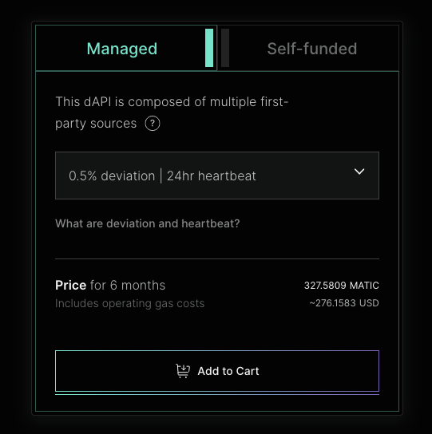
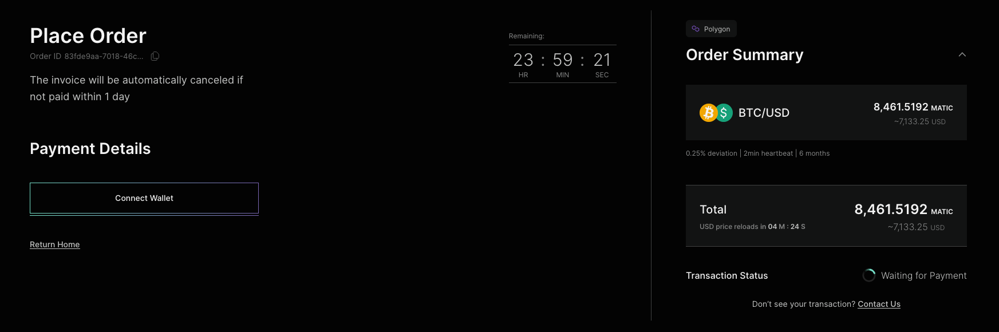
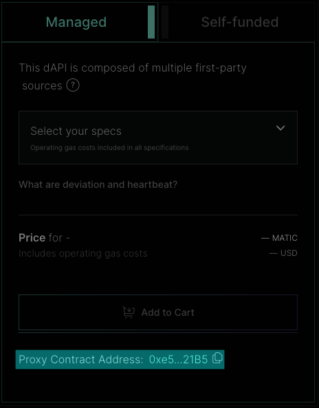

<PageHeader/>

<SearchHighlight/>

<FlexStartTag/>

# {{$frontmatter.title}}

[Managed dAPIs](/explore/dapis/using-dapis.html#managed-dapis) are datafeeds
that are sourced directly from multiple
[first-party oracles](/explore/airnode/why-first-party-oracles) and aggregated
using [Airnode's](/explore/airnode/what-is-airnode.html) signed data. It
utilises first-party oracles, enabling data to be served directly from reputable
API providers via the Airnode. Unlike self-funded dAPIs, API3 manages the gas
costs and the availability of the Managed dAPIs. This guide will walk you
through the process of subscribing to a Managed dAPI.

::: info Managed dAPIs

If you are planning to use your dAPI for a long period of time or if you are
planning to use your dAPI in a production environment, we recommend that you use
Managed dAPIs provided by the API3 DAO. This way, you can be sure that your dAPI
will be available to your users at all times.

:::

## API3 Market

The [API3 Market<ExternalLinkImage/>](https://market.api3.org) provides all the
tooling to seamlessly access dAPI services. For Managed dAPIs, this end-to-end
process consists of:

- [Exploring, selecting and configuring your dAPI](/guides/dapis/subscribing-managed-dapis/#exploring-selecting-and-configuring-your-dapi)
   
- [Placing an order for a Managed dAPI Service](/guides/dapis/subscribing-managed-dapis/#placing-an-order-for-a-managed-dapi-service)
   
- [Waiting for the dAPI to get updated](/guides/dapis/subscribing-managed-dapis/#waiting-for-the-dapi-to-get-updated)
   

## Exploring, selecting and configuring your dAPI

The [API3 Market<ExternalLinkImage/>](market.api3.org/) provides a list of all
the dAPIs available across multiple chains including testnets. You can filter
the list by chains and data providers. You can also search for a specific dAPI
by name. Once selected, you will land on the details page
[(eg ETH/USD on polygon)<ExternalLinkImage/>](https://market.api3.org/dapis/polygon/ETH-USD)
where you can find more information about the dAPI.

Once you have selected your dAPI, you will then be presented with an option to
choose from either **Managed** or **Self-funded**. Select Managed dAPIs.

Managed dAPIs gives you an option to configure the dAPI's
[devation threshold](/reference/dapis/understand/deviations) and
[heartbeat](/reference/dapis/understand/deviations.html#heartbeat). For Managed
dAPIs, you will have the following options to choose from:

| Deviation | Heartbeat |
| --------- | --------- |
| 0.25%     | 2 minutes |
| 0.25%     | 24 hours  |
| 0.5%      | 24 hours  |
| 1%        | 24 hours  |

::: info Note

Not all dAPIs support all the configurations. It depends on the asset and chain.
Check the [API3 Market](https://market.api3.org/) for more info.

:::

_[Click here](/reference/dapis/understand/deviations.html#update-interval) to
read more if you are unsure what suits your dApp_

Check the final price and time frame for the selected configuration. If you are
happy with it, select **Add to Cart**. You can also add other dAPIs on the same
nework to your cart.

## Placing an order for a Managed dAPI Service

Once you have added all the dAPIs, you can proceed to checkout. You will be
presented with a summary of your order. If you have multiple dAPIs on the same
chain in your cart, you can pay for all of them in one single order. You cannot
add multiple dAPIs on different chains in the same order. To proceed with the
order, select **Proceed to Payment**.

This will take you to the payment page where you can place the order for the
selected feeds. You can see the order summary and the total price. If it looks
fine, select **Connect Wallet**, and confirm the transaction on MetaMask.

Once the transaction is confirmed, you will be presented with a confirmation
page. You can also view the order details and status on the
[Orders page<ExternalLinkImage/>](https://market.api3.org/orders) on the API3
Market.

## Waiting for the dAPI to get updated

After placing the order, you will have to wait for the dAPI to get updated. It
usually takes 5 business days for the dAPI team to update the dAPI for the
requested configuration. Once the dAPI is updated, you can start using it in
your dApp via the proxy address present in the dAPI page

::: info Note

The proxy contract address to read from the dAPI will remain the same.
Purchasing a better configuration will not change the proxy contract address for
the dAPI.

:::

To get started with using the dAPI, you can follow the
[Reading a dAPI Proxy guide](/guides/dapis/read-a-dapi/).

<FlexEndTag/>
