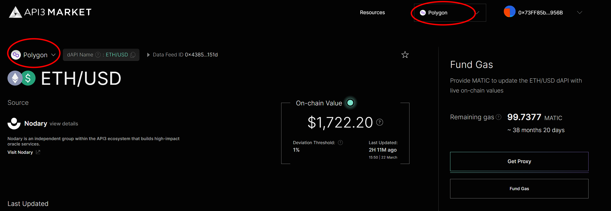
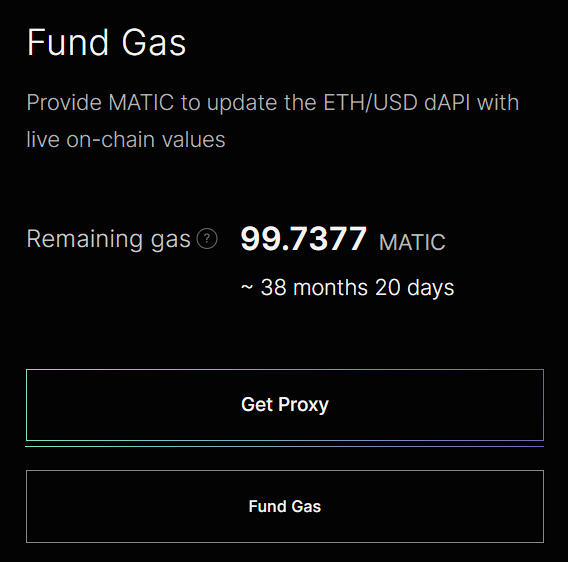
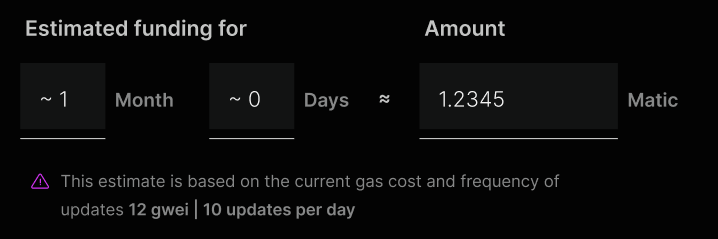
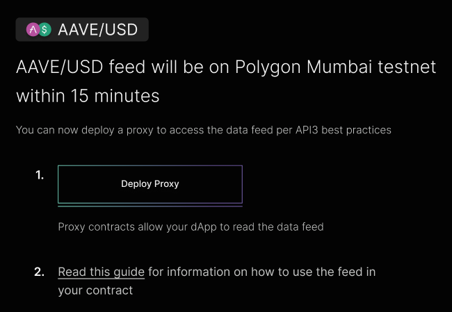
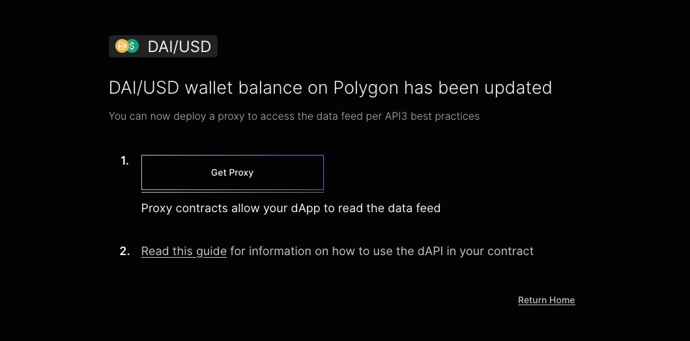
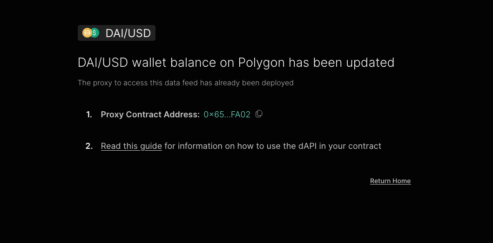
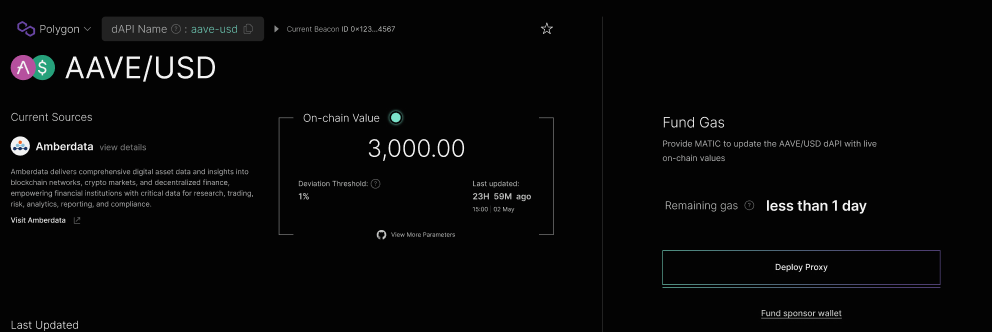
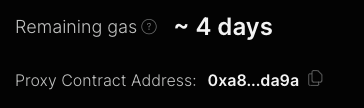

<!-- https://blog.chain.link/smart-contract-call-another-smart-contract/ -->

<!-- https://medium.com/@blockchain101/calling-the-function-of-another-contract-in-solidity-f9edfa921f4c -->

<PageHeader/>

<SearchHighlight/>

<FlexStartTag/>

# {{$frontmatter.title}}

With [Self-Funded dAPIs](/explore/dapis/using-dapis.html#self-funded-dapis), you can fund the dAPI with your own funds. The amount of
gas you supply will determine how long your dAPI will be available for use. If
you run out of gas, you can fund the dAPI again to keep it available for use.
This is a good option if you are not planning to use the dAPI for a long period
of time or if you are not planning to use the dAPI in a production environment.

::: info Managed dAPIs

If you are planning to use your dAPI for a long period of time or if you are
planning to use your dAPI in a production environment, we recommend that you use
Managed dAPIs provided by the API3 DAO. This way, you can be sure that your dAPI
will be available to your users at all times.

:::

## API3 Market

The [API3 Market<ExternalLinkImage/>](https://market.api3.org) provides all the
tooling to seamlessly access dAPI services. For self-funded data feeds this
end-to-end process consists of:


- [Exploring and selecting your data feed](/guides/dapis/subscribing-self-funded-dapis/#_1-exploring-and-selecting-your-data-feed) <br/>
- [Funding a sponsor wallet](/dapis/subscribing-self-funded-dapis/#_2-funding-a-sponsor-wallet) <br/>
- [Deploying a proxy contract to access the data feed](/guides/dapis/subscribing-self-funded-dapis/#_3-deploying-a-proxy-contract-to-access-the-data-feed) <br/>
  - [Deploying a proxy contract during funding](/guides/dapis/subscribing-self-funded-dapis/#_3a-deploying-a-proxy-contract-during-funding) <br/>
  - [Deploying a proxy contract from the API3 Market details page](/guides/dapis/subscribing-self-funded-dapis/#_3b-deploying-a-proxy-contract-from-the-api3-market-details-page) <br/>
  - [Verifying the deployed proxy contract](/guides/dapis/subscribing-self-funded-dapis/#_3c-verifying-the-deployed-proxy-contract) <br/>


## 1. Exploring and selecting your data feed

The [API3 Market<ExternalLinkImage/>](https://market.api3.org) provides a list
of all the dAPIs available across multiple chains including testnets. You can
filter the list by chains and data providers. You can also search for a specific
dAPI by name. Once selected you will land on the details page where you can find
more information about the dAPI.

::: info Request a feed

In case you cannot find the desired dAPI on the API3 Market, you can request a
new feed using
[<span style="color:rgb(16, 185, 129);">this form<ExternalLinkImage/></span>](https://api3dao.typeform.com/to/yT2Gt2fd)
which is also available on the API3 Market website.

:::

## 2. Funding a sponsor wallet

Once you have selected your dAPI, you can fund the dAPI by using the market UI
to send funds to the sponsorWallet, make sure your:

- Wallet is connected to the market and is the same network as the dAPI you are
  funding
- Balance of the wallet should be greater than the amount you are sending to the
  sponsorWallet



To fund the dAPI, you need to click on the "Fund Gas" button.



This will bring up the API3 gas estimator UI that allows users to understand how
much gas is needed for the dAPI to provide on-chain values for the selected
time.



::: warning Estimation is not 100% accurate

The estimation is calculated assuming there are 10 oracle updates per day on the
current gas costs of the respective chain. Users need to be aware that any
spikes in gas prices will impact the estimation.

:::

Clicking ''Send'' will initiate a transaction sending the amount entered into
the gas estimator from a users wallet to the sponsor wallet of the respective
data feed. 15 minutes later the feed will activate.


Always verify that you are signing a transaction with the expected amount,
networks, and destination address. Each dAPI has a unique funding address.

::: warning Note

Funds sent to the wallet address will not be returned.

:::

Once the transaction is broadcasted & confirmed on the blockchain a transaction
confirmation screen will appear.



::: info 15 mins to start the feed

If the previous balance of the dAPI was 0, it might take up to 15 minutes for
the dAPI to start operating

:::

## 3. Deploying a proxy contract to access the data feed

Smart contracts can interact and read values from contracts that are already
deployed on the blockchain. By deploying a proxy contract via the API3 market, a
dAPP can interact and read values from a dAPI like ETH/USD.

Once the dAPI is funded, you can deploy a proxy contract to access the data
feed. Proxy contracts can be deployed in two ways:

- During the funding process
- Deploying from the API3 Market details page of the dAPI

::: info Self-funded Proxies

If a proxy is already deployed for a self-funded dAPI, the dAPP can read the
dAPI without having to deploy a proxy contract by using the address of the
already deployed proxy contract which will be visible on the API3 market.

:::

### 3a. Deploying a proxy contract during funding

If you are deploying a proxy contract during the funding process, you will see
the following UI.



Clicking on the "Get proxy" button will initiate a transaction to your metamask
that will deploy a proxy contract.

Once the transaction is broadcasted & confirmed on the blockchain, the proxy
contract address will be shown on the UI.



### 3b. Deploying a proxy contract from the API3 Market details page

If you are deploying a proxy contract from the API3 Market details page, you
will see the following UI.



Clicking on the "Get Proxy" button will initiate a transaction to your metamask
that will deploy a proxy contract. Once the transaction is broadcasted &
confirmed on the blockchain, the proxy contract address will be shown on the UI.



### 3c. Verifying the deployed proxy contract

Before using the proxy contract, you should verify if the proxy contract points
to the correct `dapiNameHash` and `api3ServerV1` address. This can be done by
viewing the code of the proxy on the block explorer.

The `api3ServerV1` address should be the same as the address of the
`Api3ServerV1` contract. Refer to the
[chains and contract addresses](/reference/dapis/chains/) page for the address
of the `Api3ServerV1` contract on different chains.

The `dapiNameHash` should be the same as the `dapiNameHash` of the dAPI you are
using which can be computed using the following cli commands:

```bash
$ npm install -g @ethersproject/cli

$ ethers eval 'utils.solidityKeccak256(["bytes32"],[utils.formatBytes32String("ETH/USD")])'

0x9e6138f8f57d7b493a8364edb0a0ac92399dfd890eecb9121050836a1749ba42 ← dapiNameHash
```

Where `ETH/USD` is the `dapiName` from the details page of the dAPI on the API3
Market.

Once you have verified the `dapiNameHash` and `Api3ServerV1` address, you can
start using the proxy contract to read the data feed.

<FlexEndTag/>
