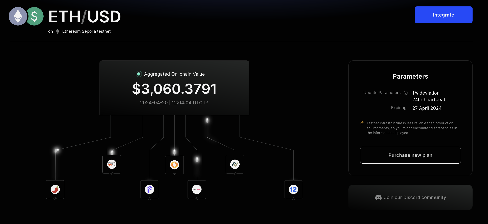
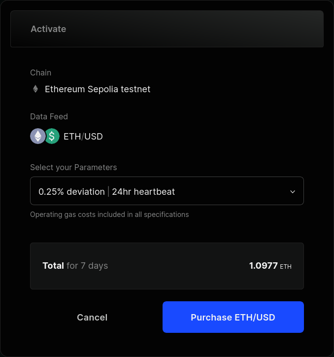
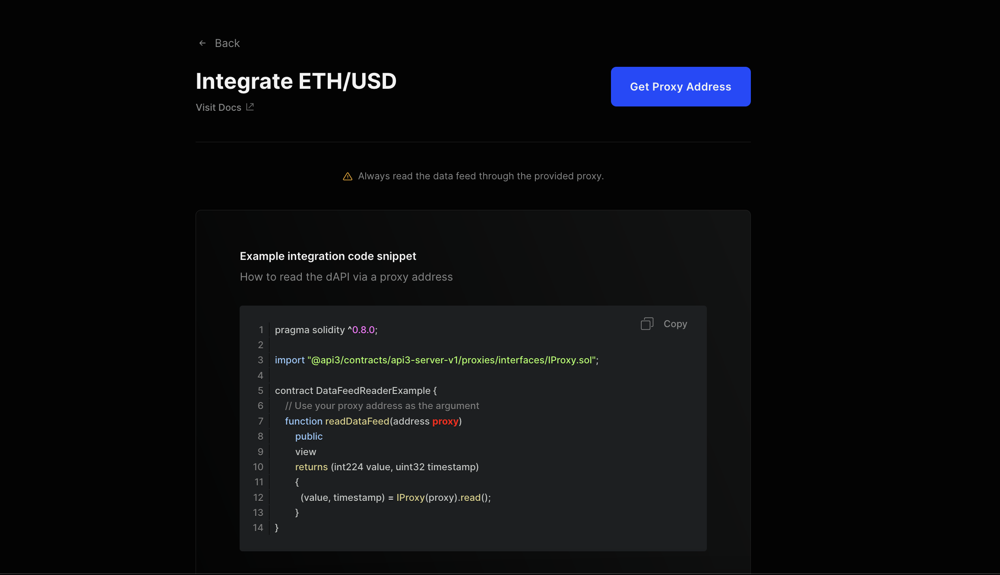
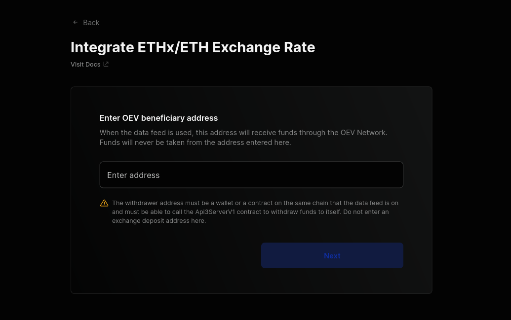
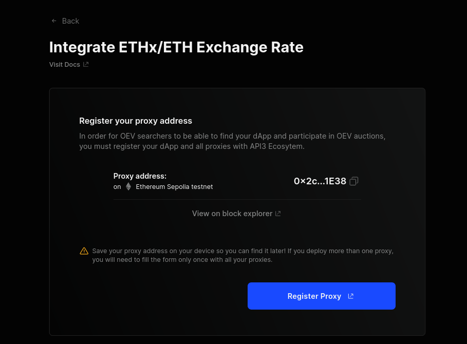

<PageHeader/>

<SearchHighlight/>

<FlexStartTag/>

# {{$frontmatter.title}}

> <Video src="https://www.youtube.com/embed/Wq8tLxbhJBQ"/>

[dAPIs](/explore/dapis/using-dapis.md#managed-dapis) are datafeeds that are
sourced directly from multiple
[first-party oracles](/explore/airnode/why-first-party-oracles) and aggregated
using [Airnode's](/explore/airnode/what-is-airnode.md) signed data. It utilizes
first-party oracles, enabling data to be served directly from reputable API
providers via the Airnode. This guide will walk you through the process of
subscribing to a dAPI.

## API3 Market

The [API3 Market](https://market.api3.org) provides all the tooling to
seamlessly access dAPI services. This end-to-end process consists of:

- [Exploring, selecting and configuring your dAPI](/guides/dapis/subscribing-to-dapis/#exploring-selecting-and-configuring-your-dapi)
   
- [Activating your dAPI](/guides/dapis/subscribing-to-dapis/#activating-your-dapi)
   
- [Setting up OEV and getting the proxy address](/guides/dapis/subscribing-to-dapis/#setting-up-oev-and-getting-the-proxy-address)
   

## Exploring, selecting and configuring your dAPI

The [API3 Market](https://market.api3.org/) provides a list of all the dAPIs
available across multiple chains including testnets. You can filter the list by
mainnet or testnet chains. After selecting the chain, you can now search for a
specific dAPI by name. Once selected, you will land on the details page
[(eg ETH/USD on Ethereum Sepolia)](https://market.api3.org/dapis/ethereum-sepolia-testnet/ETH-USD)
where you can find more information about the dAPI.

If a dAPI is already activated, it will provide information like the current
aggregated on-chain value, funding address, current configuration, and the
expiration date.

Once you have selected your dAPI, you will then be presented with an option to
purchase and activate it.

The API3 Market gives you an option to configure the dAPI's
[deviation threshold](/reference/dapis/understand/deviations) and
[heartbeat](/reference/dapis/understand/deviations.md#heartbeat). You will have
the following options to choose from:

| Deviation | Heartbeat |
| --------- | --------- |
| 0.25%     | 24 hours  |
| 0.5%      | 24 hours  |
| 1%        | 24 hours  |

::: info Note

Not all dAPIs support all the configurations. It depends on the asset and chain.
Check the [API3 Market](https://market.api3.org/) for more info.

:::

_[Click here](/reference/dapis/understand/deviations.md#update-interval) to read
more if you are unsure what suits your dApp_

## Activating your dAPI

::: info Note

If a dAPI is already activated, make sure to check the expiration date and
update parameters. You can update the parameters and extend the subscription by
purchasing a new configuration.

:::

Once you've selected the dAPI and the configuration, you will be presented with
an option to purchase the dAPI and activate it. Make sure to check the time and
amount of the subscription. If everything looks good, click on **Purchase**.

You can then connect your wallet and confirm the transaction.

Once the transaction is confirmed, you will be presented with a confirmation
page for the order. You can now go back and check the updated configuration for
the dAPI.

## Setting up OEV and getting the proxy address

Once you are done configuring and activating the dAPI, you can now integrate it.
To do so, click on the **Integrate** button on the dAPI details page.

To read from the dAPI, you will need the proxy contract address. Select **Get
Proxy Address** to get the proxy contract address.

Before you can start reading from the dAPI, you will need to set your **OEV
beneficiary address**. This is the address that will receive the OEV proceeds
through the OEV Network.

::: info Note

The OEV beneficiary address must be an EOA or a smart contract address that can
call the `Api3ServerV1` contract to withdraw funds to itself.

<!-- Click here to read more about the [OEV beneficiary](). -->

:::

Once you have entered a valid address, click on **Deploy Proxy**. Confirm the
transaction in your wallet.

You can now see the deployed proxy contract address. You can now use this to
read from the configured dAPI.

In order for OEV Searchers to be able to find your dApp and participate in the
OEV auctions, you must register your dApp and all the proxies with
[API3 Ecosystem](https://ecosystem.api3.org/). To do this, click on **Register
Proxy** and fill out all the details about your dApp.

To get started with using dAPIs, you can follow the
[Reading a dAPI Proxy guide](/guides/dapis/read-a-dapi/).

<FlexEndTag/>
