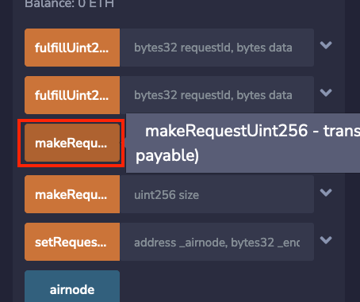
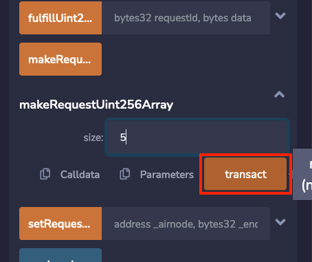
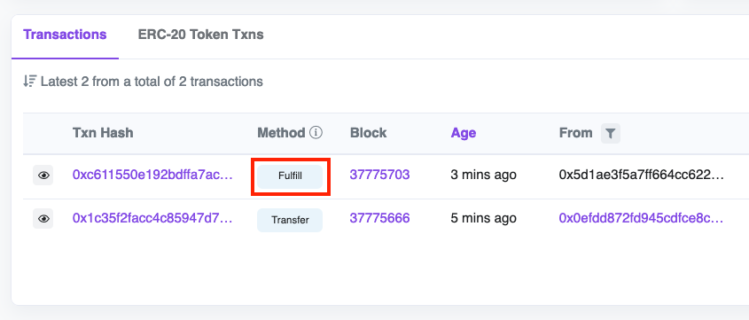
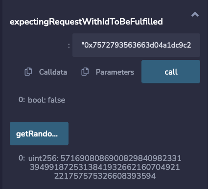
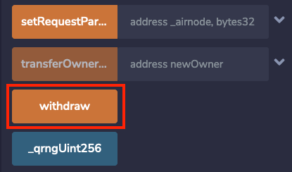
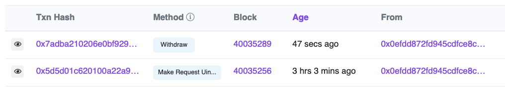

<PageHeader/>

<SearchHighlight/>

<FlexStartTag/>

# {{$frontmatter.title}}

> <Video src="https://www.youtube.com/embed/pV976MvviIA?si=1ykWLg0wFZVGEEi-"/>

## Introduction

QRNG (Quantum Random Number Generator) is a free to use public utility provided
by the API3 DAO that provides quantum randomness on-chain. It is powered by
[Airnode](/explore/airnode/what-is-airnode), the first-party oracle that is
directly operated by the QRNG API providers. This way, Quantum RNG can be
provided on-chain in a trustless manner without the need for a third-party
oracle. The QRNG service is currently available on all major EVM compatible
chains. Check the list of supported chains [here](/reference/qrng/chains).

[Click here to read more about what QRNG is how it works.](/explore/qrng/)

This guide will walk you through coding and deploying a smart contract that
requests a quantum random number on-chain using API3's QRNG Service.

You will use the browser-based [Remix IDE](https://remix.ethereum.org) and
[MetaMask](https://metamask.io/). Some basic knowledge of these two tools is
assumed.

Currently, QRNG has three [providers](/reference/qrng/providers.md), two of
which provide quantum random numbers. This guide will use the
[Testnet Random Numbers](/reference/qrng/providers#testnet-random-numbers),
available only on testnets, which returns a pseudorandom number.

<!-- To begin, you need to deploy and sponsor the
[`RemixQrngExample`](/reference/qrng/qrng-example.md) with a matching
[sponsor wallet](/reference/airnode/latest/concepts/sponsor.md#sponsorwallet).
The `RemixQrngExample` will be the primary contract that retrieves the random
number.

The `RemixQrngExample` submits a request for a random number to `AirnodeRrpV0`.
Airnode gathers the request from the `AirnodeRrpV0` protocol contract, retrieves
the random number off-chain, and sends it back to `AirnodeRrpV0`. Once received,
it performs a callback to the requester with the random number.

You can read more about how API3 QRNG Airnode uses the
[Request-Response Protocol here](/reference/airnode/latest/concepts/). -->

## 1. Coding the Contract

::: warning Check your Network!

Make sure you're on a Testnet before trying to deploy the contracts on-chain!

:::

Given below is an example of a basic contract that makes a request to the QRNG
Airnode. To follow along, you can open the following contract in Remix and try
deploying it yourself. This contract will be requesting the random number
directly from the QRNG Provider.

Head on to
[Remix online IDE.](https://remix.ethereum.org/#url=https://raw.githubusercontent.com/api3-ecosystem/remix-contracts/master/contracts/QrngRequesterUpdated.sol&lang=en&optimize=false&runs=200&evmVersion=null&version=soljson-v0.8.18+commit.87f61d96.js)
It should load up the `RemixQrngExample` contract.

[Open in Remix](https://remix.ethereum.org/#url=https://raw.githubusercontent.com/api3-ecosystem/remix-contracts/master/contracts/QrngRequesterUpdated.sol&lang=en&optimize=false&runs=200&evmVersion=null&version=soljson-v0.8.18+commit.87f61d96.js)

```solidity
//SPDX-License-Identifier: MIT
pragma solidity 0.8.9;
import "@api3/airnode-protocol/contracts/rrp/requesters/RrpRequesterV0.sol";
import "@openzeppelin/contracts/access/Ownable.sol";

/// @title Example contract that uses Airnode RRP to access QRNG services
contract QrngExample is RrpRequesterV0, Ownable {
    event RequestedUint256(bytes32 indexed requestId);
    event ReceivedUint256(bytes32 indexed requestId, uint256 response);
    event RequestedUint256Array(bytes32 indexed requestId, uint256 size);
    event ReceivedUint256Array(bytes32 indexed requestId, uint256[] response);
    event WithdrawalRequested(address indexed airnode, address indexed sponsorWallet);

    address public airnode;                 // The address of the QRNG Airnode
    bytes32 public endpointIdUint256;       // The endpoint ID for requesting a single random number
    bytes32 public endpointIdUint256Array;  // The endpoint ID for requesting an array of random numbers
    address public sponsorWallet;           // The wallet that will cover the gas costs of the request
    uint256 public _qrngUint256;            // The random number returned by the QRNG Airnode
    uint256[] public _qrngUint256Array;     // The array of random numbers returned by the QRNG Airnode

    mapping(bytes32 => bool) public expectingRequestWithIdToBeFulfilled;

    constructor(address _airnodeRrp) RrpRequesterV0(_airnodeRrp) {}

    /// @notice Sets the parameters for making requests
    function setRequestParameters(
        address _airnode,
        bytes32 _endpointIdUint256,
        bytes32 _endpointIdUint256Array,
        address _sponsorWallet
    ) external {
        airnode = _airnode;
        endpointIdUint256 = _endpointIdUint256;
        endpointIdUint256Array = _endpointIdUint256Array;
        sponsorWallet = _sponsorWallet;
    }

    /// @notice Requests a `uint256`
    /// @dev This request will be fulfilled by the contract's sponsor wallet,
    /// which means spamming it may drain the sponsor wallet.
    function makeRequestUint256() external {
        bytes32 requestId = airnodeRrp.makeFullRequest(
            airnode,
            endpointIdUint256,
            address(this),
            sponsorWallet,
            address(this),
            this.fulfillUint256.selector,
            ""
        );
        expectingRequestWithIdToBeFulfilled[requestId] = true;
        emit RequestedUint256(requestId);
    }

    /// @notice Called by the Airnode through the AirnodeRrp contract to
    /// fulfill the request
    function fulfillUint256(bytes32 requestId, bytes calldata data)
        external
        onlyAirnodeRrp
    {
        require(
            expectingRequestWithIdToBeFulfilled[requestId],
            "Request ID not known"
        );
        expectingRequestWithIdToBeFulfilled[requestId] = false;
        uint256 qrngUint256 = abi.decode(data, (uint256));
        _qrngUint256 = qrngUint256;
        // Do what you want with `qrngUint256` here...
        emit ReceivedUint256(requestId, qrngUint256);
    }

    /// @notice Requests a `uint256[]`
    /// @param size Size of the requested array
    function makeRequestUint256Array(uint256 size) external {
        bytes32 requestId = airnodeRrp.makeFullRequest(
            airnode,
            endpointIdUint256Array,
            address(this),
            sponsorWallet,
            address(this),
            this.fulfillUint256Array.selector,
            // Using Airnode ABI to encode the parameters
            abi.encode(bytes32("1u"), bytes32("size"), size)
        );
        expectingRequestWithIdToBeFulfilled[requestId] = true;
        emit RequestedUint256Array(requestId, size);
    }

    /// @notice Called by the Airnode through the AirnodeRrp contract to
    /// fulfill the request
    function fulfillUint256Array(bytes32 requestId, bytes calldata data)
        external
        onlyAirnodeRrp
    {
        require(
            expectingRequestWithIdToBeFulfilled[requestId],
            "Request ID not known"
        );
        expectingRequestWithIdToBeFulfilled[requestId] = false;
        uint256[] memory qrngUint256Array = abi.decode(data, (uint256[]));
        // Do what you want with `qrngUint256Array` here...
        _qrngUint256Array = qrngUint256Array;
        emit ReceivedUint256Array(requestId, qrngUint256Array);
    }

    /// @notice Getter functions to check the returned value.
    function getRandomNumber() public view returns (uint256) {
        return _qrngUint256;
    }

    function getRandomNumberArray() public view returns(uint256[] memory) {
        return _qrngUint256Array;
    }

    /// @notice To receive funds from the sponsor wallet and send them to the owner.
    receive() external payable {
        payable(owner()).transfer(msg.value);
        emit WithdrawalRequested(airnode, sponsorWallet);
    }

    /// @notice To withdraw funds from the sponsor wallet to the contract.
    function withdraw() external onlyOwner {
        airnodeRrp.requestWithdrawal(
        airnode,
        sponsorWallet
        );
    }
}
```

The contract will have eight main functions:

- The `setRequestParameters()` takes in `airnode`, `endpointIdUint256`,
  `_endpointIdUint256Array`, `sponsorWallet` and sets these parameters on-chain.

```solidity
    function setRequestParameters(
        address _airnode,
        bytes32 _endpointIdUint256,
        bytes32 _endpointIdUint256Array,
        address _sponsorWallet
    ) external {
        airnode = _airnode;
        endpointIdUint256 = _endpointIdUint256;
        endpointIdUint256Array = _endpointIdUint256Array;
        sponsorWallet = _sponsorWallet;
    }
```

- The `makeRequestUint256()` function calls the `airnodeRrp.makeFullRequest()`
  function of the `AirnodeRrpV0.sol` protocol contract which adds the request to
  its storage and emits a `requestId`.

```solidity
    function makeRequestUint256() external {
        bytes32 requestId = airnodeRrp.makeFullRequest(
            airnode,
            endpointIdUint256,
            address(this),
            sponsorWallet,
            address(this),
            this.fulfillUint256.selector,
            ""
        );
        expectingRequestWithIdToBeFulfilled[requestId] = true;
        emit RequestedUint256(requestId);
    }
```

- The targeted off-chain QRNG Airnode gathers the request and performs a
  callback to the `RemixQrngExample` with the random number.

```solidity
    function fulfillUint256(bytes32 requestId, bytes calldata data)
        external
        onlyAirnodeRrp
    {
        require(
            expectingRequestWithIdToBeFulfilled[requestId],
            "Request ID not known"
        );
        expectingRequestWithIdToBeFulfilled[requestId] = false;
        uint256 qrngUint256 = abi.decode(data, (uint256));
        // Do what you want with `qrngUint256` here...
        _qrngUint256 = qrngUint256;
        emit ReceivedUint256(requestId, qrngUint256);
    }
```

- Similarly, `makeRequestUint256Array()` takes in `_endpointIdUint256Array` and
  can be used to request an array of random numbers.

```solidity
    function makeRequestUint256Array(uint256 size) external {
        bytes32 requestId = airnodeRrp.makeFullRequest(
            airnode,
            endpointIdUint256Array,
            address(this),
            sponsorWallet,
            address(this),
            this.fulfillUint256Array.selector,
            // Using Airnode ABI to encode the parameters
            abi.encode(bytes32("1u"), bytes32("size"), size)
        );
        expectingRequestWithIdToBeFulfilled[requestId] = true;
        emit RequestedUint256Array(requestId, size);
    }
```

- The `fulfillUint256Array()` will be the callback if an array of random numbers
  is requested.

```solidity
    function fulfillUint256Array(bytes32 requestId, bytes calldata data)
        external
        onlyAirnodeRrp
    {
        require(
            expectingRequestWithIdToBeFulfilled[requestId],
            "Request ID not known"
        );
        expectingRequestWithIdToBeFulfilled[requestId] = false;
        uint256[] memory qrngUint256Array = abi.decode(data, (uint256[]));
        // Do what you want with `qrngUint256Array` here...
        _qrngUint256Array = qrngUint256Array;
        emit ReceivedUint256Array(requestId, qrngUint256Array);
    }
```

- `getRandomNumber()` and and `getRandomNumberArray()` are getter functions that
  returns the random number and random number array respectively.

```solidity
    function getRandomNumber() public view returns (uint256) {
        return _qrngUint256;
    }

function getRandomNumberArray() public view returns (uint256[] memory) {
        return _qrngUint256Array;
    }
```

- `withdraw()` is used to request a withdrawal from the QRNG Airnode. The
  Airnode picks up the request, and sends the funds from the `sponsorWallet` to
  the contract using `receive()` that inturn sends the funds back to the owner.
  It calls the `requestWithdrawal` function of the `airnodeRrp` contract.

```solidity
  receive() external payable {
        payable(owner()).transfer(msg.value);
        emit WithdrawalRequested(airnode, sponsorWallet);
    }

  function withdraw() external onlyOwner {
        airnodeRrp.requestWithdrawal(
          airnode,
          sponsorWallet
        );
    }
```

## 2. Compiling the Contract

We now need to compile and deploy the contract. Be sure the
`RemixQrngExample.sol` contract is selected in the **FILE EXPLORER** tab. Switch
to the **SOLIDITY COMPILER** tab. Select the `0.8.9` version of Solidity from
the **COMPILER** pick list. Select the **Compile RemixQrngExample.sol** button
to compile the contract.

> 

## 3. Deploying the Contract

::: warning Set up your Testnet Metamask Account!

Make sure you've already configured your Metamask wallet and funded it with some
testnet ETH before moving forward. You can request some from here➚

:::

This guide will use the
[Testnet Random Numbers](/reference/qrng/providers#testnet-random-numbers) which
has the same usage as the production quantum random number generator
[providers](/reference/qrng/providers.md) but returns a pseudorandom number.

- Switch to the **DEPLOY & RUN TRANSACTIONS** tab. Use MetaMask and switch to
  the desired account and testnet for your deployment.

- Select the **ENVIRONMENT** pick list and switch to _Injected Web3_. Check that
  the testnet and account you selected in MetaMask are displayed in Remix as
  shown below.

- Be sure `QrngRequester - contracts/QrngRequester.sol` is selected in the
  **CONTRACT** pick list.

- Add the Airnode `_airnodeRrp` address parameter value for the constructor into
  the field next to the **Deploy** button. See the
  [list of addresses](/reference/qrng/chains.md) for the testnet you are using.

- Click on **Deploy** and approve the transaction with MetaMask.

> 

## 4. Setting the Parameters

::: info Testnet Random Numbers Provider

This guide uses Testnet Random Numbers as the QRNG Airnode provider. Testnet
Random Numbers emulates QRNG on testnets. If you wish to use QRNG in production,
you can use the mainnet [QRNG providers](/reference/qrng/providers.md) instead.
Also make sure to check if your particular chain is supported by the QRNG
providers. Check which chains are supported [here](/reference/qrng/chains.md).

:::

Before making a request, parameters must be set. They determine which Airnode
endpoint will be called and define the wallet used to pay the gas costs for the
response.

Under **Deployed Contracts**, expand and expose the functions and variables of
the contract. Note the address of the contract that is displayed with its name.
This is the requester's contract address which will be needed later.

Next, select and expand the **`setRequestParameters`** function to see all the
parameters that are needed.

- `_airnode`: The airnode address of the desired QRNG service provider. Use
  **Testnet Random Numbers**
  (`0x6238772544f029ecaBfDED4300f13A3c4FE84E1D`→<CopyIcon text="0x6238772544f029ecaBfDED4300f13A3c4FE84E1D"/>).

- `_endpointIdUint256`: The **Testnet Random Numbers** Airnode endpoint ID
  (`0x94555f83f1addda23fdaa7c74f27ce2b764ed5cc430c66f5ff1bcf39d583da36`→<CopyIcon text="0x94555f83f1addda23fdaa7c74f27ce2b764ed5cc430c66f5ff1bcf39d583da36"/>)
  which will return a single random number.

- `_endpointIdUint256Array`: The **Testnet Random Numbers** Airnode endpoint ID
  (`0x9877ec98695c139310480b4323b9d474d48ec4595560348a2341218670f7fbc2`→<CopyIcon text="0x9877ec98695c139310480b4323b9d474d48ec4595560348a2341218670f7fbc2"/>)
  which will return an array of random numbers.

- `_sponsorWallet`: A wallet derived from the Airnode address and the Airnode
  xpub used by **Testnet Random Numbers**, and the smart contract address for
  `RemixQrngExample.sol`. The wallet is used to pay gas costs to acquire a
  random number. A sponsor wallet must be derived using the command
  [derive-sponsor-wallet-address](/reference/airnode/latest/packages/admin-cli.md#derive-sponsor-wallet-address)
  from the Admin CLI. Use the value of the _sponsor wallet address_ that the
  command outputs. **This wallet needs to be funded.**

  ```sh
  npx @api3/airnode-admin derive-sponsor-wallet-address \
    --airnode-address 0x6238772544f029ecaBfDED4300f13A3c4FE84E1D \
    --airnode-xpub xpub6CuDdF9zdWTRuGybJPuZUGnU4suZowMmgu15bjFZT2o6PUtk4Lo78KGJUGBobz3pPKRaN9sLxzj21CMe6StP3zUsd8tWEJPgZBesYBMY7Wo \
    --sponsor-address <use-the-address-of: RemixQrngExample.sol>

    # --airnode-address: Airnode address (Testnet Random Numbers provider)
    # --airnode-xpub:    Airnode xpub (Testnet Random Numbers provider)
    # --sponsor-address: Use the smart contract address for
    #                    RemixQrngExample.sol as displayed in the Remix IDE.

    # The command outputs.
    Sponsor wallet address: 0x6394...5906757
    # Use this address as the value for _sponsorWallet.
  ```

  Be sure to fund the public address of the sponsor wallet that the command
  outputs with enough testnet currency. The funds are used to pay gas costs for
  the Airnode's response. You can use the table below for the amount of fund as
  reference.

  ::: details Funding table reference

  | Testnet                | Amount | Unit  | Chain Id |
  | ---------------------- | ------ | ----- | -------- |
  | Ethereum-Goerli        | 0.1    | ETH   | 5        |
  | Ethereum-Sepolia       | 0.05   | SEP   | 11155111 |
  | RSK testnet            | 0.001  | tRBTC | 31       |
  | BNB Chain testnet      | 0.005  | tBNB  | 97       |
  | Optimism testnet       | 0.05   | ETH   | 420      |
  | Moonbase Alpha testnet | 0.1    | DEV   | 1287     |
  | Fantom testnet         | 0.5    | FTM   | 4002     |
  | Avalanche Fuji testnet | 0.3    | AVAX  | 43113    |
  | Polygon Mumbai testnet | 0.05   | MATIC | 80001    |
  | Milkomeda C1 testnet   | 0.5    | mTAda | 200101   |
  | Arbitrum testnet       | 0.01   | AGOR  | 421613   |

  :::

Select the <b>Transact</b> button in Remix to send the parameters to the smart
contract. Approve the transaction with MetaMask. After the transaction completes
you can see each parameter's value by clicking the buttons with a parameter
name. These parameters will be used each time the smart contract requests a
random number.

<SponsorWalletWarning/>

## 5. Make a Request

Be sure you have funded the sponsor wallet created in the last step. Its funds
will be used to pay gas costs when Airnode returns a random number to the
callback function `fulfillUint256()`.

Each request made will use the parameters set in the last step. You can change
the parameters at any time and subsequent requests will use the newer parameter
set.

### To request a single random number:

To make a request for a single random number, select the `makeRequestUint256()`
button in Remix. Approve the transaction with MetaMask.

> 

### To request an array of random numbers:

To make a request for an array of random numbers, select the
`makeRequestUint256Array()` button in Remix, add the required array size and
click on **transact**. Approve the transaction with MetaMask.

> 

<!-- prettier-ignore -->
As soon as the transaction completes in MetaMask, select the **getRandomNumber/getRandomNumberArray** button in Remix. This will return the value of `_qrngUint256`/`_qrngUint256Array` which equals _0_. This is because the random
number/ random number array has yet to be returned to the callback function. Copy and paste the
`requestId` into the field for **`expectingRequestWithIdToBeFulfilled`** and
select the button. You will see the value is _true_, meaning the callback has
not been made.

> 

::: info You might need to wait for a minute or two

The Airnode calls the fulfill() function in `AirnodeRrpV0.sol` that will in turn
call back the requester contract at `fulfillAddress` using function
`fulfillFunctionId` to deliver data.

:::

Head over to the block explorer and check your `sponsorWallet` for any new
transactions. Here, you can see the latest `Fulfill` transaction.

> 

## 6. View the Response

The request is gathered by the off-chain Airnode which in turn calls the API
provider. Once the API provider returns data, Airnode will callback to the
`RemixQrngExample.sol` contract function `fulfillUint256`/`fulfillUint256Array`
with the random number/array of random numbers.

select the **getRandomNumber/getRandomNumberArray** button in Remix again. If
the callback has been successfully completed the randomNumber will be present.
The value of **expectingRequestWithIdToBeFulfilled** will be _false_.

> 

## 7. Withdrawing Funds from the `sponsorWallet` (optional)

You can withdraw funds from the sponsor wallet to address of the owner by
calling the `withdraw()` function.

The QRNG Airnode listens for withdrawal requests and fulfills them
automatically. Therefore, the Requester contract makes a request for withdrawal
to the Airnode. The Airnode then fulfills the request, calls the `receive()`
function in the Requester contract, that sends the funds back to the owner.

```solidity
    receive() external payable {
        payable(owner()).transfer(msg.value);
    }
```

The `sponsorWallet` does not get deleted, and can be used in the future simply
by funding it again.

Simply click on the **withdraw** button in Remix and approve the transaction.

> 

_[Click here to read more about how sponsors, requesters and withdrawals work](/reference/airnode/latest/concepts/sponsor.md)_

Now wait for the QRNG Airnode to fulfill the withdrawal request. You can check
the sponsor wallet for any new transactions.

> 

The funds from the `sponsorWallet` have been transferred to the owner.

<FlexEndTag/>
