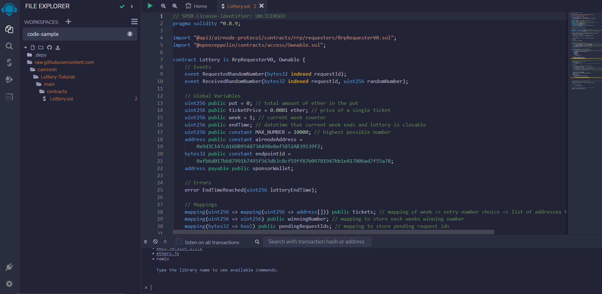
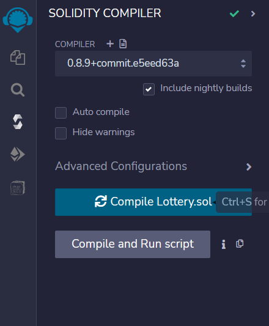
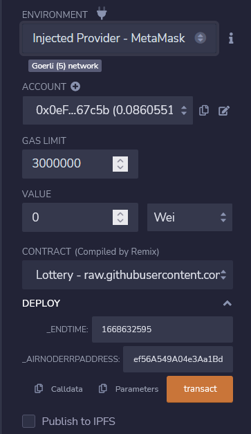
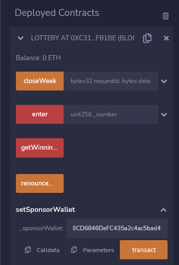
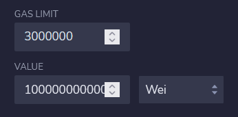
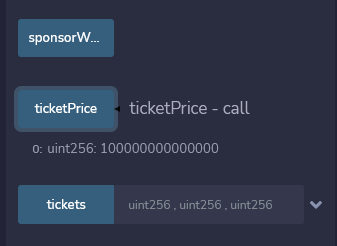
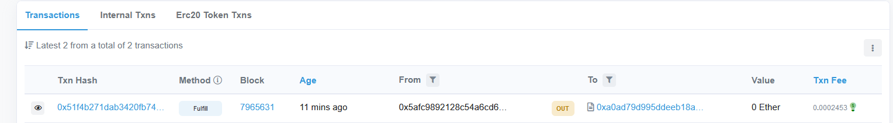
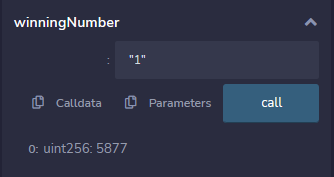

<PageHeader/>

<SearchHighlight/>

<FlexStartTag/>

# {{$frontmatter.title}}

This is a simple tutorial that will walk you through building and deploying a
decentralized lottery smart contract in Solidity using Remix to demonstrate the
use of [API3's QRNG](/reference/qrng/) service. You will use the browser-based
[Remix IDE](https://remix.ethereum.org) and [MetaMask](https://metamask.io/).
Some basic knowledge of these two tools is assumed.

Currently, QRNG has three [providers](/reference/qrng/providers.md), two of
which provide quantum random numbers. This guide will use the
[Testnet Random Numbers](/reference/qrng/providers#testnet-random-numbers),
available only on testnets, which returns a pseudorandom number.

Anyone can choose a number 1–10,000 and buy a ticket to enter into a weekly
lottery. The ticket revenue is collected into a pot in the contract. After 7
days, the contract will allow anyone to trigger the drawing.

The contract will then call the API3 QRNG for a truly random number generated by
quantum mechanics. The pot will be split amongst all users that chose this
winning number. If there are no winners, the pot will be rolled over to the next
week. Once deployed, the lottery will continue to run and operate itself
automatically without any controlling parties.

## 1. Coding the `Lottery` Contract

::: warning Check your Network!

Make sure you're on a Testnet before trying to deploy the contracts on-chain!

:::

> The complete contract code can be found
> [here](https://github.com/camronh/Lottery-Tutorial/blob/main/contracts/Lottery.sol)

Head on to [Remix online IDE](https://remix.ethereum.org) using a browser that
you have added Metamask support to. Not all browsers support
[MetaMask](https://metamask.io/download/).

It should load up the `Lottery` contract.

[Open in Remix](https://remix.ethereum.org/#url=https://raw.githubusercontent.com/api3-ecosystem/remix-contracts/master/contracts/Lottery.sol&lang=en&optimize=false&runs=200&evmVersion=null&version=soljson-v0.8.22+commit.4fc1097e.js)


As a requester, our `Lottery.sol` contract will make requests to an Airnode,
specifically the API3 QRNG, using the
[Request-Response Protocol (RRP)](/reference/qrng/airnode-rrp-v0.md). It may be
helpful to take a little time to familiarize yourself if you haven't already.

- You first need to define all the global variables - `pot`, `ticketPrice`,
  `week`, `endTime`, `MAX_NUMBER`, `airnodeAddress`, `endpointId` and
  `sponsorWallet`.

  ```Solidity
      // Global Variables
      uint256 public pot = 0; // total amount of ether in the pot
      uint256 public ticketPrice = 0.0001 ether; // price of a single ticket
      uint256 public week = 1; // current week counter
      uint256 public endTime; // datetime that current week ends and lottery is closable
      uint256 public constant MAX_NUMBER = 10000; // highest possible number
      address public constant airnodeAddress = 0x9d3C147cA16DB954873A498e0af5852AB39139f2;
      bytes32 public constant endpointId = 0x94555f83f1addda23fdaa7c74f27ce2b764ed5cc430c66f5ff1bcf39d583da36;
      address payable public sponsorWallet;
  ```

- Add the constructor function that will take the `_airnodeRrpAddress`

- When deploying the contract, you need to pass in a datetime that the lottery
  will end. After the lottery ends, the next week will begin and will end 7 days
  after the original `endTime`.

  ```Solidity
      /// @notice Initialize the contract with a set day and time of the week winners can be chosen
      /// @param _endTime Unix time when the lottery becomes closable
      constructor(uint256 _endTime, address _airnodeRrpAddress)
          RrpRequesterV0(_airnodeRrpAddress)
      {
          if (_endTime <= block.timestamp) revert EndTimeReached(_endTime);
          endTime = _endTime; // store the end time of the lottery
      }
  ```

The `Lottery` contract will have five main functions: `setSponsorWallet()`,
`enter()`, `getWinningNumber()`, `closeWeek()` and `getEntriesForNumber()`.

- The `setSponsorWallet()` function will set the address of the
  [Sponsor Wallet](/reference/airnode/latest/concepts/sponsor.md#sponsorwallet).
  We will need to fund this wallet later.

  ```Solidity
      function setSponsorWallet(address payable _sponsorWallet)
          external
          onlyOwner
      {
          sponsorWallet = _sponsorWallet;
      }
  ```

- The `enter()` function will take in `_number` as a parameter. It will be the
  participant's chosen lottery number for which they're buying a ticket. It will
  then add the user's address to list of entries for their number under the
  current week and add the funds to the `pot`.

  ```solidity
  function enter(uint256 _number) external payable {
      require(_number <= MAX_NUMBER, "Number must be 1-MAX_NUMBER"); // guess has to be between 1 and MAX_NUMBER
      if (block.timestamp >= endTime) revert EndTimeReached(endTime); // lottery has to be open
      require(msg.value == ticketPrice, "Ticket price is 0.0001 ether"); // user needs to send 0.0001 ether with the transaction
      tickets[week][_number].push(msg.sender); // add user's address to list of entries for their number under the current week
      pot += ticketPrice; // account for the ticket sale in the pot
  }
  ```

Users can call this function with a number 1-10000 and a value of 0.001 ether to
buy a lottery ticket. The user's address is added to the addresses array in the
`tickets` mapping.

- The `getWinningNumber()` function will be used to make the request for
  randomness. It calls the `airnodeRrp.makeFullRequest()` function of the
  `AirnodeRrpV0.sol` protocol contract which adds the request to its storage and
  emits a `requestId`.

  ```Solidity
  function getWinningNumber() external payable {
    // require(block.timestamp > endTime, "Lottery has not ended"); // not available until end time has passed
    require(msg.value >= 0.01 ether, "Please top up sponsor wallet"); // user needs to send 0.01 ether with the transaction
    bytes32 requestId = airnodeRrp.makeFullRequest(
        airnodeAddress,
        endpointId,
        address(this), // Use the contract address as the sponsor. This will allow us to skip the step of sponsoring the requester
        sponsorWallet,
        address(this), // Return the response to this contract
        this.closeWeek.selector, // Call this function with the response
        "" // No params
    );
    pendingRequestIds[requestId] = true; // Store the request id in the pending request mapping
    emit RequestedRandomNumber(requestId); // Emit an event that the request has been made
    sponsorWallet.call{value: msg.value}(""); // Send funds to sponsor wallet
  }
  ```

- The off-chain QRNG Airnode gathers the request and performs a callback to the
  contract with the random number. Here, the `closeWeek()` function fulfills the
  request, gets the random number and assigns it as the winning number for that
  week.

- It then checks from an array of addresses who participated in the lottery,
  divides the pot evenly among the winners and sends it to each winner.

  ```solidity
      function closeWeek(bytes32 requestId, bytes calldata data)
          external
          onlyAirnodeRrp
      {
          require(pendingRequestIds[requestId], "No such request made");
          delete pendingRequestIds[requestId]; // remove request id from pending request ids

          uint256 _randomNumber = abi.decode(data, (uint256)) % MAX_NUMBER; // get the random number from the data
          emit ReceivedRandomNumber(requestId, _randomNumber); // emit the random number as an event

          // require(block.timestamp > endTime, "Lottery is open"); // will prevent duplicate closings. If someone closed it first it will increment the end time and not allow

          winningNumber[week] = _randomNumber;
          address[] memory winners = tickets[week][_randomNumber]; // get list of addresses that chose the random number this week
          unchecked {
              ++week; // increment week counter, will not overflow on human timelines
          }
          endTime += 7 days; // set end time for 7 days later
          if (winners.length > 0) {
              uint256 earnings = pot / winners.length; // divide pot evenly among winners
              pot = 0; // reset pot
              for (uint256 i = 0; i < winners.length; ) {
                  payable(winners[i]).call{value: earnings}(""); // send earnings to each winner
                  unchecked {
                      ++i;
                  }
              }
          }
      }
  ```

The `getEntriesForNumber()` is a read only function that returns the list of
addresses that chose the given number for the given week.

```Solidity
function getEntriesForNumber(uint256 _number, uint256 _week) public view returns (address[] memory) {
    return tickets[_week][_number];
}
```

The
[`receive()`](https://docs.soliditylang.org/en/v0.8.14/contracts.html#receive-ether-function)
function will be called if funds are sent to the contract. In this case, we need
to add these funds to the pot.

```Solidity
receive() external payable {
    pot += msg.value; // add funds to the pot
}
```

## 2. Deploying the Contract

:::warning Set up your Testnet Metamask Account!

Make sure you've already configured your Metamask wallet and funded it with some
testnet ETH before moving forward. You can request some from
[here](https://faucet.paradigm.xyz/)

:::

Now deploy the Lottery contract and call it through Remix. It will call the QRNG
Airnode to request a random number.

### Compile and Deploy the Lottery Contract on Goerli Testnet

- [Click here](https://remix.ethereum.org/#url=https://raw.githubusercontent.com/api3-ecosystem/remix-contracts/master/contracts/Lottery.sol&lang=en&optimize=false&runs=200&evmVersion=null&version=soljson-v0.8.22+commit.4fc1097e.js)
  to open the Lottery Contract in Remix.

  

- Click on the **COMPILE** tab on the left side of the dashboard and click on
  **Compile Lottery.sol**

  

- Head to Deploy and run Transactions and select **Injected Provider —
  MetaMask** option under **Environment**. Connect your MetaMask. Make sure
  you’re on the Goerli Testnet.

- The `endTime` will be the ending time of the lottery. To have it end in the
  next week, execute the following code snippet. Use its output for `_ENDTIME`

  ```js
  console.log((nextWeek = Math.floor(Date.now() / 1000) + 9000));
  ```

- The `_airnodeRrpAddress` is the main `airnodeRrpAddress`. The RRP Contracts
  have already been deployed on-chain. You can check for your specific chain
  [here](/reference/airnode/latest/). Fill it in and Deploy the Contract.

  

## 3. Deriving the Sponsor Wallet

The
[Sponsor Wallet](/reference/airnode/latest/concepts/sponsor.md#sponsorwallet)
needs to be derived from the requester's contract address (Lottery contract in
this case), the Airnode address, and the Airnode xpub. The wallet is used to pay
gas costs of the transactions. The sponsor wallet must be derived using the
command
[derive-sponsor-wallet-address](/reference/airnode/latest/developers/requesters-sponsors.md#how-to-derive-a-sponsor-wallet)
from the Admin CLI. Use the value of the sponsor wallet address that the command
outputs while making the request. **This wallet needs to be funded.**

::: details Testnet Random Numbers QRNG Airnode Details

```
Testnet Random Numbers QRNG Airnode Address = 0x6238772544f029ecaBfDED4300f13A3c4FE84E1D
Testnet Random Numbers QRNG Airnode XPUB = xpub6CuDdF9zdWTRuGybJPuZUGnU4suZowMmgu15bjFZT2o6PUtk4Lo78KGJUGBobz3pPKRaN9sLxzj21CMe6StP3zUsd8tWEJPgZBesYBMY7Wo
```

:::

```sh
npx @api3/airnode-admin derive-sponsor-wallet-address \
  --airnode-xpub xpub6CuDdF9zdWTRuGybJPuZUGnU4suZowMmgu15bjFZT2o6PUtk4Lo78KGJUGBobz3pPKRaN9sLxzj21CMe6StP3zUsd8tWEJPgZBesYBMY7Wo \
  --airnode-address 0x6238772544f029ecaBfDED4300f13A3c4FE84E1D \
  --sponsor-address <Use the address of your Deployed Lottery Contract>

  Sponsor wallet address: 0x6394...5906757
  # Use the above address from your command execution as the value for sponsorWallet.
```

Click on the `setSponsorWallet` button and enter your Sponsor Wallet Address to
set it on-chain.



::: warning Designated Sponsor Wallets

Sponsors should not fund a `sponsorWallet` with more than they can trust the
Airnode with, as the Airnode controls the private key to the `sponsorWallet`.
The deployer of such Airnode undertakes no custody obligations, and the risk of
loss or misuse of any excess funds sent to the `sponsorWallet` remains with the
sponsor.

:::

## 4. Making the Bet

To make a bet on-chain, we've defined a minimum ticket price that the user will
have to pay to make a bet (0.0001 ETH). Under Deployed Contracts, select the
`enter` function and enter your number. You will also need to send in the ticket
price along with the bet. Head over to the top and enter the `ticketPrice` under
**VALUE** and click on transact.




You can also check the Ticket Price by running the `ticketPrice` function.



Next, you need a way for people to call Airnode for a random number when the
lottery is closed. Call the `getWinningNumber` function in the contract to make
a random number request. This function will emit an event that will be used to
listen for our `requestID` that will be used to listen for a response. This
function will also fund the sponsor wallet.

Enter the amount to fund the sponsor wallet (0.01 ETH) and call
`getWinningNumber`


Head over to [Goerli Testnet Explorer](https://goerli.etherscan.io/) and check
your `sponsorWallet` for any new transactions.



Here, You can see the latest `Fulfill` transaction.

::: info You might need to wait for a minute or two

The Airnode calls the fulfill() function in `AirnodeRrpV0.sol` that will in turn
call back the requester contract at `fulfillAddress` using function
`fulfillFunctionId` to deliver data.

:::

You can check the winning number by calling `winningNumber`. Pass in the week to
check which number won that week.



## Conclusion

This is how you can use Quantum Randomness in your smart contracts. To learn
more, go to the [QRNG reference](/reference/qrng/) section. If you have any
doubts/questions, visit the API3
[Discord](https://discord.com/channels/758003776174030948/765618225144266793).

<FlexEndTag/>
