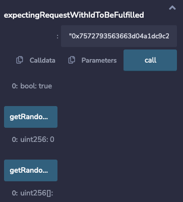

<PageHeader/>

<SearchHighlight/>

<FlexStartTag/>

# {{$frontmatter.title}}

This project is a simple and quick introduction to
[API3's QRNG](/reference/qrng/) service. Simply follow the steps to see how a
smart contract can access an on-chain quantum random number. You will use the
browser-based [Remix IDE<ExternalLinkImage/>](https://remix.ethereum.org) and
[MetaMask<ExternalLinkImage/>](https://metamask.io/). Some basic knowledge of
these two tools is assumed.

Currently, QRNG has three [providers](/reference/qrng/providers.md), two of
which provide quantum random numbers. This guide will use the
[Nodary provider<ExternalLinkImage/>](https://nodary.io/), available only on
testnets, which returns a pseudorandom number.

To begin, you need to deploy and sponsor the
[`RemixQrngExample`](/reference/qrng/qrng-example.md) with a matching
[sponsor wallet](/reference/airnode/latest/concepts/sponsor.md#sponsorwallet).
The `RemixQrngExample` will be the primary contract that retrieves the random
number.

The `RemixQrngExample` submits a request for a random number to `AirnodeRrpV0`.
Airnode gathers the request from the `AirnodeRrpV0` protocol contract, retrieves
the random number off-chain, and sends it back to `AirnodeRrpV0`. Once received,
it performs a callback to the requester with the random number.

You can read more about how API3 QRNG Airnode uses the
[Request-Response Protocol here](/reference/airnode/latest/concepts/).

## 1. Coding the `RemixQrngExample`

Head on to [Remix online IDE<ExternalLinkImage/>](https://remix.ethereum.org)
using a browser that you have added Metamask support to. Not all browsers
support [MetaMask<ExternalLinkImage/>](https://metamask.io/download/). It should
load up the `RemixQrngExample` contract.

[Open in Remix<ExternalLinkImage/>](https://remix.ethereum.org/#url=https://raw.githubusercontent.com/api3dao/qrng-example/main/contracts/QrngExample.sol)

> 

The `RemixQrngExample` will have five main functions: `setRequestParameters()`,
`makeRequestUint256()`, `fulfillUint256()`, `makeRequestUint256Array()`, and
`fulfillUint256Array()`.

- The `setRequestParameters()` takes in `airnode`, `endpointIdUint256`,
  `_endpointIdUint256Array`, `sponsorWallet` and sets these parameters on-chain.

```solidity
    function setRequestParameters(
        address _airnode,
        bytes32 _endpointIdUint256,
        bytes32 _endpointIdUint256Array,
        address _sponsorWallet
    ) external {
        airnode = _airnode;
        endpointIdUint256 = _endpointIdUint256;
        endpointIdUint256Array = _endpointIdUint256Array;
        sponsorWallet = _sponsorWallet;
    }
```

- The `makeRequestUint256()` function calls the `airnodeRrp.makeFullRequest()`
  function of the `AirnodeRrpV0.sol` protocol contract which adds the request to
  its storage and emits a `requestId`.

```solidity
    function makeRequestUint256() external {
        bytes32 requestId = airnodeRrp.makeFullRequest(
            airnode,
            endpointIdUint256,
            address(this),
            sponsorWallet,
            address(this),
            this.fulfillUint256.selector,
            ""
        );
        waitingFulfillment[requestId] = true;
        latestRequest.requestId = requestId;
        latestRequest.randomNumber = 0;
        emit RequestedUint256(requestId);
    }
```

- The targeted off-chain QRNG Airnode gathers the request and performs a
  callback to the `RemixQrngExample` with the random number.

```solidity
    function fulfillUint256(bytes32 requestId, bytes calldata data)
        external
        onlyAirnodeRrp
    {
        require(
            waitingFulfillment[requestId],
            "Request ID not known"
        );
        waitingFulfillment[requestId] = false;
        uint256 qrngUint256 = abi.decode(data, (uint256));
        // Do what you want with `qrngUint256` here...
        latestRequest.randomNumber = qrngUint256;
        emit ReceivedUint256(requestId, qrngUint256);
    }
```

Similarly, `makeRequestUint256Array()` takes in `_endpointIdUint256Array` and
can be used to request an array of random numbers.

```solidity
    function makeRequestUint256Array(uint256 size) external {
        bytes32 requestId = airnodeRrp.makeFullRequest(
            airnode,
            endpointIdUint256Array,
            address(this),
            sponsorWallet,
            address(this),
            this.fulfillUint256Array.selector,
            // Using Airnode ABI to encode the parameters
            abi.encode(bytes32("1u"), bytes32("size"), size)
        );
        expectingRequestWithIdToBeFulfilled[requestId] = true;
        emit RequestedUint256Array(requestId, size);
    }
```

The `fulfillUint256Array()` will be the callback if an array of random numbers
is requested.

```solidity
    function fulfillUint256Array(bytes32 requestId, bytes calldata data)
        external
        onlyAirnodeRrp
    {
        require(
            expectingRequestWithIdToBeFulfilled[requestId],
            "Request ID not known"
        );
        expectingRequestWithIdToBeFulfilled[requestId] = false;
        uint256[] memory qrngUint256Array = abi.decode(data, (uint256[]));
        // Do what you want with `qrngUint256Array` here...
        emit ReceivedUint256Array(requestId, qrngUint256Array);
    }
```

## 2. Compiling the Contract

Be sure the `RemixQrngExample.sol` contract is selected in the **FILE EXPLORER**
tab. Switch to the **SOLIDITY COMPILER** tab. Select the `0.8.9` version of
Solidity from the **COMPILER** pick list. Select the **Compile
RemixQrngExample.sol** button to compile the `RemixQrngExample.sol` contract.

> 

## 3. Deploying the Contract

::: danger Deploy to a testnet only.

Do not deploy the `RemixQrngExample.sol` contract to a production network. It
lacks adequate security features!

:::

This guide will use the
[Nodary provider<ExternalLinkImage/>](https://nodary.io/) which has the same
usage as the production quantum random number generator
[providers](/reference/qrng/providers.md) but returns a pseudorandom number.

- Switch to the **DEPLOY & RUN TRANSACTIONS** tab. Use MetaMask and switch to
  the desired account and testnet for your deployment.

- Select the **ENVIRONMENT** pick list and switch to _Injected Web3_. Check that
  the testnet and account you selected in MetaMask are displayed in Remix as
  shown below.

- Be sure `QrngReqester - contracts/QrngReqester.sol` is selected in the
  **CONTRACT** pick list.

- Add the Airnode `_airnodeRrp` address parameter value for the constructor into
  the field next to the **Deploy** button. See the
  [list of addresses](/reference/qrng/chains.md) for the testnet you are using.

- Click on **Deploy** and approve the transaction with MetaMask.

> 

## 4. Setting the Parameters

Before making a request, parameters must be set. They determine which Airnode
endpoint will be called and define the wallet used to pay the gas costs for the
response.

Under **Deployed Contracts** expand and expose the functions and variables of
the contract. Note the address of the contract that is displayed with its name.
This is the requester's contract address which will be needed later. Next,
expand the **`setRequestParameters`** function. Add the following to the
corresponding fields for the function.

- `_airnode`: The airnode address of the desired QRNG service provider. Use
  **nodary**
  (`0x6238772544f029ecaBfDED4300f13A3c4FE84E1D`→<CopyIcon text="0x6238772544f029ecaBfDED4300f13A3c4FE84E1D"/>).

- `_endpointIdUint256`: The **nodary** Airnode endpoint ID
  (`0xfb6d017bb87991b7495f563db3c8cf59ff87b09781947bb1e417006ad7f55a78`→<CopyIcon text="0xfb6d017bb87991b7495f563db3c8cf59ff87b09781947bb1e417006ad7f55a78"/>)
  which will return a single random number.

- `_endpointIdUint256Array`: The **nodary** Airnode endpoint ID
  (`0x27cc2713e7f968e4e86ed274a051a5c8aaee9cca66946f23af6f29ecea9704c3`→<CopyIcon text="0x27cc2713e7f968e4e86ed274a051a5c8aaee9cca66946f23af6f29ecea9704c3"/>)
  which will return an array of random numbers.

- `_sponsorWallet`: A wallet derived from the Airnode address and the Airnode
  xpub used by **nodary**, and the smart contract address for
  `RemixQrngExample.sol`. The wallet is used to pay gas costs to acquire a
  random number. A sponsor wallet must be derived using the command
  [derive-sponsor-wallet-address](/reference/airnode/latest/packages/admin-cli.md#derive-sponsor-wallet-address)
  from the Admin CLI. Use the value of the _sponsor wallet address_ that the
  command outputs.

  ```sh
  npx @api3/airnode-admin derive-sponsor-wallet-address \
    --airnode-address 0x6238772544f029ecaBfDED4300f13A3c4FE84E1D \
    --airnode-xpub xpub6CuDdF9zdWTRuGybJPuZUGnU4suZowMmgu15bjFZT2o6PUtk4Lo78KGJUGBobz3pPKRaN9sLxzj21CMe6StP3zUsd8tWEJPgZBesYBMY7Wo \
    --sponsor-address <use-the-address-of: RemixQrngExample.sol>

    # --airnode-address: Airnode address (nodary provider)
    # --airnode-xpub:    Airnode xpub (nodary provider)
    # --sponsor-address: Use the smart contract address for
    #                    RemixQrngExample.sol as displayed in the Remix IDE.

    # The command outputs.
    Sponsor wallet address: 0x6394...5906757
    # Use this address as the value for _sponsorWallet.
  ```

  Be sure to fund the public address of the sponsor wallet that the command
  outputs with enough testnet currency. The funds are used to pay gas costs for
  the Airnode's response. You can use the table below for the amount of fund as
  reference.

  ::: details Funding table reference

  | Testnet                   | Amount | Unit  | Chain Id |
  | ------------------------- | ------ | ----- | -------- |
  | Ethereum-Goerli           | 0.1    | ETH   | 5        |
  | Ethereum-Sepolia          | 0.05   | SEP   | 11155111 |
  | RSK testnet               | 0.001  | tRBTC | 31       |
  | POA Network Sokol testnet | 0.05   | POA   | 77       |
  | BNB Chain testnet         | 0.005  | tBNB  | 97       |
  | Optimism testnet          | 0.05   | ETH   | 420      |
  | Moonbase Alpha testnet    | 0.1    | DEV   | 1287     |
  | Fantom testnet            | 0.5    | FTM   | 4002     |
  | Avalanche Fuji testnet    | 0.3    | AVAX  | 43113    |
  | Polygon Mumbai testnet    | 0.05   | MATIC | 80001    |
  | Milkomeda C1 testnet      | 0.5    | mTAda | 200101   |
  | Arbitrum testnet          | 0.01   | AGOR  | 421613   |

  :::

Select the <b>Transact</b> button in Remix to send the parameters to the smart
contract. Approve the transaction with MetaMask. After the transaction completes
you can see each parameter's value by clicking the buttons with a parameter
name. These parameters will be used each time the smart contract requests a
random number.

<SponsorWalletWarning/>

## 5. Make a Request

Be sure you have funded the sponsor wallet created in the last step. Its funds
will be used to pay gas costs when Airnode returns a random number to the
callback function `fulfillUint256()`.

Each request made will use the parameters set in the last step. You can change
the parameters at any time and subsequent requests will use the newer parameter
set.

To make a request select the **makeRequest** button in Remix. Approve the
transaction with MetaMask.

<!-- prettier-ignore -->
As soon as the transaction completes in MetaMask, select the **lastRequest** button in Remix. You will see the
`requestId` and a `randomNumber` which equals _0_. This is because the random
number has yet to be returned to the callback function. Copy and paste the
`requestId` into the field for **`waitingFulfillment`** and
select the button. You will see the value is _true_, meaning the callback has
not been made.

> 

## 6. View the Response

The request is gathered by the off-chain Airnode which in turn calls the API
provider. Once the API provider returns data, Airnode will callback to the
`RemixQrngExample.sol` contract function
`fulfillUint256(bytes32 requestId, bytes calldata data)`.

Select the the **lastRequest** button in Remix again. If the callback has been
successfully completed the randomNumber will be present. The value of
**waitingFulfillment** will be _false_.

> 

<FlexEndTag/>
