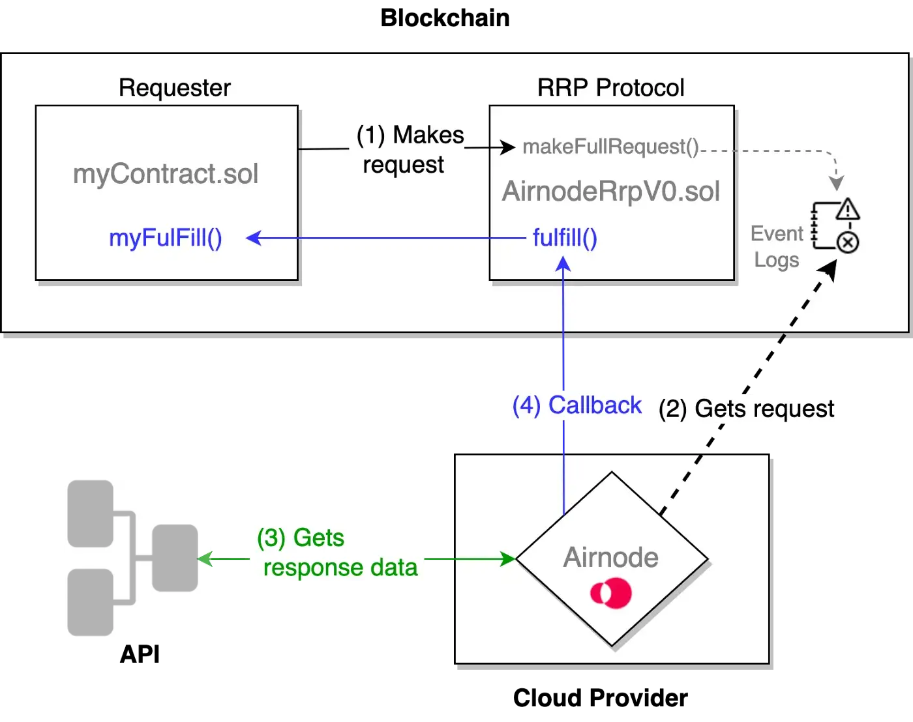
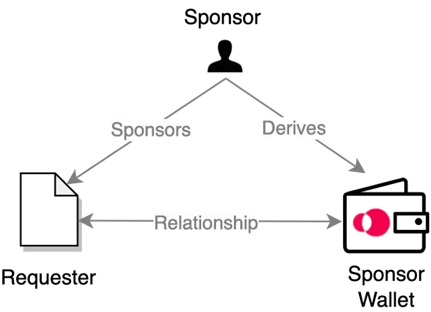

<PageHeader/>

# {{$frontmatter.title}}

[Quantumon](https://quantumon.xyz/) - Quantum Monsters are a collection of AI
generated monsters that are minted to users with the help of
[API3's QRNG](/reference/qrng/) and [DALL-E AI](https://openai.com/dall-e-2/).
It utilises the power of QRNG to generate unique random NFTs.

One of the most important aspects of NFTs is their perceived rarity making it
very important for the attributes that affect rarity to be randomly generated.
If a bad actor exploits the minting contract, they can keep the rare items for
themselves making it unfair for everyone else. With QRNG, you can do fair
distribution of NFTs using
[“out of order”](https://www.justinsilver.com/technology/cryptocurrency/nft-mint-random-token-id/)
minting.

## Understanding Quantumon

To see how Quantumon works, you can visit the
[Quantumon](https://quantumon.xyz/) website. It uses an ERC-721 standard
contract and QRNG to mint random NFTs and distribute them.
[Check out the code here]().

Start by specifying the license, solidity version, importing the necessary
contracts and then creating the actual contract itself.

```solidity
//SPDX-License-Identifier: MIT
pragma solidity 0.8.14;
import "@api3/airnode-protocol/contracts/rrp/requesters/RrpRequesterV0.sol";
import "@openzeppelin/contracts/token/ERC721/ERC721.sol";
import "@openzeppelin/contracts/access/Ownable.sol";
contract Quantumon is ERC721, RrpRequesterV0, Ownable {

}
```

- **Ownable** : This is [Openzeppelin implementation of an ownership]()
  contract. Contracts that inherit the Ownable contract have access to modifiers
  that make it possible for certain function to only be invoked by the owner.
  The owner of the contract is the contract deployer. However the ownership can
  be transferred by the owner.

- **ERC721** : This is
  [Openzeppelin implementation of a Non Fungible Token(NFT)](https://docs.openzeppelin.com/contracts/3.x/erc721)
  standard. This is the contract we inherit to have the contract be able to mint
  and transfer NFTs.

- **RrpRequesterV0** : The main contract will inherit this contract to be
  declared as a Requester that will be communicating with the
  [Request Response Protocol(RRP)](/reference/airnode/latest/concepts/). Using
  the RRP protocol you will request for a random number from the QRNG Airnode.

### Constructor and Public Variables

```solidity
contract Quantumon is ERC721, RrpRequesterV0, Ownable {
    using Strings for uint256;


    uint256[9958] public ids; //Array to store the Quantomon Id - This is different from the tokenId
    uint256 private index;	// Track the next TokenId to be minted
    string private _baseURIextended; // The Extended baseUrl for ERC721
    mapping(uint256 => string) private _tokenURIs; //Mapping a custom URI to a tokenId

    address public airnode;            //The address of the QRNG airnode
    bytes32 public endpointIdUint256;  // The endpointId of the airnode to fetch a single random number
    address public sponsorWallet;      // The address of the sponsorWallet that will be making the fullfillment transaction


    // Mapping that maps the requestId for a random number to the fullfillment status of that request
    mapping(bytes32 => bool) public expectingRequestWithIdToBeFulfilled;

    //Mapping that maps the requestId to the address that made the request
    mapping(bytes32 => address) requestToSender;

    constructor(address _airnodeRrp)
        RrpRequesterV0(_airnodeRrp)
        ERC721("QUANTUMON", "QUANTUMON")
    {

    }
}
```

- `using Strings for uint256;`

  - This statement makes it possible for a `uint256` variable to call up
    functions in the Strings library.

- `ids`: This is an array used to help in “out of order” minting process. This
  array does not keep track of the already minted NFTs.

- `index`: This variable will be used to keep track of the number of NFTs minted
  so far.

- `_baseURIextended`: This variable holds the base URI which will be appended to
  the tokenURI of each minted NFT.

- `airnode`: The airnode variable holds the address of the QRNG Airnode which
  will be used to request a random number from.

- `endpointIdUint256`: When sending a request to the airnode you need to specify
  the endpointId. You can think of the `endpointId` as the path in a url. For
  example if the URL is `www.google.com/images` then `www.google.com` would be
  the airnode and `/images` would be the `endpointId`.

- `sponsorWallet`: The fullfilment transaction that returns us the random number
  will be done via the `sponsorWallet` of QRNG Airnode. It is called
  `sponsorWallet` because it is derived via the sponsor address(since we import
  `RrpRequesterV0` this contract sponsor’s itself so the sponsor address is the
  address of the contract after it is deployed) and the QRNG Airnode’s extended
  public key.

- `expectingRequestWithIdToBeFulfilled`: Whenever you make a request to the
  airnode, a `requestId` is returned. This mapping maps the `requestId` to a
  boolean, setting it true when a request is made and setting it false when the
  request is fulfilled.

- `requesterToSender`: This mapping maps the `requestId` to the address making
  the request.

The constructor of the contract will be invoked when we deploy the contract. The
constructor will accept a single argument called `_airnodeRrp` . This argument
is the address of the Airnode
[Request Response Protocol](/reference/airnode/latest/concepts/) of the chain
this contract will be deployed to. A list of all the AirnodeRrp addresses can be
found [here](/reference/airnode/latest/airnode-addresses.html) for each chain.
This address is passed onto the constructor of `RrpRequesterV0` which sets the
current deployed contract as a sponsor for itself. You don’t have to worry about
sponsorship for now we will cover that in a bit.

You also need to call the constructor of `ERC721` and give it the `tokenName`
and `tokenSymbol` as arguments. In this case it is `QUANTUMON` for both the name
and symbol.

### Setting the Request Parameters

```solidity
     function setRequestParameters(
        address _airnode,
        bytes32 _endpointIdUint256,
        address _sponsorWallet
    ) external onlyOwner {
        airnode = _airnode;
        endpointIdUint256 = _endpointIdUint256;
        sponsorWallet = _sponsorWallet;
        emit SetRequestParameters(airnode, endpointIdUint256, sponsorWallet);
    }
}
```

The `setRequestParameters` function is used to set the QRNG Airnode parameters.
It sets the `airnode`, `endpointIdUint256` and `sponsorWallet`. This function
has the `onlyOwner` modifier which means that only the owner of this contract
can call this function. The `setRequestParameters` function should be called
immediately after deploying the contract.

### Metadata and TokenURI functions

NFT platforms call the `tokenURI(uint256 tokenId)` function to get the url that
points to the metadata of the NFT. This metadata contains different attributes
of the NFT like its name, image and other custom attributes depending on which
platform you use. Opensea expects the metadata to be of the following format:

```json
{
    "description": "Friendly OpenSea Creature",
    "external_url": "https://openseacreatures.io/3",
    "image": "https://storage.googleapis.com/opensea-prod.appspot.com/puffs/3.png",
    "name": "Dave Starbelly",
    "attributes": [ ... ],
}
```

Override the default ERC721 `tokenURI()` method to enable custom URI for every
token and also add a `baseURL` that gets prefixed to every `tokenURI`.

```solidity
    function setBaseURI(string memory baseURI) external onlyOwner {
        _baseURIextended = baseURI;
        emit SetBaseURI(_baseURIextended);
    }

    function _setTokenURI(uint256 tokenId, string memory _tokenURI)
        internal
        virtual
    {
        require(
            _exists(tokenId),
            "ERC721Metadata: URI set of nonexistent token"
        );
        _tokenURIs[tokenId] = _tokenURI;
    }

    function _baseURI() internal view virtual override returns (string memory) {
        return _baseURIextended;
    }

    function tokenURI(uint256 tokenId)
        public
        view
        virtual
        override
        returns (string memory)
    {
        require(
            _exists(tokenId),
            "ERC721Metadata: URI query for nonexistent token"
        );

        string memory _tokenURI = _tokenURIs[tokenId];
        string memory base = _baseURI();

        // If there is no base URI, return the token URI.
        if (bytes(base).length == 0) {
            return _tokenURI;
        }
        // If both are set, concatenate the baseURI and tokenURI (via abi.encodePacked).
        if (bytes(_tokenURI).length > 0) {
            return string(abi.encodePacked(base, _tokenURI));
        }
        // If there is a baseURI but no tokenURI, concatenate the tokenID to the baseURI.
        return string(abi.encodePacked(base, tokenId.toString()));
   }
```

`_baseURI`: This function is an internal function which means that this can only
be called by this contract or contracts that inherit this contract. `_baseURI`
is a method of the original ERC721 contract, we are overriding it using the
override keyword to just return the `_baseURIextended` string.

`setBaseURI`: This function is an `onlyOwner` function that can set the
`_baseURIextended` string.

`_setTokenURI`: This is an internal function that maps the URI to a `tokenId`.
If the `tokenId` hasn’t been minted it will revert.

`tokenURI`: This is a `view` function (function that don’t change the state of
the blockchain) that is overridden to return the URI in the `_tokenURIs`
mapping. The code comments explain what it does in more detail.

:::tip Note: In solidity `string(abi.encodePacked(StringA,StringB))` returns the
concatenation of `stringA` and `stringB`.

:::

### How the NFTs are structured

We have all the necessary variables and functions to request a random number and
mint our NFT. In our case each NFT has a `_baseUrlExtended` that is set to

`https://quantumon.s3.amazonaws.com/data/quantum_dex/nft/`

If we add 0 to the end of that URL we get the metadata of the `0th` Quantumon.
If we add 1, we get the metadata of the `1st` Quantumon. In total there are
`9958` Quantumons which means there are `9958` metadata files. We want to be
able to randomly choose the number that gets appended to this url, however if a
Quantumon is already minted we don’t want to mint it again. To do this we use
this algorithm by Justin Silver that takes a random number and gives a
completely unique non minted QuantumonId.

```solidity
function _pickRandomUniqueId(uint256 random) private returns (uint256 id) {
    uint256 len = ids.length - index++;
    require(len > 0, 'no ids left');
    uint256 randomIndex = random % len;
    id = ids[randomIndex] != 0 ? ids[randomIndex] : randomIndex;
    ids[randomIndex] = uint16(ids[len - 1] == 0 ? len - 1 : ids[len - 1]);ids[len - 1] = 0;
    }
```

### `requestQuantumon` function

```solidity
    function requestQuantumon() public payable returns (bytes32) {
        require(
            msg.value >= 5 ether,
            "Need to send atleast 5 ether to the sponsorWallet"
        );
        bytes32 requestId = airnodeRrp.makeFullRequest(
            airnode,
            endpointIdUint256,
            address(this),
            sponsorWallet,
            address(this),
            this.generateQuantumon.selector,
            ""
        );
        expectingRequestWithIdToBeFulfilled[requestId] = true;
        requestToSender[requestId] = msg.sender;
        (bool success, ) = sponsorWallet.call{value: 0.01 ether}("");
        require(success, "Forward failed");
        emit RequestQuantumon(msg.sender, requestId);
        return requestId;
    }
```

To use the algorithm to mint the Quantumons you need to request the random
number first. The `requestQuantumon()` function creates the request to the
Airnode using the `airnodeRrp.makeFullRequest()` function. The
`airnodeRrp.makeFullRequest()` function expects the following arguments:

- `airnode`
- `endpointId`
- `sponsor`
- `sponsorWallet`
- `fulfillmentAddress`
- `fulfillmentFunction`
- `parameters`

To understand `sponsor` and `sponsorWallets`, we need to first understand the
first party oracle architecture. The diagram below will help you understand it a
little better.



Essentially when you call `makeFullRequest()` an event is emitted and the API’s
airnode is listening to this event. Based on the event it makes the call to the
actual API itself and fetches the data we requested. In our case it fetches the
random number and makes a callback. This callback is again a blockchain
transaction. Blockchain transaction costs gas and the API’s airnode doesn’t want
to spend money on gas. Hence we “sponsor” our smart contract and send gas tokens
to the api cloud provider to make the callback transaction.

But where do we send our funds? How will the API’s airnode know which sponsor
does the funds belong to in case of multiple such sponsors?

There is a way to derive a wallet that is owned by the api cloud provider which
will be unique for each sponsor.

using the command below you can derive a unique `sponsorWallet` for a given
sponsor, all you need is the airnode address and the airnode’s extended public
key.

```bash
npx @api3/airnode-admin derive-sponsor-wallet-address \
  --airnode-xpub xpub6CUGRUo... \
  --airnode-address 0xe1e0dd... \
  --sponsor-address 0x9Ec6C4...
```



By inheriting the `RrpRequesterV0` contract, we declare the contract as its own
sponsor. This means that we can substitute the address of the deployed contract
as the sponsor address in the above command.

`fulfillmentAddress` is the address the request will be fullfilled to, in our
case it will be the address of the contract itself.

`fullfullmentFunction` is the function within the `fulfillmentAddress` that will
be called with the requested data. In our case it is the `generateQuantumon`
Function

Now that we have all our parameters we can call the `makeFullRequest()`
function. The `makeFullRequest()` function returns a `requestId` , which we use
to set the `expectingRequestWithIdToBeFulfilled` mapping and also the
`requestToSender` mapping.

The `requestQuantumon` function has a `require(msg.value >= 5 ether,"...")`
condition, which means the user must pay 5 ether to be able to call this
function.

> _To have a streamlined UX we can have the user pay for the fulfillment
> transaction by sending some funds over to the sponsorWallet using
> sponsorWallet.call{value: 0.01 ether}("") . In most cases this amount should
> be enough to cover the fulfillment transaction, however it depends on the gas
> price and gas cost of the transaction, so vary it accordingly._

### `generateQuantumons` function

```solidity
    function generateQuantumon(bytes32 requestId, bytes calldata data)
        public
        onlyAirnodeRrp
    {
        require(
            expectingRequestWithIdToBeFulfilled[requestId],
            "Request ID not known"
        );
        expectingRequestWithIdToBeFulfilled[requestId] = false;
        uint256 qrngUint256 = abi.decode(data, (uint256));
        uint256 id = _pickRandomUniqueId(qrngUint256);
        uint256 tokenId = index - 1;
        _safeMint(requestToSender[requestId], tokenId);
        _setTokenURI(tokenId, id.toString());
        emit GenerateQuantumon(requestToSender[requestId], tokenId);
    }
```

When the airnode makes the fullfillment transaction it will call
`generateQuantumon()` with `requestId` and data as arguments.

:::warning Note: `generateQuantumon()` has the `onlyAirnodeRrpmodifier` which
means that only the `AirnodeRrp`contract can call this function. 

:::

we decode the data, using `abi.decode(data, (uint256))` . We decode using
`uint256` because we know that `data` only contains a `uint256` random number.
Using this random number we call `_pickRandomUniqueId()` to get a non minted
Quantumon Id. We use index to keep track of the how many Quantumons have been
minted and it also serves as the `tokenId` of the next mint.

We now call the `_mint()` function and supply it `destinationAddress`, `tokenId`
as arguments. The destination address is the address we set in the
`requestToSender` mapping for the specified `requestId`.

We also call the `_setTokenURI()` which maps the Quantumon `id` to the
`tokenId`. (Remember: the tokenIds are minted sequentially, but we want the
Quantumon ids to be minted “out of order”).

## Conclusion

In this guide, you learnt how Quantumon utilises QRNG to mint Quantumon
Monsters. You also learnt how to request data from a QRNG Airnode and how to use
the data to mint an NFT.

[Click here]() to see the source code for the Quantumon contract.
