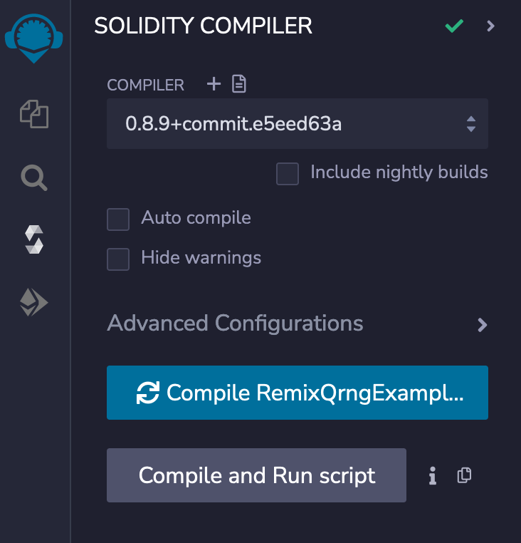

<PageHeader/>

<SearchHighlight/>

<FlexStartTag/>

# {{$frontmatter.title}}

This guide is an introduction to API3's QRNG service. Follow along to see how a
requester (smart contract) can access an on-chain quantum random number. You
will use the browser based Remix IDE and MetaMask. Some basic knowledge of these
two tools is assumed. This guide uses the Goerli testnet so you will need
[GoerliETH<ExternalLinkImage/>](https://goerlifaucet.com/).

Currently QRNG has three [providers](/reference/qrng/providers.md), two of which
provide quantum random numbers. This guide will use the
[byog](/reference/qrng/providers.md#byog-pseudorandom-numbers) provider,
available only on testnets, which returns a pseudorandom number.

## 1. Load the Remix workspace

[Click here](https://remix.ethereum.org/#version=soljson-v0.8.9+commit.e5eed63a.js&optimize=false&runs=200&gist=7726bda976cf162a846b5210aee483e5)
to open Remix pre-loaded with a workspace and a single smart contract called
`RemixQrngExample.sol` pulled from a gist on GitHub.

Optionally consider renaming the Remix workspace (now called gist-sample) to
"QRNG" using the hamburger menu. This will separate this guide from other guides
provided in these docs.


## 2. Understanding the smart contract

In the **FILE EXPLORER** tab click on the contract named `RemixQrngExample.sol`
to view its source code. This smart contract imports `RrpRequesterV0.sol`. The
smart contract function `makeRequestUint256()` calls the function
`airnodeRrp.makeFullRequest(...)` which requests the random number and returns a
`restestId`. The `requestId` is then added to the smart contract's variable
`latestRequest`.

When the random number is ready a callback to `fulfillUint256(...)` is made
which in turn populates the contract variable `latestRequest` with the random
number.

## 3. Compile the Contract

Be sure the `RemixQrngExample.sol` contract is selected in the **FILE EXPLORER**
tab. Switch to the <b>SOLIDITY COMPILER</b> tab. Select the `0.8.9` version of
Solidity from the <b>COMPILER</b> pick list. Select the <b>Compile
RemixQrngExample.sol</b> button to compile the `RemixQrngExample.sol` contract.



## 4. Deploy the Contract

Do not deploy the `RemixQrngExample.sol` contract to a production network. It
lacks adequate security features. This guide will use the
[byog](/reference/qrng/providers.md#byog-pseudorandom-numbers) provider which
has same usage as the production quantum random number generator
[providers](/reference/qrng/providers.md) but returns a pseudorandom number.

- Switch to the <b>DEPLOY & RUN TRANSACTIONS</b> tab. Use MetaMask and switch to
  the desired account and Goerli testnet for your deployment.
- Select the <b>ENVIRONMENT</b> pick list and switch to _Injected Provider -
  Metamask_. Check that the Goerli testnet and account you selected in MetaMask
  are displayed in Remix as shown below.

- Be sure `RemixQrngExample` is selected in the <b>CONTRACT</b> pick list.

- Next to the **Deploy** button, add the AirnodeRrpV0 `_airnodeRrp` address
  (`0xa0AD79D995DdeeB18a14eAef56A549A04e3Aa1Bd`→<CopyIcon text="0xa0AD79D995DdeeB18a14eAef56A549A04e3Aa1Bd"/>)
  on the [Goerli network](/reference/qrng/chains.html#byog) as the parameter
  value for the smart contract's constructor.

- Select the <b>Deploy</b> button and approve the transaction with MetaMask.


If you close the Remix IDE or change workspaces, Remix will lose track of any
deployed contracts. Under **Deployed Contracts** select the copy icon to the
right of the contract name. Add the contract's address to the `addresses.txt`
file under the **FILE EXPLORER**. This will be useful to reload the contract
should the need arise.

::: warning Remix Reload Contract

The [Remix Reload Contract](/guides/misc/remix-reload-contract/) guide will step
you through the process to reload a deployed contract in order to interact with
it again.

:::

## 5. Setting the Parameters

Before making a request, parameters must be set on the smart contract. They
determine which Airnode endpoint will be called and define the wallet used to
pay the gas costs for the response. They can be set once and all subsequent
calls for a random number will use the parameters repeatably.

Under <b>Deployed Contracts</b> expand and expose the functions and variables of
the contract. Note the address of the contract that is displayed with its name.
This is the requester's contract address which will be needed later. Next expand
the <b>setRequestParameters()</b> function. Add the following to the
corresponding fields for the function.

- `_airnode`: The airnode address of the desired QRNG service provider. Use
  **byog**
  (`0x6238772544f029ecaBfDED4300f13A3c4FE84E1D`→<CopyIcon text="0x6238772544f029ecaBfDED4300f13A3c4FE84E1D"/>).

- `_endpointIdUint256`: The **byog** Airnode endpoint ID
  (`0xfb6d017bb87991b7495f563db3c8cf59ff87b09781947bb1e417006ad7f55a78`→<CopyIcon text="0xfb6d017bb87991b7495f563db3c8cf59ff87b09781947bb1e417006ad7f55a78"/>)
  which will return a single random number.

- `_sponsorWallet`: A wallet derived from the Airnode address and the Airnode
  xpub used by **byog**, and the smart contract address for
  `RemixQrngExample.sol`. The wallet is used to pay gas costs to acquire a
  random number. A sponsor wallet must be derived using the command
  [derive-sponsor-wallet-address](/reference/airnode/latest/packages/admin-cli.md#derive-sponsor-wallet-address)
  from the Admin CLI. Use the value of the _sponsor wallet address_ that the
  command outputs.

  ```sh
  npx @api3/airnode-admin derive-sponsor-wallet-address \
    --airnode-address 0x6238772544f029ecaBfDED4300f13A3c4FE84E1D \
    --airnode-xpub xpub6CuDdF9zdWTRuGybJPuZUGnU4suZowMmgu15bjFZT2o6PUtk4Lo78KGJUGBobz3pPKRaN9sLxzj21CMe6StP3zUsd8tWEJPgZBesYBMY7Wo \
    --sponsor-address <use-the-address-of: RemixQrngExample.sol>

    # --airnode-address: Airnode address (byog provider)
    # --airnode-xpub:    Airnode xpub (byog provider)
    # --sponsor-address: Use the smart contract address for
    #                    RemixQrngExample.sol as displayed in the Remix IDE.

    # The command outputs.
    Sponsor wallet address: 0x6394...5906757
    # Use this address as the value for _sponsorWallet.
  ```

  Be sure to fund the public address of the sponsor wallet that the command
  outputs with enough testnet currency. The funds are used to pay gas costs for
  the Airnode's response. You can use the table below for the amount of fund as
  reference.

  ::: details Funding table reference

  | Testnet                   | Amount | Unit  | Chain Id |
  | ------------------------- | ------ | ----- | -------- |
  | Ethereum-Goerli           | 0.1    | ETH   | 5        |
  | Ethereum-Sepolia          | 0.05   | SEP   | 11155111 |
  | RSK testnet               | 0.001  | tRBTC | 31       |
  | POA Network Sokol testnet | 0.05   | POA   | 77       |
  | BNB Chain testnet         | 0.005  | tBNB  | 97       |
  | Optimism testnet          | 0.05   | ETH   | 420      |
  | Moonbase Alpha testnet    | 0.1    | DEV   | 1287     |
  | Fantom testnet            | 0.5    | FTM   | 4002     |
  | Avalanche Fuji testnet    | 0.3    | AVAX  | 43113    |
  | Polygon Mumbai testnet    | 0.05   | MATIC | 80001    |
  | Milkomeda C1 testnet      | 0.5    | mTAda | 200101   |
  | Arbitrum testnet          | 0.01   | AGOR  | 421613   |

  :::

Select the <b>Transact</b> button in Remix to send the parameters to the smart
contract. Approve the transaction with MetaMask. After the transaction completes
you can see each parameter's value by clicking the buttons with a parameter
name. These parameters will be used each time the smart contract requests a
random number.

<SponsorWalletWarning/>

## 6. Make a Request

Be sure you have funded the sponsor wallet created in step #5. Its funds will be
used to pay gas costs when Airnode returns a random number to the callback
function `fulfillUint256()`.

Each request made will use the parameters set in step #5. You can change the
parameters at any time and subsequent requests will use the newer parameter
values.

To make a request select the **MakeRequest** button in Remix. Approve the
transaction with MetaMask.

<!-- prettier-ignore -->
As soon as the transaction completes in MetaMask, select the **lastRequest** 
button in Remix. You will see the
`requestId` and a `randomNumber` which equals _0_. This is because the random
number has yet to be returned to the callback function. Copy and paste the
`requestId` into the field for **waitingFulfillment** and
select the button. You will see the value is _true_, meaning the callback has
not been made.


## 7. View the Response

The request is gathered by the off-chain Airnode which in turn calls the API
provider. Once the API provider returns data, Airnode will callback to the
`RemixQrngExample.sol` contract function
`fulfillUint256(bytes32 requestId, bytes calldata data)`.

Select the the **lastRequest** button in Remix again. If the callback has been
successfully completed the randomNumber will be present. The value of
**waitingFulfillment** will be _false_.


## More related material...

<div class="api3-css-nav-box-flex-row">
  <NavBox  type='REFERENCE' id="_reference-qrng-providers"/>
</div>

<FlexEndTag/>
