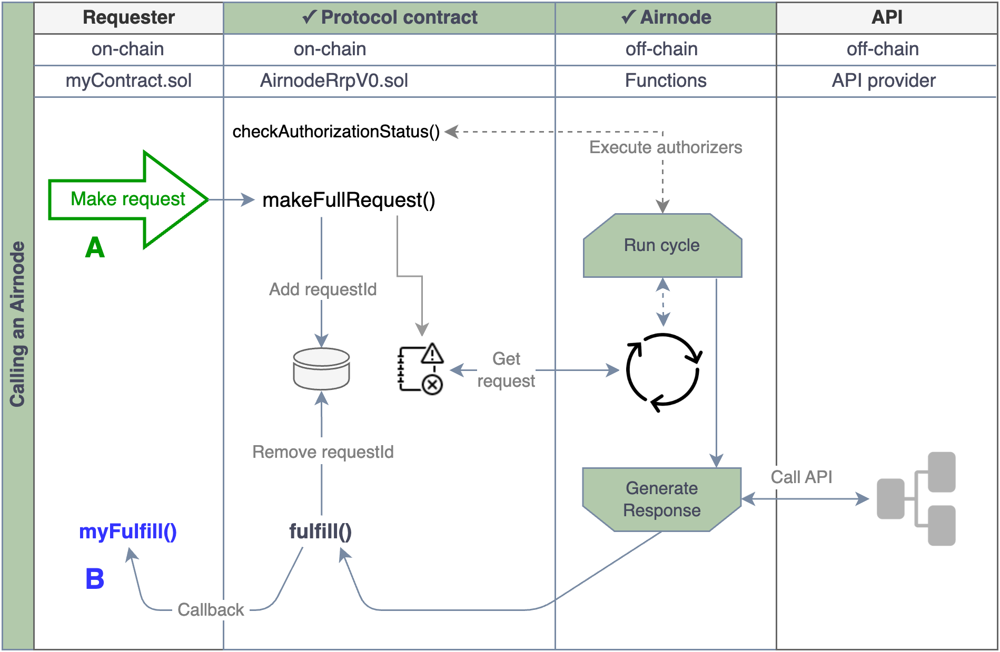

<VersionWarning/>

<PageHeader/>

<SearchHighlight/>

# {{$frontmatter.title}}

::: danger WARNING

This doc has been altered for `v1.0`. Do not overwrite when converting the
latest `v0.x` relase to the new docs.

:::

Airnode is a serverless oracle node implemented with a _"set and forget"_
[philosophy](/explore/airnode/unlocking-real-world-data.md).

::: danger TODO:

Add the new component that speaks to Airnode as a data source for both RRP and
dAPIs.

:::

<!-- TODO: Link why should you use Airnode -->

## Airnode processes RRP requests

An Airnode is capable of serving one or more APIs to
[requesters](./requester.md) (which are on-chain smart contracts) that request
data served by a particular Airnode. The AirnodeRrpV0 protocol is designed to be
flexible and is meant to serve a variety of use cases. See the Airnode
[requester examples](https://github.com/api3dao/airnode/tree/v0.8/packages/airnode-examples/contracts)<ExternalLinkImage/>
for potential design patterns.

Airnode consists of two parts: the off-chain **Airnode** (a.k.a. "the node")
deployed as self hosted or cloud provider functions, e.g., AWS) and the on-chain
**protocol contract** AirnodeRrpV0.sol. A requester calls the protocol contract,
which emits a blockchain event with the request parameters. Airnode listens to
the events emitted by the AirnodeRrpV0 contract. During the next run cycle,
Airnode gets the request parameters from the emitted event. The diagram below
illustrates the mechanics of the entire process.

Ignoring the mechanics of the overall process, the requester calling an Airnode
primarily focuses on two tasks, indicated by points A & B in the diagram below.

- <span style="color:green;font-weight:bold;">1</span>: Make the request
- <span style="color:blue;font-weight:bold;">2</span>: Accept and decode the
  response

> 
>
> 1.  <p>A requester makes a request to the AirnodeRrpV0 contract which adds the <code>requestId</code> to storage, emits the request to the event logs and returns the <code>requestId</code> to the requester. The request is retrieved by the Airnode during its next run cycle. It then verifies the requester is authorized by checking authorizer contracts assigned to the Airnode.</p>
> 2.  <p>If the request is authorized, Airnode proceeds to respond. It first gathers the requested data from the API and calls the <code>fulfill()</code> function in AirnodeRrpV0, which removes the pending <code>requestId</code> from storage and makes a callback to <code>myFulfill()</code>. The gas costs associated 
>     with the response are covered by the sponsor of the requester.</p>

## Airnode sources data for dAPIs

An Airnode also supplies the data, as datafeeds, to Beacons which are the
underlying data source for dAPIs.

::: danger TODO:

More content needed here. Something that starts like this:

Airnode has an attached mechanism the looks for a deviation it the value of its
endpoints which point to an API provider's API operations. This mechanism
updates beacons that are the source of data for all dAPIs.

:::

## mnemonic

Each and every Airnode has a unique mnemonic identifying its wallet. This
mnemonic is kept secret and Airnode is publicly identified using the default
[address](airnode.md#airnodeaddress) derived from the mnemonic.

## airnodeAddress

An Airnode is identified by the default address of a BIP 44 wallet (with the
path `m/44'/60'/0'/0/0`) which is referred to as the `airnodeAddress`. This
address is same for all chains on which Airnode operates. The wallet mnemonic is
specified in the [secrets.env](../deployment-files/secrets-env.md) file when
deploying the Airnode.

Use the admin CLI command
[derive-airnode-address](../packages/admin-cli.md#derive-airnode-address) to
derive the `airnodeAddress` from the mnemonic for informational purposes.

```bash
npx @api3/airnode-admin derive-airnode-address \
--airnode-mnemonic "cricket elephant ..."

# outputs
Airnode address: 0xaBd9...
```

## xpub

The Airnode owner announces the _extended public key_ (`xpub` of the hardened
derivation path `m/44'/60'/0'`) off-chain. Then a sponsor derives a
[sponsor wallet](sponsor.md#sponsorwallet) for the Airnode using the `xpub` and
`airnodeAddress`. The sponsor wallet will then be used by the Airnode to fulfill
requests made by the sponsor's contracts.

Use the admin CLI command
[derive-airnode-xpub](../packages/admin-cli.md#derive-airnode-xpub) to get the
`xpub` of an Airnode by passing the same mnemonic used to create the
`airnodeAddress`.

```bash
npx @api3/airnode-admin derive-airnode-xpub \
--airnode-mnemonic "cricket elephant ..."

# outputs
Airnode xpub: xpub6CUGRUo...
```

## Admin CLI: `generate-airnode-mnemonic`

The
[generate-airnode-mnemonic](../packages/admin-cli.md#generate-airnode-mnemonic)
command is useful because it will generate a mnemonic as well as return the
`airnodeAddress` and `xpub`.

```sh
npx @api3/airnode-admin generate-airnode-mnemonic

# output
This mnemonic is created locally on your machine using "ethers.Wallet.createRandom" under the hood.
Make sure to back it up securely, e.g., by writing it down on a piece of paper:

############################## MNEMONIC ###############################

cricket elephant ...

############################## MNEMONIC ###############################

The Airnode address for this mnemonic is: 0xaBd9...
The Airnode xpub for this mnemonic is: xpub6CUGRUo...
```

## Verification

The `xpub` that the Airnode owner has announced is not verified on-chain. A
sponsor can verify the `xpub` off-chain. Use the admin CLI command
[verify-xpub](../packages/admin-cli.md#verify-airnode-xpub) command from the
admin CLI.

```bash
npx @api3/airnode-admin verify-airnode-xpub \
--airnode-xpub xpub6CUGRUo... \
--airnode-address 0xaBd9...

# output
Airnode xpub is: VALID
```
