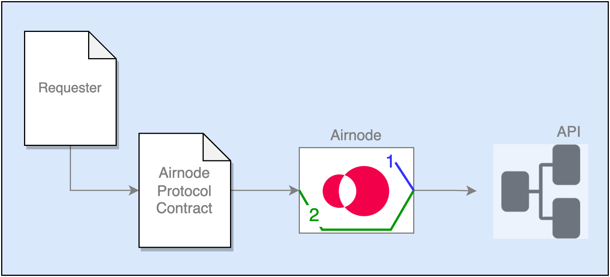

<VersionWarning/>

<PageHeader/>

<SearchHighlight/>

<FlexStartTag/>

# {{$frontmatter.title}}

Airnode can pass along security information (schemes) when making calls to API
operations. There are two groups of security schemes.

- [Airnode Authentication](/reference/airnode/latest/concepts/airnode-auth.md)
- [Relayed Meta Data Authentication](/reference/airnode/latest/concepts/relay-meta-auth.md)

<!-- prettier-ignore-->
> 
> 
> 1.  <p>The Airnode uses <i><b>Airnode Authentication Security Schemes</b></i> to authenticate itself to an API operation of which the values are known only by the Airnode.</p>
> 2.  <p>The Airnode uses <i><b>Relayed Meta Data Security Schemes</b></i> to forward known information from the requester's request to an API operation.</p>

Security schemes are declared by the required `type` property inside the
security scheme definition. The following security scheme types are supported.

- Airnode Authentication Security Schemes

  - apiKey
  - http

- Relayed Meta Data Security Schemes
  - relayRequesterAddress
  - relayChainId
  - relayChainType
  - relaySponsorAddress
  - relaySponsorWalletAddress
  - relayRequestId

It is important to note that the security schemes in any given OIS object apply
to all endpoints/API operations in the OIS object. If different security schemes
are required by a mix of endpoints/API operations, then more than one OIS object
will be required grouping endpoint/API operations based on their security needs.

## Airnode Authentication Security Schemes

An Airnode can use the following security scheme types to authenticate itself to
API operations.

- [apiKey]/reference/airnode/latest/understand/api-security.md#apikey)
- [http](/reference/airnode/latest/understand/api-security.md#http)

A security scheme requires a unique name within the OIS object for which it
exists. This name groups the security scheme values for `in`, `type`, and` name`
as shown in the two code examples below.

- `securitySchemes.<schemeName>`
- `security.<schemeName>`
- `apiCredentials[n].securitySchemeName`

### apiKey

The `apiKey` security scheme type allows you to define an API key the Airnode
will send to API operations. It is an object which consists of the following
fields:

- `type` must be `apiKey`
- `in` can be one of the `query`, `header` or `cookie`. This value specifies how
  the value will be sent to an API operation. When using the `query` option, the
  API key will be sent in the request body for POST requests and in query string
  for GET requests.

- `name` is the name of the API key that should be sent to an API. For example
  "X-Api-Key".

```json
"ois": [
  {
    "oisFormat": "2.0.0",
    "title": "Ois Title",
    "version": "1.0.0",
    "apiSpecifications": {
      "paths": ...
      "components": {
        "securitySchemes": {
          "requiresXApiKey": { <──────────────┐────┐
            "in": "header",                   │    │
            "type": "apiKey",                 │    │
            "name": "X-api-key"               │    │
          }                                   │    │
        }                                     │    │
      },                                      │    │
      "security": {                           │    │
        "requiresXApiKey": [] <───────────────┘    │
      } ,                                          │
      "endpoints": ...                             │
    }                                              │
  }                                                │
]                                                  │
```

The value of the `apiKey` goes in the `apiCredentials` field of `config.json`
designated by the proper `oisTitle` and `securitySchemeName` values, which is
not part of the `ois` object, it exists in the root level of the `config.json`
file. Normally the value is accessed using interpolation from the `secrets.env`
file.

```json
"apiCredentials": [                                │
  {                                                │
    "oisTitle": "Ois Title",                       │
    "securitySchemeName": "requiresXApiKey", <─────┘
    "securitySchemeValue": "${X_API_KEY}" // interpolated from secrets.env
  }
]
```

### http

The `http` security scheme type is used to define either a `basic` or `bearer`
authentication scheme. This security scheme will always be sent in the headers.
The security scheme value should be base64 encoded value "username:password" for
`basic` auth and the encoded token for `bearer` auth. It is an object which
consists of the following fields:

- `type` must be `http`
- `scheme` is either `basic` or `bearer`

```json
{
  "requiresBasicAuth": {
    "scheme": "basic",
    "type": "http"
  }
}
```

The value of the `http` goes in the `apiCredentials` field of `config.json`
designated by the proper `oisTitle` and `securitySchemeName` values, which is
not part of the `ois` object, it exists in the root level of the `config.json`
file. Normally the value is accessed using interpolation from the `secrets.env`
file.

```json
{
  "oisTitle": "Ois Title",
  "securitySchemeName": "requiresBasicAuth",
  "securitySchemeValue": "${BASE_64_ENCODED_BASIC_AUTH}" // interpolated from secrets.env
}
```

::: info Authentication Tutorial

The
[<span style="color: rgb(16, 185, 129)">authenticated-coinmarketcap</span>](/guides/airnode/monorepo-examples.md)
monorepo example demonstrates authentication.

:::

## Relayed Meta Data Security Schemes

In addition to authenticating itself, Airnode can "relay" security information
about a request to an API operation. This is different then the authorization of
requesters using
[Authorizers](/reference/airnode/latest/understand/apply-auth.md) to access the
Airnode.

- [relayRequesterAddress](/reference/airnode/latest/understand/api-security.md#relayrequesteraddress)
- [relayChainId](/reference/airnode/latest/understand/api-security.md#relaychainid)
- [relayChainType](/reference/airnode/latest/understand/api-security.md#relaychaintype)
- [relaySponsorAddress](/reference/airnode/latest/understand/api-security.md#relaysponsoraddress)
- [relaySponsorWalletAddress](/reference/airnode/latest/understand/api-security.md#relaysponsorwalletaddress)
- [relayRequestId](/reference/airnode/latest/understand/api-security.md#relayrequestid)

For relayed meta data security schemes do not provide any values in
[apiCredentials](/reference/airnode/latest/deployment-files/config-json.md#apicredentials)
as they are extracted from the request by Airnode.

Note that Airnode relays this metadata to an API operation and does not perform
any additional processing logic. The API provider must implement any desired
logic in the API operation for any desired security checks. See
[Relayed Meta Data Authentication](/reference/airnode/latest/concepts/relay-meta-auth.md)
for overview of its usage.

::: info Relay Metadata Tutorial

The
[<span style="color: rgb(16, 185, 129)">relay-security-schemes</span>](/guides/airnode/monorepo-examples.md)
monorepo example demonstrates how to relay request metadata like chain ID and
sponsor address to the API endpoint.

:::

### relayRequesterAddress

The `relayRequesterAddress` security scheme type instructs Airnode to forward
the [requester](/reference/airnode/latest/concepts/requester.md) address.

```json
{
  "in": "header",
  "type": "relayRequesterAddress",
  "name": "requesterAddress"
}
```

### relayChainId

The `relayChainId` security scheme type instructs Airnode to forward the chain's
ID.

```json
{
  "in": "query",
  "type": "relayChainId",
  "name": "chainId"
}
```

### relayChainType

The `relayChainType` security scheme type instructs Airnode to forward the
chain's type.

```json
{
  "in": "query",
  "type": "relayChainType",
  "name": "chainType"
}
```

### relaySponsorAddress

The `relaySponsorAddress` security scheme type instructs Airnode to forward the
[sponsor address](/reference/airnode/latest/concepts/sponsor.md#sponsoraddress).

```json
{
  "in": "query",
  "type": "relaySponsorAddress",
  "name": "sponsorAddress"
}
```

### relaySponsorWalletAddress

The `relaySponsorWalletAddress` security scheme type instructs Airnode to
forward the
[sponsor wallet address](/reference/airnode/latest/concepts/sponsor.md#sponsorwallet).

```json
{
  "in": "query",
  "type": "relaySponsorWalletAddress",
  "name": "sponsorWalletAddress"
}
```

### relayRequestId

The `relayRequestId` security scheme type instructs Airnode to forward the
[id of the request](/reference/airnode/latest/concepts/request.md#requestid).

```json
{
  "in": "query",
  "type": "relayRequestId",
  "name": "requestId"
}
```

The following example shows how to set up relayed meta data to forward the
`relayRequestId` and `relayChainId` from Airnode to an AP operation. Note that
unlike the Airnode authentication security scheme, no values are stored in
`apiCredentials` as Airnode passes these known values to the API operation.

```json
"ois": [
  {
    "oisFormat": "2.0.0",
    "title": "Ois Title",
    "version": "1.0.0",
    "apiSpecifications": {
      "paths": ...
      "components": {
        "securitySchemes": {
          "myRelayed_requestId": { <────────────┐
            "in": "header",                     │
            "type": "relayRequestId",           │
            "name": "requestId"                 │
          },                                    │
          "myRelayed_relayChainId": { <──────┐  │
            "in": "query",                   │  │
            "type": "relayChainId",          │  │
            "name": "chainId"                │  │
          }                                  │  │
        }                                    │  │
      },                                     │  │
      "security": {                          │  │
        "myRelayed_relayChainId": [], <──────┘  │
        "myRelayed_requestId": [] <─────────────┘
      },
      "endpoints": ...
    }
  }
]
```

::: info Remember

The relayed meta data security schemes do not require a supplied value. Values
will be provided (relayed) by Airnode depending on the particular request.

:::

## Example

OIS security is inspired by OAS security practices. This is implemented using
the security schemes and security field. All supported security schemes are
described in detail in the
[Airnode Authentication Security Schemes](/reference/airnode/latest/understand/api-security.md#airnode-authentication-security-schemes)
and
[Relayed Meta Data Security Schemes](/reference/airnode/latest/understand/api-security.md#relayed-meta-data-security-schemes)
sections above. The following example is related to _Airnode Authentication
Security Schemes_. Working with security schemes can be described in three
steps.

1. [Define the security schemes for an OIS](/reference/airnode/latest/understand/api-security.md#step-1-define-the-security-schemes-for-an-ois)
2. [Turn on the defined security schemes](/reference/airnode/latest/understand/api-security.md#step-2-turn-on-the-defined-security-schemes)
3. [Specify the values for the defined security schemes](/reference/airnode/latest/understand/api-security.md#step-3-specify-the-values-for-the-defined-security-schemes)

Following is an example of a partial `config.json` which demonstrates the usage
of security scheme and security field.

```json
{
  "ois": [
    {
      ...
      "title": "My OIS title",
      ...
      "apiSpecifications": {
        "components": {
          "securitySchemes": {
            "requiresXApiKey": {
              "in": "header",
              "type": "apiKey",
              "name": "X-api-key"
            }
          }
        },
        "security": {
          "requiresXApiKey": []
        }
      }
    }
  ],
  "apiCredentials": [
    {
      "oisTitle": "My OIS title",
      "securitySchemeName": "requiresXApiKey",
      "securitySchemeValue": "${X_API_KEY}"
    }
  ]
}
```

### Step #1: Define the security schemes for an OIS

Use
<code style="overflow-wrap:break-word;">ois[n].apiSpecifications.components.securitySchemes</code>
to define the security schemes the API operation requires. Consider the partial
`config.json` above that declares a security scheme named `requiresXApiKey`.
This scheme declares that the API requires an API key that must exist in the
HTTP header named `X-api-key`.

### Step #2: Turn on the defined security schemes

When the scheme is defined, it is not turned on by default. You need to
explicitly list the security schemes you intend to use in the `security` field
located in `ois[n].apiSpecifications.security` object. The keys in this object
are the names of security schemes to be used. Use empty array (`[]`) as its
value.

_Be aware that this step seems like extra work since there is no reason to
define a security scheme that will not be used. However, Airnode may support
[more complex authentication](https://github.com/OAI/OpenAPI-Specification/blob/main/versions/3.0.3.md#security-requirement-object)
logic in the future and using `[]` allows its implementation without a breaking
change._

### Step #3: Specify the values for the defined security schemes

After defining and turning on a security scheme, it may be unclear what provides
the value and how it is set.

The authentication schemes are intended to be common for the whole OIS and set
by the API provider using `apiCredentials` which is part of `config.json`. The
`apiCredentials` is an array which specifies the values for all security schemes
in all OIS definitions. Each element of this array contains the following fields

- `oisTitle` is the title of the OIS for the particular security scheme
- `securitySchemeName` is the name of the security scheme
- `securitySchemeValue` is the actual value that should be used by Airnode when
  making the API request. This value is usually a secret and it is recommended
  to interpolate it from `secrets.env`.

## Using Different Security Schemes

Currently, if you want different API operations to use different security
schemes they must be grouped in different OIS objects based on their common
security schemes. For example, your API has four operations, three require an
API key in the HTTP header, another (public `/ping` endpoint) requires no
security.

- The first three API operations might be in the `ois[0]` object with a security
  scheme named _requiresXApiKey_ of type _apiKey_ as shown above.
- The /ping API operation would be in `ois[1]` which would not have any
  `component.securitySchemes` and `security` would be an empty array.

## Multiple Security Schemes

You can use multiple security schemes (e.g., an API key goes in the header, and
an additional secret goes in the query).

```json
// inside ois[n].apiSpecifications.
"components": {
  "securitySchemes": {
    "requiresXApiKey": {
      "type": "apiKey",
      "in": "header",
      "name": "X-api-key"
    },
    "specificQuerySecret": {
      "type": "apiKey",
      "in": "query",
      "name": "secret"
    }
  }
},
"security": {
  "requiresXApiKey": [],
  "specificQuerySecret": []
}
```

## No Security

If the API you are integrating is publicly accessible, you can set both the
`security schemes` and `security` fields to empty objects.

<FlexEndTag/>
