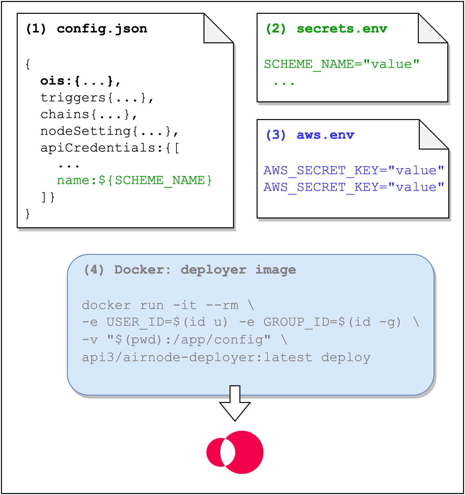
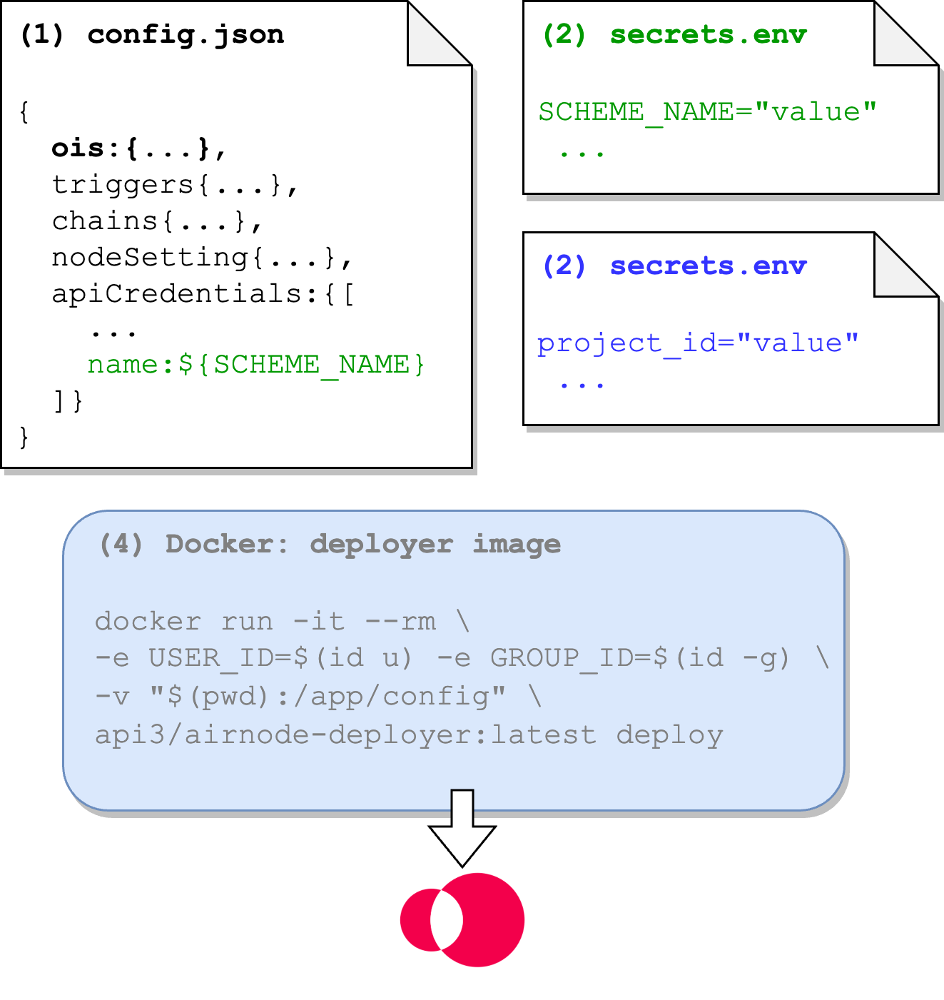

<VersionWarning/>

<PageHeader/>

<SearchHighlight/>

<FlexStartTag/>

# {{$frontmatter.title}}

This section is a progression of pages that aims to provide a detailed
understanding of the capabilities and functionality of Airnode. Airnode is a
first-party oracle that pushes off-chain API data on-chain via data feeds
(dAPIs) or using its request-response protocol (RRP). Airnode runs off-chain as
a background component of the API3 ecosystem. Learn more about what an
[Airnode](/explore/airnode/what-is-airnode.md) is.

## Project Folder

A typical Airnode project folder contains files used to define the Airnode. Show
below are typical project folders for each of AWS, GCP, and container
deployments.

::: code-group

```sh [AWS]
my-airnode
├── aws.env
├── config.json
└── secrets.env
```

```sh [GCP]
my-airnode
├── config.json
├── gcp.json
└── secrets.env
```

```sh [Container]
my-airnode
├── config.json
└── secrets.env
```

::: code-group

Both AWS and GCP have a platform specific file `aws.env` and `gcp.json`. Use the
files in the
[Templates](/reference/airnode/latest/deployment-files/templates/config-json.md)
as an aid to create all but the `gcp.json` files. Also see the
[Examples](/reference/airnode/latest/deployment-files/examples/config-json.md)
for demonstration purposes.

## Configuration files

- `config.json`: Defines Airnode and its behavior.
- `secrets.env`: Secrets referenced by `config.json` using interpolation.
- `aws.env`: AWS credentials.
- `gcp.json`: GCP project information.

The diagrams below depict the configuration files needed for a successful
deployment of an Airnode to AWS, GCP, and a Docker Container.

### AWS



1. **config.json**: Contains the Airnode's configuration. It contains an
   important element, called OIS, that maps an API to Airnode endpoints.
2. **secrets.env**: Contains values that should not be exposed in config.json.
3. **aws.env**: Contains AWS credentials required by the Docker deployer image.
4. **deployer image**: Docker image that deploys the Airnode using its deploy
   command.

### GCP



1. **config.json**: Contains the Airnode's configuration. It contains an
   important element, called OIS, that maps an API to Airnode endpoints.
2. **secrets.env**: Contains values that should not be exposed in config.json.
3. **gcp.json**: GCP project file.
4. **deployer image**: Docker image that deploys the Airnode using its deploy
   command.

### Container


1. **config.json**: Contains the Airnode's configuration. It contains an
   important element, called OIS, that maps an API to Airnode endpoints.
2. **secrets.env**: Contains values that should not be exposed in config.json.
3. **client image**: The Docker client image that contains the Airnode and runs
   with the provided configuration.

## Deploying

There are two ways to deploy and run an Airnode. The most popular is with a
cloud provider such as AWS or GCP. Use the Docker
[Airnode Deployer Image](/reference/airnode/latest/docker/deployer-image.md) for
these type of deployments.

The second method is to run a containerized Airnode hosted internally or with a
cloud provider service (e.g. AWS, EC2, or Lightsail). Use the Docker
[Airnode Client Image](/reference/airnode/latest/docker/client-image.md) for
this type of deployment.

Try the guide AWS
[Deploying Airnode via AWS](/guides/airnode/deploy-airnode/deploy-aws/index.md)
as a quick introduction to an Airnode deployment. Also be sure to visit
[ChainAPI<ExternalLinkImage/>](https://chainapi.com) and try its user-friendly
UI that deploys an Airnode.

<FlexEndTag/>
