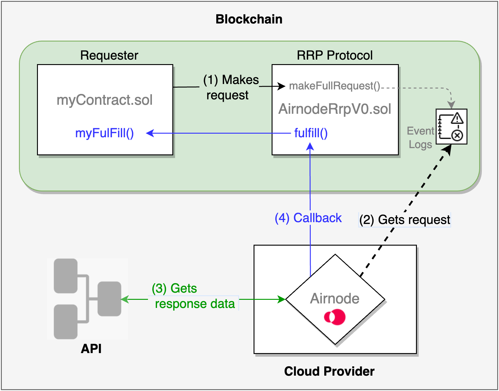

<VersionWarning/>

<PageHeader/>

<SearchHighlight/>

<FlexStartTag/>

# {{$frontmatter.title}}

Airnode is a first-party oracle that can push off-chain API data to an on-chain
contract. While dApp developers will find
[dAPIs](https://docs.api3.org/oev-searchers/in-depth/dapis/) popular and the
most useful aspect of an Airnode's capabilities, there is the option for
developers to access Airnode data using its request-response protocol (RRP). The
[AirnodeRrpV0.sol](https://github.com/api3dao/airnode/blob/master/packages/airnode-protocol/contracts/rrp/AirnodeRrpV0.sol)
protocol contract facilitates RRP and is designed to be flexible and is meant to
serve a variety of use cases. See the Airnode
[requester examples](https://github.com/api3dao/airnode/tree/v0.11/packages/airnode-examples/contracts)
for potential design patterns.

## It starts with a requester

A requester is a smart contract that can trigger an Airnode RRP request. To do
so, the requester needs to be sponsored and make the request using a matching
sponsor wallet. See
[Requesters and Sponsors](/reference/airnode/v0.11/developers/requesters-sponsors.md)
on how to sponsor a requester and derive the sponsor wallet.

## A simplified understanding

In the diagram below, any typical smart contract is called a requester if it
makes a request of Airnode's RRP protocol. It makes a request to the on-chain
RRP protocol contract (AirnodeRrpV0.sol) that adds the request to the event
logs. The off-chain Airnode then accesses the event logs, gets the API data and
performs a callback to the requester.

In summary, the requester will do two things.

- Call `makeFullRequest()` or `makeTemplateRequest()` on the AirnodeRrpV0.sol
  contract, which returns a
  [`requestId`](/reference/airnode/v0.11/concepts/request.md#requestid).
- Add a `myFulfill()` function (call it what you like) to your requester where
  the off-chain Airnode can send the requested data when ready. The data
  includes the same `requestId` as the one returned at the time of making the
  request.

In the diagram below a requester makes a request to the on-chain RRP protocol
contract (AirnodeRrpV0.sol) that adds the request to its event logs. During its
run cycle the off-chain Airnode accesses the event logs, gets the requested data
from the the API provider, then performs a callback to the requester.

> 
>
> 1.  
The requester (myContract.sol) makes a request to the RRP protocol contract (AirnodeRrpV0.sol) by calling <code>makeFullRequest()</code> which adds the request to the event logs and returns a <code>requestId</code> to the requester.

> 2.  
Airnode retrieves the on-chain request from the event logs.

> 3.  
Airnode gathers response data from the API specified in the request.

> 4.  
Airnode performs a callback to a named function <code>myFulfill()</code> in myContract.sol via the AirnodeRrpV0.sol function <code>fulfill()</code> with the requested data and the <code>requestId</code>.

See the guide [ Making an RRP Request](/guides/airnode/rrp-request.md) and learn
how to make a RRP request of an Airnode.

## A deeper dive

This section, through its detailed illustration, builds on the previous section
([A simplified understanding](/reference/airnode/v0.11/developers/index.md#a-simplified-understanding))
in an attempt to further illustrate and explain the mechanics of how an Airnode
response to a request made by a requester.

Airnode RRP consists of two parts: the off-chain **Airnode** (a.k.a. "the node")
deployed as self hosted or cloud provider functions (e.g., AWS) and the on-chain
**protocol contract** AirnodeRrpV0.sol.

> 
>
> - 
A requester makes a request to the AirnodeRrpV0 protocol contract which adds the <code>requestId</code> to storage, emits the request to the event logs and returns the <code>requestId</code> to the requester. The request is retrieved by the Airnode during its next run cycle. It then verifies the requester is authorized by checking authorizer contracts assigned to the Airnode.

> - 
If the request is authorized, Airnode proceeds to respond. It first gathers the requested data from the API and calls the <code>fulfill()</code> function in AirnodeRrpV0, which removes the pending <code>requestId</code> from storage and makes a callback to <code>myFulfill()</code>. The gas costs associated 
>    with the response are covered by the sponsor of the requester.

<FlexEndTag/>
