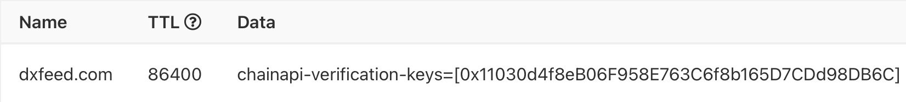

<VersionWarning/>

<PageHeader/>

<SearchHighlight/>

<FlexStartTag/>

# {{$frontmatter.title}}

An Airnode is owned and operated by an API provider. Every Airnode has a unique
on-chain
[`airnodeAddress`](/reference/airnode/v0.12/concepts/airnode.md#airnodeaddress)
created and known by its API provider. API providers normally announce their
Airnode addresses in the form of a DNS `TXT` record within their DNS
registration, which also serves to prove ownership. An API provider's Airnode
address is the same for all chains.

The key for the `TXT` record is `chainapi-verification-keys` and is an array of
Airnode addresses owned by the API provider. Below is an example of the Airnode
for
[dxFeed](https://www.digitalocean.com/community/tools/dns?domain=dxfeed.com#TXT-Records).

## API providers

- Coinpaprika: https://coinpaprika.com/
- dxFeed: https://dxfeed.com/
- Finage: https://finage.co.uk/
- Finnhub: https://finnhub.io/
- Kaiko: https://www.kaiko.com/
- NewChangeFX: https://www.newchangefx.com/
- Nodary: https://nodary.io/docs/data-feeds/
- TraderMade: https://tradermade.com/
- **twelve**data: https://twelvedata.com/

## API provider `txt` records

The following list of links go to the DNS lookup at DigitalOcean.

- [Coinpaprika](https://www.digitalocean.com/community/tools/dns?domain=coinpaprika.com#TXT-Records)
- [dxFeed](https://www.digitalocean.com/community/tools/dns?domain=dxfeed.com#TXT-Records)
- [Finage](https://www.digitalocean.com/community/tools/dns?domain=finage.co.uk#TXT-Records)
- [Finnhub](https://www.digitalocean.com/community/tools/dns?domain=finnhub.io#TXT-Records)
- [Kaiko](https://www.digitalocean.com/community/tools/dns?domain=kaiko.io#TXT-Records)
- [NewChangeFX](https://www.digitalocean.com/community/tools/dns?domain=newchangefx.com#TXT-Records)
- [Nodary](https://www.digitalocean.com/community/tools/dns?domain=nodary.io#TXT-Records)
- [TraderMade](https://www.digitalocean.com/community/tools/dns?domain=tradermade.com#TXT-Records)
- [twelvedata](https://www.digitalocean.com/community/tools/dns?domain=twelvedata.com#TXT-Records)

<FlexEndTag/>
