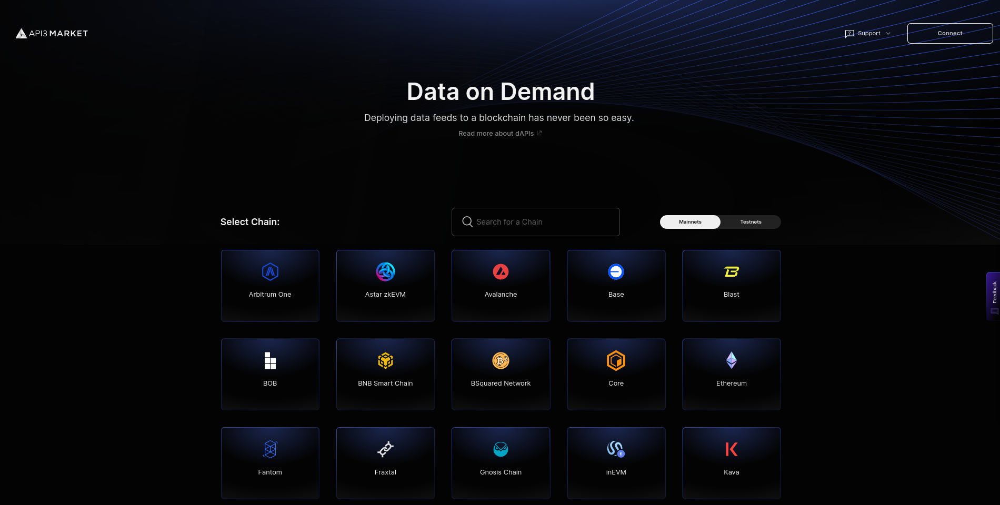
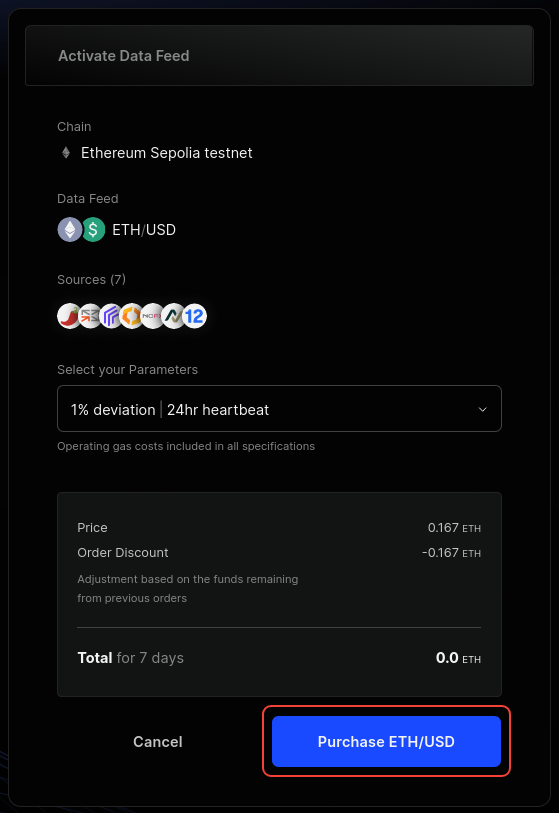
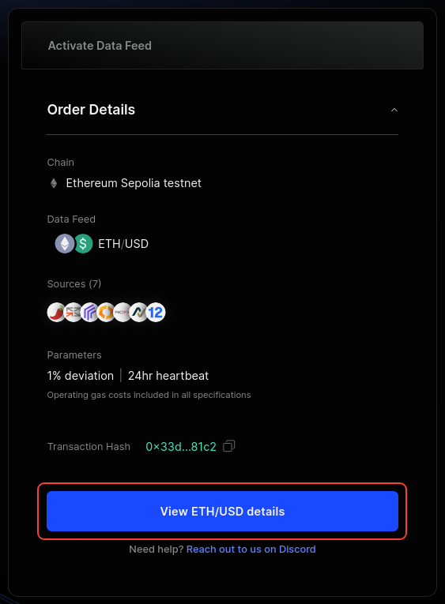
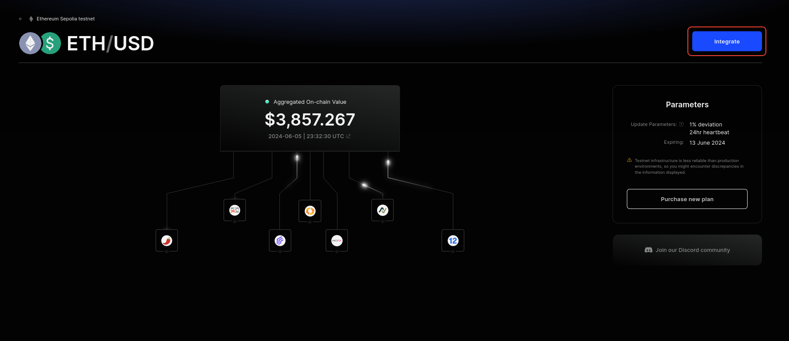

<PageHeader/>

# Subscribing to dAPIs

[dAPIs](/dapis/introduction/using-dapis.md) are datafeeds that are sourced
directly from multiple [first-party oracles](/dapis/introduction/first-party.md)
and aggregated using Signed data. It utilizes first-party oracles, enabling data
to be served directly from reputable API providers. This guide will walk you
through the process of subscribing to a dAPI.

## API3 Market

The [API3 Market](https://market.api3.org) provides all the tooling to
seamlessly access dAPI services. This end-to-end process consists of:

- [Exploring, selecting and configuring your dAPI](/dapis/guides/subscribing-to-dapis/#exploring-selecting-and-configuring-your-dapi)
   
- [Activating your dAPI](/dapis/guides/subscribing-to-dapis/#activating-your-dapi)
   
- [Getting the proxy address](/dapis/guides/subscribing-to-dapis/#getting-the-proxy-address)
   

## Exploring, selecting and configuring your dAPI

The [API3 Market](https://market.api3.org/) provides a list of all the dAPIs
available across multiple chains including testnets. You can filter the list by
mainnet or testnet chains. After selecting the chain, you can now search for a
specific dAPI by name. Once selected, you will land on the details page
[(eg ETH/USD on Ethereum Sepolia)](https://market.api3.org/dapis/ethereum-sepolia-testnet/ETH-USD)
where you can find more information about the dAPI.

The API3 Market gives you an option to configure the dAPI's
[deviation threshold](/dapis/reference/understand/deviations) and
[heartbeat](/dapis/reference/understand/deviations.md#heartbeat). You will have
the following options to choose from:

| Deviation | Heartbeat |
| --------- | --------- |
| 0.25%     | 24 hours  |
| 0.5%      | 24 hours  |
| 1%        | 24 hours  |
| 5%        | 24 hours  |

::: info Note

Not all dAPIs support all the configurations. It depends on the asset and chain.
Check the [API3 Market](https://market.api3.org/) for more info.

:::

_[Click here](/dapis/reference/understand/deviations.md#update-interval) to read
more if you are unsure what suits your dApp_

## Activating your dAPI

::: info Note

If a dAPI is already activated, make sure to check the expiration date and
update parameters. You can update the parameters and extend the subscription by
purchasing a new configuration or read the dAPI directly by using the proxy.

:::

Once you've selected the dAPI and the configuration, you will be presented with
an option to purchase the dAPI and activate it. Make sure to check the time and
amount of the subscription. If everything looks good, click on **Purchase**.

You can then connect your wallet and confirm the transaction.

Once the transaction is confirmed, you will be presented with a confirmation
page for the order. You can now go back and check the updated configuration for
the dAPI.

## Getting the Proxy Address

Once you are done configuring and activating the dAPI, you can now integrate it.
To do so, click on the **Integrate** button on the dAPI details page.

To read from the dAPI, you will need the
[proxy contract](/dapis/reference/understand/proxy-contracts) address. Copy the
displayed proxy address.

You can now use this to read from the configured dAPI.

To get started with using dAPIs, you can follow the
[Reading a dAPI Proxy guide](/dapis/guides/read-a-dapi/).
