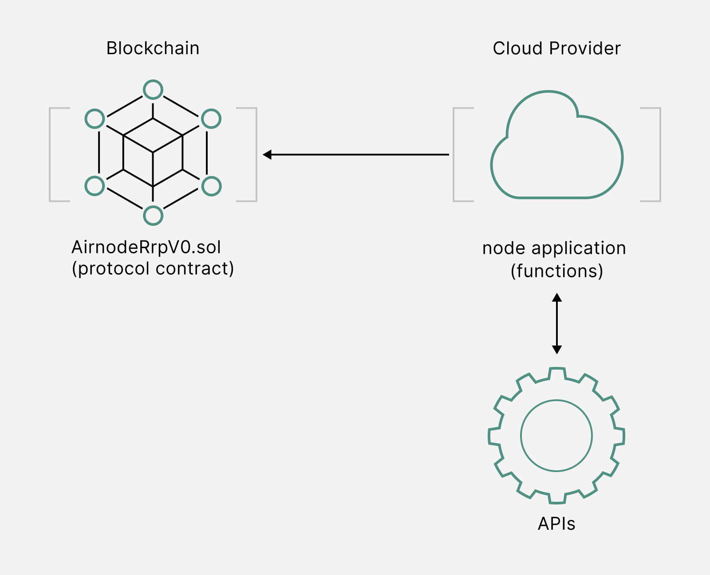

<PageHeader/>

# What are first-party oracles?

An oracle is an agent that acts as an intermediary between a smart contract
platform and an API. In other words, a decentralized application can use an
oracle to call an API. It is important to understand that an oracle can access
API data in more than one way on behalf of a dApp.

In a traditional sense, an oracle node acts as a proxy by listening for requests
made on the blockchain. The oracle then calls the API over the Web and fulfills
the requests by making transactions on the blockchain. This is known as the
request-response protocol (RRP). An oracle uses its own smart contracts to
implement a protocol. This defines how decentralized applications can make
requests to the oracle and receive responses.

Moving beyond the RRP protocol, certain protocols may be more appropriate
depending on how an oracle node is being utilized such as for data feeds, which
have values stored on-chain. In fact data feeds are what dApp owners desire the
most. API3 provides data feeds know as [dAPIs](/dapis/introduction/index.md).

The tough question that comes into play, who owns and operates the oracle?

## First-party oracles

<!-- Based on this information, it looks like simply having an oracle solves the API
connectivity problem.-->

When considering if an
[oracle is first or third party](https://hackernoon.com/the-difference-between-first-party-and-third-party-oracles),
there is an important point to consider: Who will host the oracle node?

1. If an API provider hosts the oracle node, the oracle is called a first-party
   oracle.
2. If a third-party middleman hosts the oracle node, the oracle is called a
   third-party oracle.

API3's Airnode is a first-party oracle as the node is hosted in the
infrastructure of the API provider. Likewise, this means protocols serving data
do so in a first-party manor.

### Advantages

First-party oracles and the data feeds they provide offer a range of benefits
for dApp owners.

- **Security:** First-party oracles are more secure because there is no
  middleman on the interface path.

- **Cost efficiency:** Avoiding the middle man tax means first-party oracles are
  cost efficient.

- **Transparency:** Enhanced source transparency means reputation can be gauged
  when looking to utilize real-world data in dApps.

- **Signed data:** Data from the API provider is signed before it is pushed
  through a first-party oracle and onto any chain.

- **Flexibility:** These type of oracles also are increasingly flexible when it
  comes to delivering oracle services and first-party data feeds can be utilized
  in a multitude of ways to best serve the users application.

For these reasons, API3 believes in order to facilitate meaningful dApps,
first-party oracle must provide an optimal architecture.

<!--Third-party oracles are both insecure and expensive (see the
<a href="/api3-whitepaper-v1.0.3.pdf#page=10" target="_blank">API3
Whitepaper</a> _Issues with Third-Party Oracles as Middlemen_ for a detailed explanation). In contrast, first-party oracles are both secure and cost-efficient due to not having a middleman on the interface path. -->

<!-- Legacy oracle governance

Traditionally an oracle network makes the same request to multiple independent
oracles and reduces their responses to a single answer through predetermined
consensus rules. This is implemented as a smart contract called the aggregator.

Individual malicious oracles cannot manipulate the outcome of this process,
which provides a degree of decentralization and trustlessness. Here, an
important thing to consider is how the oracle network is governed.

02-b-First*vs_Third_party_oracles-Descentralized_API*(dAPI)

::: -->

## First-party oracle governance

If a central entity can switch the oracles or APIs used in the aggregator in and
out, or even replace the aggregator itself making use of a proxy mechanism, they
can effectively manipulate the oracle network output at will.

This eliminates the decentralization and trustlessness qualities that using an
oracle network provides. Therefore, it is not adequate to use an oracle network
to achieve decentralization, this oracle network must be governed decentrally as
well.

### Decentrally governed oracles

Decentrally-governed networks of first-party oracles would adequately solve the
API connectivity problem. Consider the following:

1. Decentralized applications need access to APIs.
2. It is optimal to interface APIs to smart contract platforms through
   first-party oracles.
3. For API level decentralization, decentrally-governed oracle networks should
   be employed.

   

API3 delivers decentralized interfaces to APIs to facilitate this through
governance.

A decentralized API is a product which contains:

1. APIs interacting with oracle networks decentralized interfaces
2. Decentralized governance and interfaces

By taking advantage of the advantages offered by decentralization, developers
can build applications with elevated security and trustworthiness. See the
medium article,
[Why API3 DAO?](https://medium.com/api3/why-api3-dao-not-api3-corp-2dde51c537c1)
on DAOs and decentralized governance.

<!--
Due to being defined as a full product rather than an interface, unlike a
traditional oracle network, a decentralized API includes the underlying APIs. This results in
a superior solution (secure and cost-efficient first-party oracles) and
ecosystem (with API providers as its members).  -->

<!--Although this is technically correct, the
same solution can be reached through a more useful lens-->

<!--Decentralized applications cannot access Web APIs, and oracle solutions aim to build decentralized interfaces to facilitate this. However, this approach results in an inferior solution and ecosystem (see the
<a href="/api3-whitepaper-v1.0.3.pdf" target="_api3-whitepaper">API3
Whitepaper</a> for a detailed explanation).-->

<!--Instead, API3 builds complete products called decentralized APIs (dAPIs for
short), which are blockchain-native, decentralized API services. From the user's
(i.e., the entity that operates the decentralized application) perspective, the
experience of using a dAPI would be very similar to a Web developer using a
traditional API; they would find a dAPI they need, pay the subscription fee, and
enjoy access.-->
