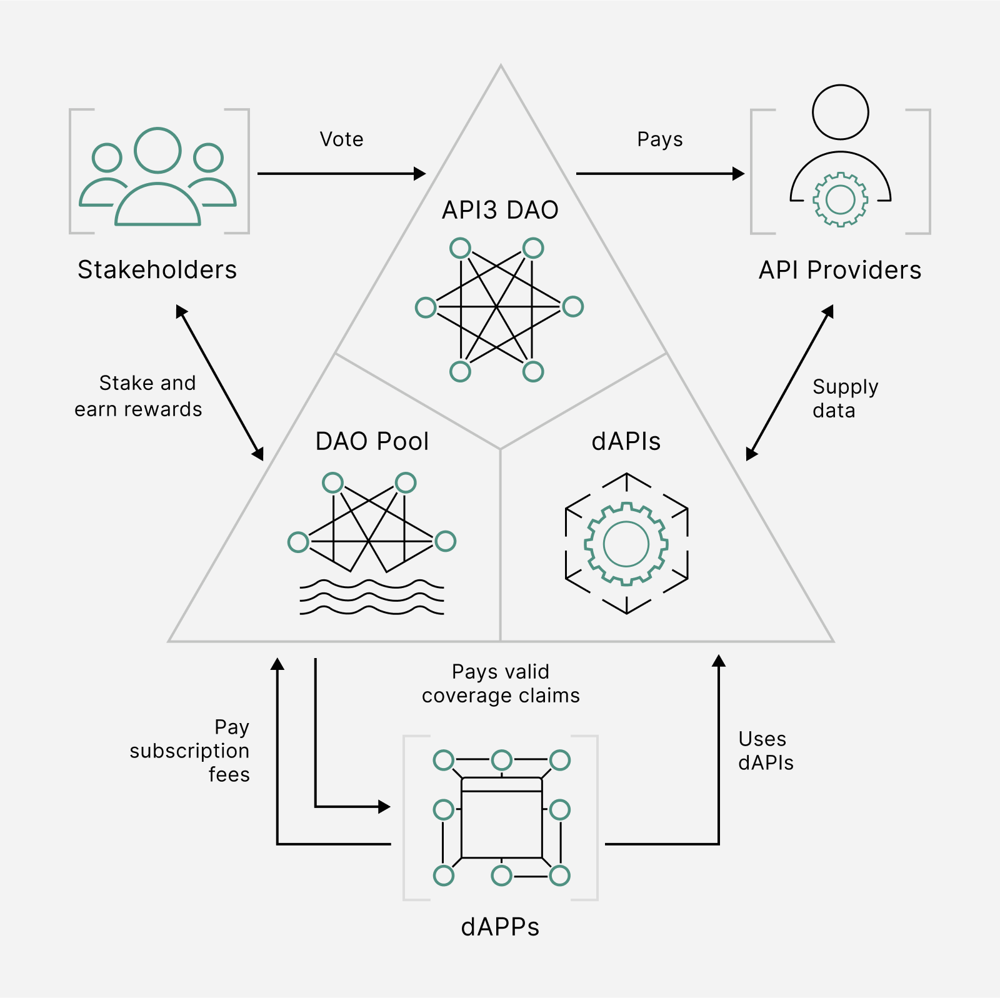
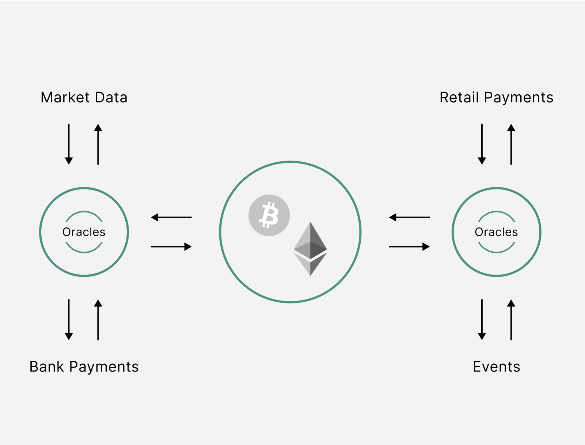

<PageHeader/>

# Getting started with API3

[API3](https://api3.org) is a collaborative project to deliver traditional API
services to smart contract platforms in a decentralized and trust-minimized way.
It is governed by a decentralized autonomous organization (DAO), namely the API3
DAO.

API3 believes DeFi & Web3 can change the financial landscape with the right
infrastructure and access to meaningful real world data. The goal of API3 is to
provide developers with an easy way to access off-chain resources from within
their smart contracts, without having to worry about the security and trust
implications of doing so.

### Within this introduction of API3 we will explore:

- APIs within the blockchain
- Airnode & First-party oracles
- dAPI Price Feeds
- API3 Market
- The OEV Network

If you wish to view a detailed discussion of the API3 project, read the
[API3 Whitepaper](https://github.com/api3dao/api3-whitepaper/blob/master/api3-whitepaper.pdf).

## APIs in Web3

An API is used to communicate with a specific application to receive services or
data from it. It is often a well-defined and documented protocol one can use to
interact with an application programmatically. This has led to Web2 developers
integrating APIs to build increasingly complex and capable applications.

In the context of decentralized applications, this definition is quite useless,
and even misguiding. Instead, we should see APIs as channels businesses use to
monetize their data and services. See the medium article
[APIs: The Digital Glue](https://medium.com/api3/apis-the-digital-glue-7ac87566e773)
for additional background on APIs.

## The API Connectivity Problem

Smart contracts operating on a blockchain are limited in their access to
off-chain data, this phenomenon is referred to as the **Oracle Problem**. This
is only worth consideration because it includes not being able to call the paid
APIs described above.

All the game theoretic and cryptographic methods proposed for various oracle
solutions essentially aim to provide smart contracts access to these paid APIs.
Therefore, it would be more accurate to define the problem at hand as _the API
connectivity problem_.

As you read about API3 offerings, you will discover that this redefinition will
have ripple effects across the entire solution, from how the ecosystem is built
to the lowest levels of the protocol.

Additionally, existing oracle solutions fall short because they fail to make
this distinction, resulting in inferior solutions that depend on third-party
oracles and ecosystems that exclude API providers. As such, API3 believes the
oracle problem is ill-posed, instead we are faced with an API Connectivity
Problem.

## Airnode

API3’s Airnode has been designed so API providers can easily run their own
oracle nodes. Once an API has had an Airnode deployed, API data can be pushed
on-chain.

It is an open source tool that allows them to provide their data on-chain,
without an intermediary, to any decentralized app (dApp) interested in their
services. Through simplifying how an API provider can monetize their data within
Web3, hundreds of Airnodes have been deployed.

Airnode also has range of common features built into it. These include
implementations such as pre and post processing, authentication, or
authorizations, to name a few.

### Operated by the data provider

At its core, Airnode brings the ability for API providers to easily run their
own [first-party oracle](/dapis/introduction/first-party.md) nodes. Doing so
means that it is the API provider's Airnode that places its signed API data
on-chain.

When data served from Airnode is served directly from the source to the chain
with cryptographic signatures. When used in DeFi this enhances the security of
the price feed due to the optimized transparency.
