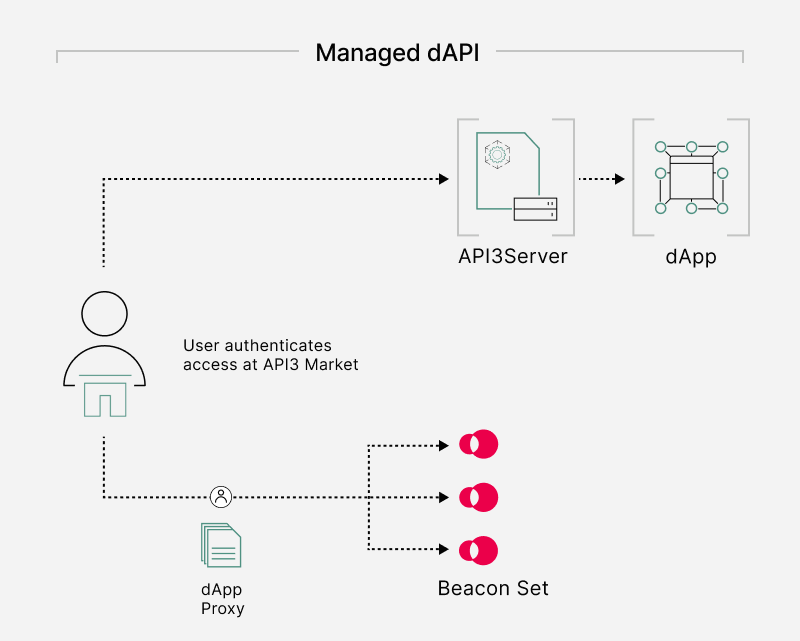

<PageHeader/>

# Using dAPIs in a dApp

> <Video src="https://www.youtube.com/embed/FVI16FAJgjQ"/>

As outlined on the page [What are dAPIs?](/dapis/guides/index.md), API3 has
created a unified, user-friendly implementation that is designed to simplify the
process of obtaining data feed services. The API3 Market enables dApp owners to
connect to a decentralized API and access its data feeds.

## A Next Generation Push Oracle

dAPIs are sourced from multiple first-party oracles and aggregated using a
median function. They operate using a push model with a variety of update
specifications based on deviation thresholds. dAPIs have been designed to be
simple to integrate, manage and change.

### Accessing dAPIs

dAPI are accessible through the [API3 Market](https://market.api3.org/dapis).
The market enables developers to permissionlessly access price feeds and manage
them once integrated. Once gas overheads required to activate a feed are
provided, within minutes price reference data will be readable on-chain.

 <!--  -->

It is worth noting that API3 operates all infrastructure required for data feed
updates, there is no additional infrastructure to set up, operate and maintain
by a dApp looking to utilize a dAPI.

## API3 Market

The API3 Market lists all available dAPIs. It represents a hub that allows
developers to:

- Search for available dAPIs data feeds to integrate
- Provide gas for dAPIs to activate a decentralized oracle
- Access the proxy address to read the value of a required data pair
- Request new data types

You can head to the [API3 Market](https://market.api3.org/dapis) to explore this
further.
