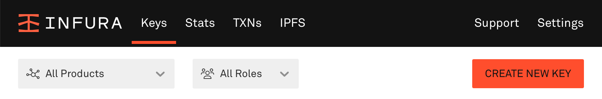
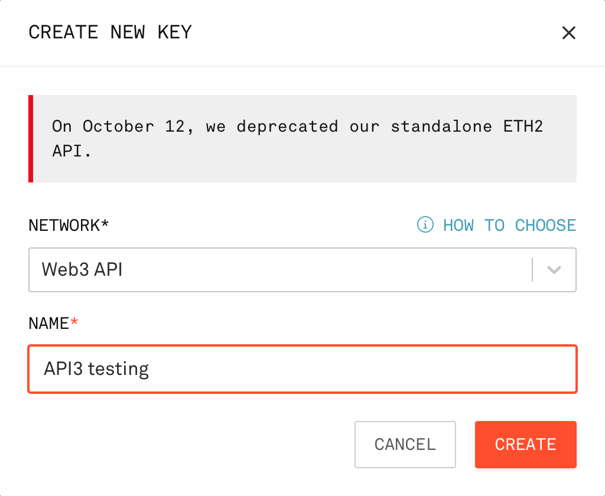

<PageHeader/>

# Create an Infura key

Some of the guides require a blockchain provider URL to interact with the
Sepolia testnet. When a URL is needed for a guide, you will be referred to this
page. Infura provides access to Sepolia with its free plan.

## 1. Access your account

To get started go to [Infura](https://www.infura.io/) and create an account if
you do not have one. If you do login. Infura will present your dashboard.

## 2. Create a key

Select the <b>CREATE NEW KEY</b>. Note that Infura projects have been renamed as
keys. If you already have a key you wish to use, click on the <b>MANAGE KEY</b>
button to the right of the key name and go to the next step (#3).



In the <b>CREATE NEW KEY</b> overlay select Web3 API from the <b>NETWORK</b>
picklist. Then give the key a name (suggestion: API3 testing) and select the
<b>CREATE</b> button.



## 3. Get the Sepolia endpoint URL

Once a key is created or selected, Infura presents the key's management page
showing the <b>ENDPOINTS</b> tab.

The API KEY has several network endpoints available, some are free and others
are paid. The Sepolia endpoint is free. Select the Sepolia network from the
picklist in the <b>Ethereum</b> box then select the copy icon.


The key will look as shown below. Use the URL when guides call for the Sepolia
blockchain provider URL.

```sh
https://sepolia.infura.io/v3/ec3dda...b3618a2
```
