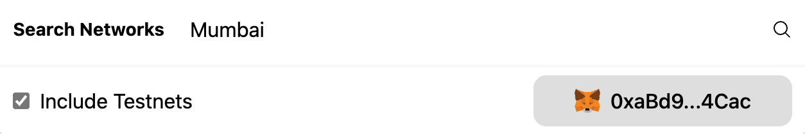

<PageHeader/>

# Add testnets to MetaMask

ChainList is a list of EVM networks. Use its information to connect wallets and
Web3 middleware providers to the appropriate chain. Follow the simple
instructions below to add the Polygon Mumbai testnet to MetaMask. Before you
start ensure that you have [MetaMask](https://metamask.io) loaded on a
compatible browser.

## 1. Go to the ChainList website

Use the [ChainList](https://chainlist.org/) website and search for Mumbai,
ensure that the Testnets checkbox is enabled.

## 2. Add Mumbai to MetaMask

Locate the Mumbai box (ChainId 80001 and Currency MATIC) and select the
**Connect Wallet** button (if not already connected to MetaMask) then select the
**Add to MetaMask** button.

