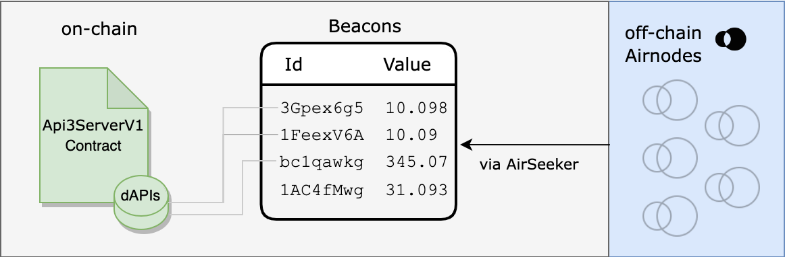

<PageHeader/>

# dAPIs

dAPIs are on-chain data feeds sourced from off-chain first-party oracles owned
and operated by API providers themselves and are continuously updated using
signed data. dApp owners can read the on-chain value of any dAPI in realtime.

dAPIs can serve a variety of continuously updated streams of off-chain data,
such as the latest cryptocurrency, stock, and commodity prices. They can power
various decentralized applications such as DeFi lending, synthetic assets,
stable coins, derivatives, NFTs, and more.

## Values stored on-chain

Datafeed values are stored on-chain within the
[`Api3ServerV1.sol`](https://github.com/api3dao/contracts/tree/main/contracts/api3-server-v1)
contract and are updated on the basis of `beaconIds`. To provide aggregated
data, collection of multiple `beaconIds` are aggregated using a median function
on-chain and used to update the `beaconSetId` which is a `keccak256()` hash
representation of all the underlying `beaconIds`. Beacon sets get updated by
updating each underlying beacon using `updateBeaconWithSignedData` and then
calling the function `updateBeaconSetWithBeacons` to update the beacon set.

dAPIs are human-readable mappings that maps to a `beaconId` or `beaconSetId`.
The `beaconId` for each dAPI gets updated when the price hits the set
[deviation threshold](/dapis/reference/understand/deviations.md)/[heartbeat](/dapis/reference/understand/deviations.md#heartbeat)
using
[Signed-APIs](https://github.com/api3dao/signed-api/tree/main/packages/signed-api).
[Airseeker](#airseeker) and other entities who have access to signed data are
responsible for updating each individual `beaconId` for each dAPI.

A `beaconId` for each dAPI is derived from the hash of the provider's Airnode's
address and its Template ID(a hash of one of the Airnode's `endpointId` and
encoded parameters).

API3 is running Airseekers which are primarily responsible for updating the
`beaconId` based on the specification of the dAPI. Data Providers also update
the `beaconId` at a higher deviation threshold/heartbeat as a fallback. There
are also other entities that serve as additional fallback which operate at an
even higher deviation threshold/heartbeat.

Apart from relying on just the Airseeker to look for price deviations, searchers
can bid for price updates through the OEV Network to update the data feeds.

<!-- [Click here to read more about OEV](). -->

## Airseeker

[Airseeker](https://github.com/api3dao/airseeker-v2) is a serverless lambda
function that is responsible for updating the values of each `beaconId` for each
dAPI. It is used to update the beacons with signed responses from
[Signed-API](https://github.com/api3dao/signed-api/tree/main/packages/signed-api).
Signed-API receives signed data from the data providers via
[Airnode-Feed](https://github.com/api3dao/signed-api/tree/main/packages/airnode-feed).

Similar to Airnode's OIS, Airseeker also requires a configuration file that is
used to configure the Airseeker.
[Click here to see an example of an Airseeker configuration file](https://github.com/api3dao/airseeker-v2/blob/main/config/airseeker.example.json).
The configuration file is used to configure the deviation thresholds and
heartbeat for each `beaconId` or `beaconSetId`.

## Providers for dAPIs

Currently there are eight API providers each running an Airnode.

- Coingecko
- Coinpaprika
- dxFeed
- Finage
- Kaiko
- NCFX
- Nodary
- Twelvedata

All the data providers listed here are selected and properly tested by the dAPI
team to ensure the highest quality data availability for the listed dAPIs.

## Chains

dAPIs are available on both major EVM-compatible testnets and mainnets. Head
over to the [API3 Market](https://market.api3.org/) to see lists of all chains
and the dAPIs on each.

## Update Process

When a user places an order for a dAPI, the order will be created on-chain and
the mapping for the dAPI will be updated to point to the particular
`beaconSetId` with the requested deviation threshold and heartbeat.

::: info Note

Purchasing a better configuration will not change the proxy contract address for
the dAPI.

:::

With dAPIs, dApps can have an option to configure the deviation threshold and
heartbeat. For both mainnet and testnet feeds, dApps have the following options
to choose from based on the chain and dAPI:

| Deviation | Heartbeat |
| --------- | --------- |
| 0.25%     | 24 hours  |
| 0.5%      | 24 hours  |
| 1%        | 24 hours  |
| 5%        | 24 hours  |

See the guide [Subscribing to dAPIs](/dapis/guides/subscribing-to-dapis/) and
learn more on how to access dAPIs.
