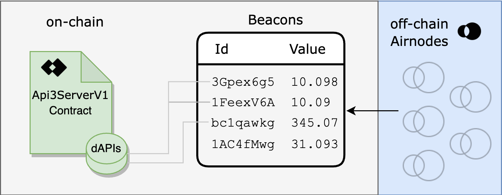
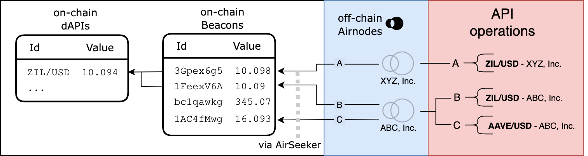

<PageHeader/>

<SearchHighlight/>

<FlexStartTag/>

# {{$frontmatter.title}}

dAPIs are sourced directly from multiple
[first-party](/explore/airnode/why-first-party-oracles.md) data providers
running an [Airnode](/reference/airnode/latest/understand/) and aggregated using
Airnode's signed data.

dAPIs can serve a variety of continuously updated streams of off-chain data,
such as the latest cryptocurrency, stock, and commodity prices. They can power
various decentralized applications such as DeFi lending, synthetic assets,
stable coins, derivatives, NFTs, and more.

## How it works

[Datafeed values are stored on-chain](/reference/dapis/understand/#values-stored-on-chain)
within the
[`Api3ServerV1.sol`](https://github.com/api3dao/airnode-protocol-v1/tree/79b509f0e88a96fa4ea3cd576685051d37c9a504/contracts/api3-server-v1)
contract and are updated on the basis of `beaconIds`. To provide aggregated
data, beacon sets are used which are a collection of multiple `beaconIds` that
are then used to calculate the aggregated value on-chain using a median
function. The median value is then used to update the `beaconSetId` of the dAPI.
Beacon sets get updated by updating each underlying beacon using
`updateBeaconWithSignedData` and then calling the function to update the beacon
set `updateBeaconSetWithBeacons`.

dAPIs are human-readable mappings that maps to a `beaconId` or `beaconSetId`.
The `beaconId` for each dAPI gets updated when the price hits the set
[deviation threshold](/reference/dapis/understand/deviations.md)/[heartbeat](/reference/dapis/understand/deviations.md#heartbeat)
using
[Airnode's Signed Data](/reference/airnode/latest/understand/http-gateways.md).
[Airseeker](/reference/dapis/understand/dapis.md#airseeker) and other entities
who have access to Airnode's signed data are responsible for updating each
individual `beaconId` for each dAPI.

A `beaconId` for each dAPI is derived from the hash of the provider's Airnode's
address and its Template ID(a hash of one of the Airnode's `endpointId` and
encoded parameters).

The data providers are running Airseekers which are primarily responsible for
updating the `beaconId` based on the specification of the dAPI. Providers also
update the `beaconId` at a higher deviation threshold/heartbeat as a fallback.
There are also other entities that serve as additional fallback which operate at
an even higher deviation threshold/heartbeat.

Apart from relying on just the Airseeker to look for price deviations,
[searchers](/reference/dapis/understand/dapis.html#searchers) can bid for price
updates through the OEV Network to update the data feeds.

<!-- [Click here to read more about OEV](). -->

## The role of Airnode

[Airnode](/reference/airnode/latest/concepts/airnode) is a flexible off-chain
module that can support multiple protocols. Most noticeably is its
implementation of the
[Request-Response Protocol (RRP)](/reference/airnode/latest/concepts/) and data
feeds.

An Airnode is owned by an API provider and is used to call API provider
endpoints to fetch and sign data at the request of [Airseeker](). Airseeker uses
the signed data to determine if the deviation of a beacon value warrants an
on-chain update.

## Airseeker

Like Airnode, [Airseeker](https://github.com/api3dao/airseeker/) is a serverless
lambda function that is responsible for updating the values of each `beaconId`
for each dAPI. It is used to update the beacons with signed responses from
[Airnode's HTTP-Signed-Gateway](/reference/airnode/latest/understand/http-gateways.md).

Airseeker uses Airnode's built-in HTTP-Gateway to receive signed data and push
it on-chain in a tamper proof way.

Similar to Airnode's OIS, Airseeker also requires a configuration file that is
used to configure the Airseeker.
[Click here to see an example of an Airseeker configuration file.](https://github.com/api3dao/airseeker/blob/main/config/airseeker.example.json).
The configuration file is used to configure the deviation thresholds and
heartbeat for each `beaconId` or `beaconSetId`.

## Searchers

Searchers are bots/entities that can bid for price updates for dAPIs through the
OEV Network. They get the right to update the data feeds by bidding for it. This
is a way for dApps to earn revenue by auctioning off the right to update the
data feeds to searchers.

The incentive for searchers to bid for price updates is to look for on-chain
liquidations and trigger the update of the dAPIs once they find an opportunity.

The proceeds from the OEV Network goes back to the dApp.

<!-- [Click here to read more about OEV]() -->

## Providers for dAPIs

Currently, the [API3 Market](https://market.api3.org/) has 4 different asset
classes that are listed below. For each type, there are multiple providers that
are running an Airnode and are providing data for the dAPIs. The providers are
listed below:

| Asset Type     | Data Provider                                                           |
| -------------- | ----------------------------------------------------------------------- |
| Cryptocurrency | Nodary, Coinpaprika, Finage, Twelvedata, NCFX, Kaiko, dxFeed            |
| Forex          | Nodary, Finage, Twelvedata, NCFX, IEXCloud, Finnhub, dxFeed, Tradermade |
| Commodities    | Nodary, Finage, Twelvedata, dxFeed, Tradermade                          |
| Equities       | Nodary, Finage, Twelvedata, IEXCloud, Finnhub, dxfeed                   |

All the data providers listed here are selected and properly tested by the dAPI
team to ensure the highest quality data availability for the listed dAPIs.

## Chains

dAPIs are available on both major EVM-compatible testnets and mainnets. The
chains that are currently supported are listed below:

| Mainnet | Testnet |
| ------- | ------- |
|         |         |
|         |         |
|         |         |
|         |         |

Head over to the [API3 Market](https://market.api3.org/) to see the list of all
available dAPIs and their chains.

## Update Process

When a user places an order for a dAPI, the order will be created on-chain and
the mapping for the dAPI will be updated to point to the particular
`beaconSetId` with the requested deviation threshold and heartbeat.

::: info Note

If you have already deployed your proxy contract to read from the dAPI, it will
remain the same. Purchasing a better configuration will not change your proxy
contract address for the dAPI.

:::

With dAPIs, dApps can have an option to configure the deviation threshold and
heartbeat. For mainnet feeds, dApps have the following options to choose from
based on the chain and dAPI:

| Deviation | Heartbeat |
| --------- | --------- |
| 0.25%     | 24 hours  |
| 0.5%      | 24 hours  |
| 1%        | 24 hours  |

See the guide [Subscribing to dAPIs](/guides/dapis/subscribing-to-dapis/) and
learn more on how to access dAPIs.

<FlexEndTag/>
