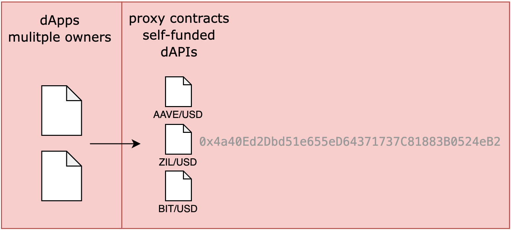
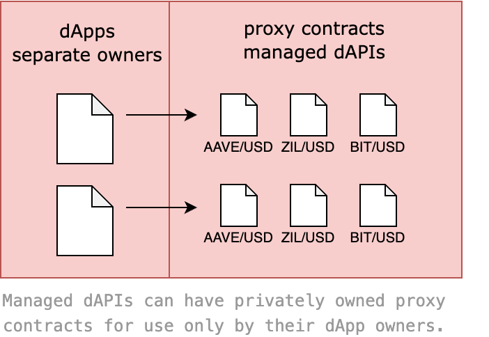

<PageHeader/>

<SearchHighlight/>

# {{$frontmatter.title}}

Proxy contracts from the [API3 Market](https://market.api3.org) allow for simple
access to dAPIs. Use the API3 Market UI to easily obtain proxy contracts that
any dApp can use to read the value of a dAPI. Each proxy contract (using its
address) reads from a single predefined dAPI. Use as many proxy contracts needed
to access each dAPI desired.

## dAPI roadmap

Currently dPAIs are under an expansive development cycle and in March of 2023
the first functional **Self-funded dAPIs** were made available.

| Self-funded dAPIs                                 | Managed dAPIs                                         |
| ------------------------------------------------- | ----------------------------------------------------- |
| (March 2023)                                      | (Summer 2023)                                         |
| Single public proxy contract                      | Additional private proxy contracts                    |
| Single sourced dAPI (beacon) <br/> no aggregation | Multiple sourced dAPP (beacons)                       |
| Gas costs are community funded                    | Gas costs are managed by API3 using<br/> upgrade fees |

## Self funded dAPIs

Self-funded dAPIs were made available in March 2023. These are community funded
and community manage dPAIs that are only sourced from a single datafeed
(beacon). The funding is used to pay gas costs incurred by an Airnode as it
places teh dAPI's value on-chain when a deviation threshold is reached. Any dApp
owner can fund the dAPI and any dApp owner can use the dAPI. Meaning that if
three dApp owners are using the dAPI and only one provides funding, the other
two would benefit. However this is not best practice for the two that are not
providing funding as their dApp could fail if the original dApp decides to stop
providing funding. So the community benefits from a community funding approach.

Each self-funded dAPI can have only one publicly known proxy contract for all
dApp owners to use. Generally these are used for development purposes. For
example, the proxy contract for the self-funded dAPI
[ZIL/USD<ExternalLinkImage/>](https://staging.api3-market.pages.dev/dapis/polygon-testnet/ZIL-USD)
has an address of `0x4a40Ed2Dbd51e655eD64371737C81883B0524eB2` on the Mumbai
testnet. This is the only proxy contract in existence for this self-funded dAPI.

```solidity
return IDapiProxy(0x4a40Ed2Dbd51e655eD64371737C81883B0524eB2).read();
```

Any dApp can call this proxy contract using the address mentioned above to get
the price (value) of ZIL/USD. Therefore, in the diagram below there is only ever
one proxy contract for each of the illustrated proxy contracts. The same is said
for thousands of self-funded dAPIs.

- AAVE/USD
- ZIL/USD
- BIT/USD



See the guide
[Reading a self-funded dAPI proxy](/guides/dapis/read-self-funded-dapi/) and
learn how to use a proxy contract.

### Providing funding

Self-funded dAPIs (for development purpose) are commonly sourced from one beacon
and have a single publicly available proxy contract. These dAPIs must be funded
for the cost of gas to place their beacon values on-chain. These funds keep the
dAPI active. Since this type of dAPI only has one publicly know proxy contract
address, any dApp using the proxy contract benefits from the pool of gas costs
funds.

Therefore best practice is not to use self-funded dAPIs in production on
networks such as mainnet because the pool of funds for the gas costs benefit any
dApp using the common proxy contract, including dApp owners who may not add
funds to the pool. However there is no set rule precluding the use of
self-funded dAPis on a mainnet Simply be aware others . While in development
mode simply add funds to keep the dAPI running using the token for the network
being used. Normally this is not an issue given that testnet tokens are free.

## Manage dAPIs

These dAPIs are currently under development for a target date of summer 2023. A
managed dAPI is actually the process of upgrading a self-funded dAPI to become a
managed dAPI. Here the dApp that does the upgrade pays a small fee which is used
to pay gas costs incurred by hte Airnode to place the dAPI value on-chain.
Unlike self-funded dAPIs, API3 will manage the gas cost. This is advantages as
the dApp owner does not need to worry about missing a community based funding
that will cause the dAPI to shut down.

### Private proxy contracts

Another advantage of manage dAPIs is that each dApp owner can request a private
proxy contract. These contracts will be listed on the API3 Market website under
"my dAPIS" allowing the dApp owner a visual management console for the dAPIs
they may be using.

### Changing specifications

The specifications for the concept of a managed dAPI may change to some degree
as development continues. The full feature specification will be updated here as
this type of dAPIs is made available.



## Beyond manage dAPIs

Development of dAPIs beyond self-funded and managed dAPIs will include OEV and
service coverage. More details on these concepts will be forthcoming.

## More related material...

See the guide
[Subscribing to self-funded dAPIs](/guides/dapis/subscribing-self-funded-dapis/)
and learn more on how to fund a dAPI.

See the guide
[Reading a self-funded dAPI proxy](/guides/dapis/read-self-funded-dapi/) and
learn more on how to use a proxy contract to read teh value of a dAPI.

Learn more about the differences between a [self-funded]() and [managed]() dAPI.
