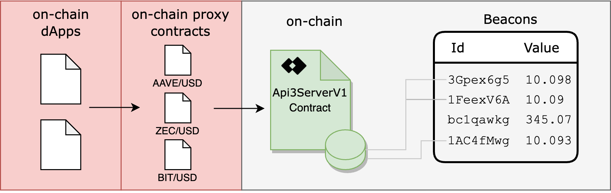

<PageHeader/>

<SearchHighlight/>

<FlexStartTag/>

# {{$frontmatter.title}}

dApps can easily read dAPIs with API3 Market
[proxy contracts](/reference/dapis/understand/proxy-contracts.md). Use the
[API3 Market](https://market.api3.org) UI to obtain the proxy contract address
for any dAPI such as
[AAVE/USD](https://market.api3.org/dapis/polygon-testnet/AAVE-USD) on the Mumbai
network. A proxy contract only reads from single predefined dAPI. There are many
dAPIs, each of which has its own proxy contract which in turn reads the dAPI's
data (`value` int224, `timestamp` uint256).



## Using a proxy contract address and IProxy

Currently each dAPI has a unique on-chain proxy contract with an address that is
linked to the OEV beneficiary address that was set while deploying it. This
address is used to read (via [IProxy](/reference/dapis/understand/iproxy.md))
the dAPI's data (`value` int224, `timestamp` uint256).

```solidity
(value, timestamp) = IProxy(0xa8785d83A31B21065F27b640F50694b39B1bda9a).read();
```

See the guide [Reading a dAPI proxy](/guides/dapis/read-a-dapi/) and learn more
on how to use a proxy contract address.

<FlexEndTag/>
