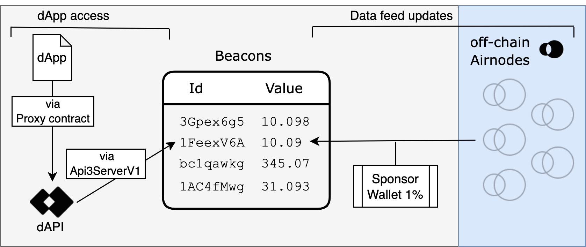

<PageHeader/>

<SearchHighlight/>

<FlexStartTag/>

# {{$frontmatter.title}}

Funds from sponsor wallets are used to pay the gas cost when updating the
on-chain value of dAPIs' sourced beacon value.

When a user purchases a dAPI configuration from the API3 Market, the funds are
transferred to the sponsor wallet of the dAPI. The sponsor wallet is used to pay
for the gas costs of updating the beacon value of the dAPI. The user can then
deploy a [proxy contract](/reference/dapis/understand/proxy-contracts.md) to
read the value of the dAPI.

> **dApp access:**
>
> A dApp uses a proxy contract address to
> [read()](/reference/dapis/understand/read-dapis.md) the value of the dAPI. The
> dAPI is defined, and its value retrieved, by the `Api3ServerV1.sol` contract.
>
> **Data feed updates:**
>
> Airnode monitors the value of an API provider's API endpoint based on its
> `updateInterval` parameter. If the on-chain value deviates from the API
> provider value, the dAPI's beacon is updated on-chain.

<FlexEndTag/>
