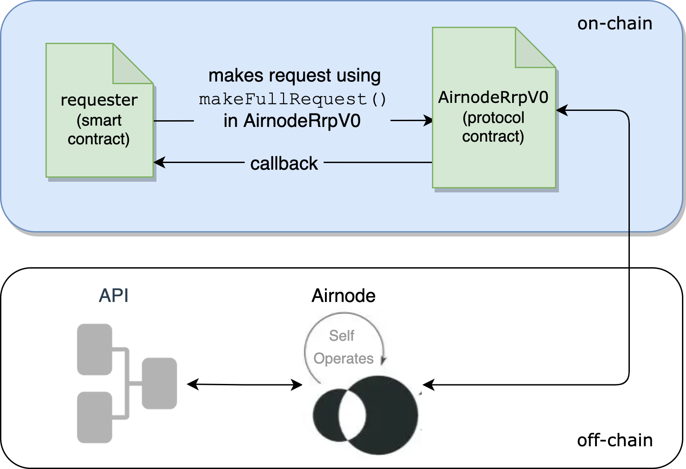

<PageHeader/>

<SearchHighlight/>

# {{$frontmatter.title}}

The API3 QRNG service is implemented using the Airnode request–response protocol
contract
[AirnodeRrpV0<ExternalLinkImage/>](https://github.com/api3dao/airnode/blob/master/packages/airnode-protocol/contracts/rrp/AirnodeRrpV0.sol)
(by way of
[RrpRequesterV0.sol<ExternalLinkImage/>](https://github.com/api3dao/airnode/blob/master/packages/airnode-protocol/contracts/rrp/requesters/RrpRequesterV0.sol))
to acquire a random number.

::: tip QRNG example project

After reading this page, visit and run the
[QRNG Example](https://github.com/api3dao/qrng-example/blob/main/README.md)
project in the `qrng-example` repo.

:::

In the diagram below a requester (smart contract) submits a request for a
quantum random number to the on-chain `AirnodeRrpV0` protocol contract using its
`makeFullRequest()` function. The off-chain Airnode gathers the request from the
`AirnodeRrpV0` protocol contract, gets the random number from an API operation
and sends it back to `AirnodeRrpV0`. Once received, `AirnodeRrpV0` performs a
callback to the requester with the quantum random number.

> 

Calling `AirnodeRrpV0` for a quantum random number is the same as any Airnode
RRP request. Read more about how a requester
[accesses an Airnode](/reference/airnode/latest/concepts/airnode.md) to acquire
data from API operations.

## Requesters

A requester (smart contract) calls the QRNG service using the _request–response
protocol (RRP)_ implemented by the on-chain `AirnodeRrpV0` contract. The
contract
[RrpRequesterV0.sol<ExternalLinkImage/>](https://github.com/api3dao/airnode/blob/master/packages/airnode-protocol/contracts/rrp/requesters/RrpRequesterV0.sol)
is meant to be inherited by any requester that will be making requests to
AirnodeRrpV0. It is part of the NPM
[@api3/airnode-protocol<ExternalLinkImage/>](https://www.npmjs.com/package/@api3/airnode-protocol)
package.

In practice, the requester implements two functions that are specific to
_requesting_ and _receiving_ a random number from the QRNG service. Consider the
following flow (extracted from the
[QRNG example contract<ExternalLinkImage/>](https://github.com/api3dao/qrng-example/blob/main/contracts/QrngExample.sol))
to understand how to call for a random number.

1. The function `makeRequestUint256()` calls `airnodeRrp.makeFullRequest()` to
   request a random number, which in turn returns a `requestId`. The `requestId`
   is stored in the mapping `expectingRequestWithIdToBeFulfilled` for reference
   in the callback function.

2. The requester has a function `fulfillUint256` (the function name is
   user-defined) as the callback to receive the random number from the QRNG
   service. The callback contains the `requestId` returned by the initial
   request and the `data`, which contains the random number. The `requestId` is
   verified and removed from the mapping `expectingRequestWithIdToBeFulfilled`.

```solidity
import "@api3/airnode-protocol/contracts/rrp/requesters/RrpRequesterV0.sol";
...
function makeRequestUint256() external {
   bytes32 requestId = airnodeRrp.makeFullRequest(
      airnode,
      endpointIdUint256,
      address(this),
      sponsorWallet,
      address(this),
      this.fulfillUint256.selector,
      ""
   );
   expectingRequestWithIdToBeFulfilled[requestId] = true;
   emit RequestedUint256(requestId);
}
...
function fulfillUint256(bytes32 requestId, bytes calldata data)
   external
   onlyAirnodeRrp
{
   require(
      expectingRequestWithIdToBeFulfilled[requestId],
      "Request ID not known"
   );
   expectingRequestWithIdToBeFulfilled[requestId] = false;
   uint256 qrngUint256 = abi.decode(data, (uint256));
   // Do what you want with `qrngUint256` here...
   emit ReceivedUint256(requestId, qrngUint256);
}
...
```

See [QrngExample.sol](/reference/qrng/qrng-example.md) for a complete example.

An additional pair of functions
([makeRequestUint256Array()<ExternalLinkImage/>](https://github.com/api3dao/qrng-example/blob/main/contracts/QrngExample.sol#L98-L113)
and
[fulfillUint256Array()<ExternalLinkImage/>](https://github.com/api3dao/qrng-example/blob/main/contracts/QrngExample.sol#L115-L131))
can be used to acquire an array of random numbers.

## Gas Costs

Using the QRNG service is free, meaning there is no subscription fee to pay.
There is a gas cost incurred on-chain when Airnode places the random number
on-chain in response to a request, which the requester needs to pay for.

## More related material...

<div class="api3-css-nav-box-flex-row">
  <NavBox type='GUIDE' id='_qrng-remix-example'/>
  <NavBox type='REPO' id='_qrng-starter-project'/>
</div>
